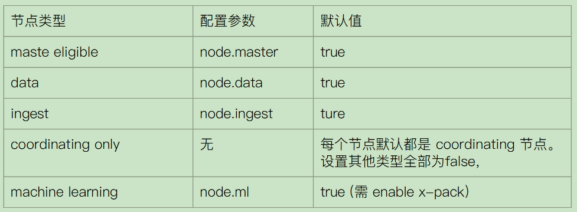
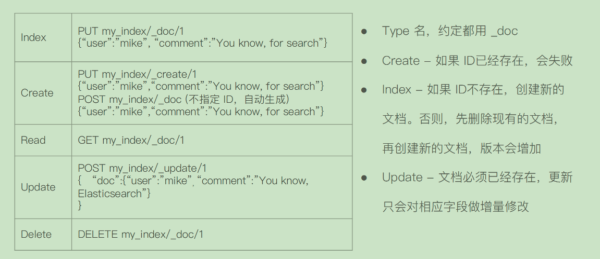
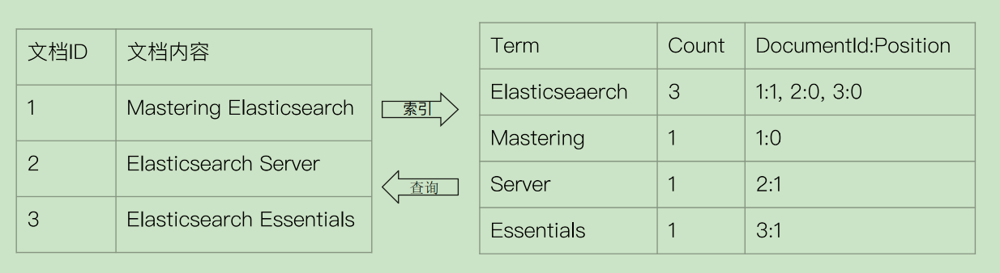
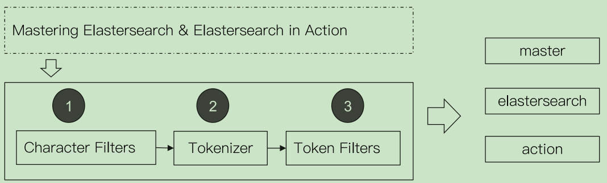
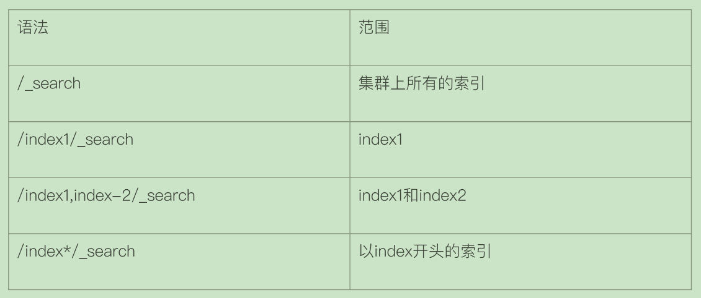
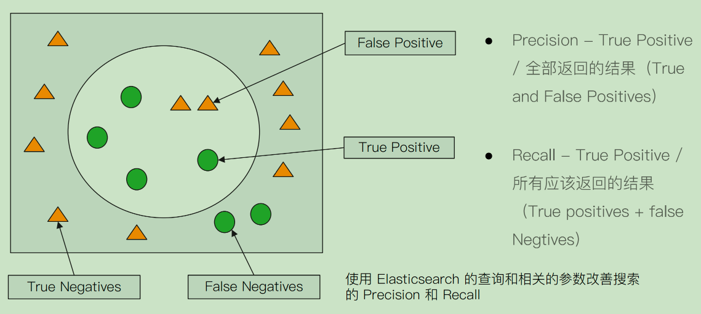
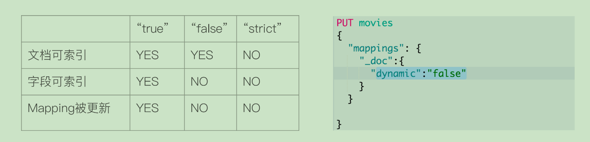

# Elasticsearch 的安装与简单配置

## 启动docker 集群

```dtd

docker-compose -f docker-compose.yaml up -d

```

> 在Docker中，卷（volumes）是一种存储方式，用于持久化和共享容器的数据。driver则指定用于管理这个卷的驱动程序。

driver的值"local"表示使用内置的local卷驱动，将数据存储在宿主机的文件系统中。也就是说，当你创建一个新的卷，并指定driver为local的时候，Docker会在宿主机上创建一个新的目录，用来存储卷的数据。

这种存储方式相对简单，容易操作，特别适合单机环境。然而，它不适合在集群环境中跨多个Docker主机共享数据。对于这种场景，我们更可能会使用其他卷驱动，比如"overlay"或者"nfs"。

Windows:
C:\ProgramData\Docker\volumes

macOS:
/var/lib/docker/volumes

Linux:
/var/lib/docker/volumes
在docker-compose文件中，你可以像下面这样定义一个local驱动的卷：

```yaml
volumes:
  myvolume:
    driver: local
```
这将创建一个名为"myvolume"的新卷，使用local卷驱动。你可以在服务定义中通过volumes字段来使用这个卷。

## 安装插件

```dtd

#安装插件
bin/elasticsearch-plugin install analysis-icu

#查看插件
bin/elasticsearch-plugin list

#查看安装的插件
GET http://localhost:9200/_cat/plugins?v

#查看集群
GET http://localhost:9200

#查看nodes
GET http://192.168.56.112:9200/_cat/nodes?v

GET http://192.168.56.112:9200/_cluster/health
```

## 安装logstash

https://www.elastic.co/cn/downloads/past-releases/logstash-7-17-1

```
vim logstash.conf

```

```dtd

input {
  file {
    path => "/root/es-study/ml-25m/movies.csv"
    start_position => "beginning"
    sincedb_path => "/dev/null"
  }
}
filter {
  csv {
    separator => ","
    columns => ["id","content","genre"]
  }

  mutate {
    split => { "genre" => "|" }
    remove_field => ["path", "host","@timestamp","message"]
  }

  mutate {

    split => ["content", "("]
    add_field => { "title" => "%{[content][0]}"}
    add_field => { "year" => "%{[content][1]}"}
  }

  mutate {
    convert => {
      "year" => "integer"
    }
    strip => ["title"]
    remove_field => ["path", "host","@timestamp","message","content"]
  }

}
output {
   elasticsearch {
     hosts => "http://localhost:9200"
     index => "movies"
     document_id => "%{id}"
   }
  stdout {}
}

```

* 导入数据 https://grouplens.org/datasets/movielens/

```dtd
./bin/logstash -f config/logstash.conf
```

# 基本概念-集群/节点/分片/副本

`c` (cold node),
`d` (data node),
`f` (frozen node),
`h` (hot node),
`i` (ingest node),
`l` (machine learning node),
`m` (master-eligible node),
`r` (remote cluster client node),
`s` (content node),
`t` ({transform} node),
`v` (voting-only node),
`w` (warm node), and
`-` (coordinating node only).



## 分片 (Primary Shard & Replica Shard)
- 主分片,用以解决数据水平扩展的问题。通过主分片,可以将数据分布到集群内的所有节点之上
  - 一个分片是一个运行的Lucene的实例
  - 主分片数在索引创建时指定,后续不允许修改,除非Reindex
- 副本,用以解决数据高可用的问题。分片是主分片的拷贝
  - 副本分片数,可以动态题调整
  - 增加副本数,还可以在一定程度上提高服务的可用性(读取的吞吐)

## 分片的设定

- 对于生产环境中分片的设定,需要提前做好容量规划
  - 分片数设置过小
    - 导致后续无法增加节点实现水品扩展
    - 单个分片的数据量太大,导致数据重新分配耗时
  - 分片数设置过大,7.0开始,默认主分片设置成1,解决了over-sharding的问题
    - 影响搜索结果的相关性打分,影响统计结果的准确性
    - 单个节点上过多的分片,会导致资源浪费,同时也会影响性能能

## 查询集群健康情况

GET _cluster/health

- Green-主分片与副本都正常分配
- Yellow-主分片全部正常分配,有副本分片未能正常分配
- Red-有主分片未能分配,例如,当服务器的磁盘容量超过85%时, 创建了一个新的索引

## 本节回顾
- 一个节点是运行 Elasticsearch的Java进程
- 一个集群由1到多个节点共同组成,每个节点可以承担不同的角色
- 一份主分片是一个Lucene的实例,索引的一部分或全部数据,
- 一个副本分片是一个主分片的拷贝
- Elasticsearch通过分片可以实现水平扩展和数据可用性
- 集群的三种健康状态,Shard的不同状态

# 文档的基本CRUD与批量操作&读取&BulkAPI

## 文档的 CRUD




```
############Create Document############
#create document. 自动生成 _id
POST users/_doc
{
	"user" : "Mike",
    "post_date" : "2019-04-15T14:12:12",
    "message" : "trying out Kibana"
}

#create document. 指定Id。如果id已经存在，报错
PUT users/_doc/1?op_type=create
{
    "user" : "Jack",
    "post_date" : "2019-05-15T14:12:12",
    "message" : "trying out Elasticsearch"
}

#create document. 指定 ID 如果已经存在，就报错
PUT users/_create/1
{
    "user" : "Jack",
    "post_date" : "2019-05-15T14:12:12",
    "message" : "trying out Elasticsearch"
}

### Get Document by ID
#Get the document by ID
GET users/_doc/1


###  Index & Update
#Update 指定 ID  (先删除，在写入)
GET users/_doc/1

PUT users/_doc/1
{
	"user" : "Mike"

}


#GET users/_doc/1
#在原文档上增加字段
POST users/_update/1/
{
    "doc":{
        "post_date" : "2019-05-15T14:12:12",
        "message" : "trying out Elasticsearch"
    }
}


### Delete by Id
# 删除文档
DELETE users/_doc/1


### Bulk 操作
#执行两次，查看每次的结果

#执行第1次
POST _bulk
{ "index" : { "_index" : "test", "_id" : "1" } }
{ "field1" : "value1" }
{ "delete" : { "_index" : "test", "_id" : "2" } }
{ "create" : { "_index" : "test2", "_id" : "3" } }
{ "field1" : "value3" }
{ "update" : {"_id" : "1", "_index" : "test"} }
{ "doc" : {"field2" : "value2"} }


#执行第2次
POST _bulk
{ "index" : { "_index" : "test", "_id" : "1" } }
{ "field1" : "value1" }
{ "delete" : { "_index" : "test", "_id" : "2" } }
{ "create" : { "_index" : "test2", "_id" : "3" } }
{ "field1" : "value3" }
{ "update" : {"_id" : "1", "_index" : "test"} }
{ "doc" : {"field2" : "value2"} }

### mget 操作
GET /_mget
{
    "docs" : [
        {
            "_index" : "test",
            "_id" : "1"
        },
        {
            "_index" : "test",
            "_id" : "2"
        }
    ]
}


#URI中指定index
GET /test/_mget
{
    "docs" : [
        {

            "_id" : "1"
        },
        {

            "_id" : "2"
        }
    ]
}


GET /_mget
{
    "docs" : [
        {
            "_index" : "test",
            "_id" : "1",
            "_source" : false
        },
        {
            "_index" : "test",
            "_id" : "2",
            "_source" : ["field3", "field4"]
        },
        {
            "_index" : "test",
            "_id" : "3",
            "_source" : {
                "include": ["user"],
                "exclude": ["user.location"]
            }
        }
    ]
}

### msearch 操作
POST kibana_sample_data_ecommerce/_msearch
{}
{"query" : {"match_all" : {}},"size":1}
{"index" : "kibana_sample_data_flights"}
{"query" : {"match_all" : {}},"size":2}


### 清除测试数据
#清除数据
DELETE users
DELETE test
DELETE test2

```

# 倒排索引

## 正排索引及倒排索引



## 倒排索引的核心组成

- 倒排索引包含两个部分
- 单词词典(Term Dictionary),记录所有文档的单词,记录单词到倒排列表的关联关系
  - 单词词典一般比较大,可以通过B+树或哈希拉链法实现,以满足高性能的插入与查询
- 倒排列表(Posting List)-记录了单词对应的文档结合,由倒排索引项组成
  - 倒排索引项(Posting)
    - 文档ID
    - 词频TF-该单词在文档中出现的次数,用于相关性评分
    - 位置(Position)-单词在文档中分词的位置。用于语句搜索(phrase query)
    - 偏移(Offset)-记录单词的开始结束位置,实现高亮显示

## Analysis与Analyzer

- Analysis-文本分析是把全文本转换一系列单词(term/token)的过程,也叫分词
- Analysis是通过 Analyzer来实现的
  - 可使用Elasticsearch内置的分析器/或者按需定制化分析听器
- 除了在数据写入时转换词条,匹配Query语句时候也需要用相同的;分析器对查询语句进行分析

## Analyzer的组成

- 分词器是专门处理分词的组件,Analyzer由三部分组成
  -   Character Filters(针对原始文本处理,例如去除html)
  /Tokenizer(按照规则切分为单词)/Token Filter(将切分的的单词进行加工,小?写,删除stopwords, 增加同义词)



## Elasticsearch的内置分词器

- Standard Analyzer-默认分词器,按词切分,小写处理
- SimpleAnalyzer-按照非字母切分(符号被过滤),小写处理
- Stop Analyzer-小写处理,停用词过滤(the,a,is)
- Whitespace Analyzer-按照空格切分,不转小写
- Keyword Analyzer-不分词,直接将输入当作输出
- PatterAnalyzer-正则表达式,默认\W+(非字符分隔)
- Language-提供了30多种常见语言的分词器
- Customer Analyzer自定义分词器


```
POST _analyze
{
  "analyzer": "standard",
  "text": "Mastering Elasticsearch"
}

POST _analyze
{
  "analyzer": "standard",
  "text": "Elasticsearch Server"
}

POST _analyze
{
  "analyzer": "standard",
  "text": "Elasticsearch Essentials"
}

POST /_analyze
{
    "tokenizer": "standard",
    "filter": ["lowercase"],
    "text": "Mastering Elasticseach"
}

```

## 查看不同的analyzer的效果

```
#standard
默认分词器
按词切分
小写处理

GET _analyze
{
"analyzer": "standard",
"text": "2 running Quick brown-foxes leap over lazy dogs in the summer evening."
}

#simpe
按照非字母切分,非字母的都被去除
小写处理

GET _analyze
{
"analyzer": "simple",
"text": "2 running Quick brown-foxes leap over lazy dogs in the summer evening."
}

# stop
相比Simple Analyzer
多了stop filter
会把the,a,is等修饰性词语去除


GET _analyze
{
"analyzer": "stop",
"text": "2 running Quick brown-foxes leap over lazy dogs in the summer evening."
}


#whitespace
按照空格切分

GET _analyze
{
"analyzer": "whitespace",
"text": "2 running Quick brown-foxes leap over lazy dogs in the summer evening."
}

#keyword
不分词,直接将输入当一个term输出

GET _analyze
{
"analyzer": "keyword",
"text": "2 running Quick brown-foxes leap over lazy dogs in the summer evening."
}
# pattern
通过正则表达式进行分词
默认是\W+,非字符的符号进行分隔

GET _analyze
{
"analyzer": "pattern",
"text": "2 running Quick brown-foxes leap over lazy dogs in the summer evening."
}


#english
GET _analyze
{
"analyzer": "english",
"text": "2 running Quick brown-foxes leap over lazy dogs in the summer evening."
}


POST _analyze
{
"analyzer": "icu_analyzer",
"text": "他说的确实在理”"
}


POST _analyze
{
"analyzer": "standard",
"text": "他说的确实在理”"
}


POST _analyze
{
"analyzer": "icu_analyzer",
"text": "这个苹果不大好吃"
}

```

# Search API 概览

- URI Search
  - 在URL中使用查询参数
- Request Body Search
  - 使用Elasticsearch提供的,基于JSON格式的更加完备的 Query Domain Specific Language (DSL)

## 指定查询的索引



## URI查询

- 使用"q",指定查询字符串
- "query string syntax",KV 键值对

```dtd
#URI Query
GET kibana_sample_data_ecommerce/_search?q=customer_first_name:Eddie
GET kibana*/_search?q=customer_first_name:Eddie
GET /_all/_search?q=customer_first_name:Eddie
```

## Request Body

```dtd
POST kibana_sample_data_ecommerce/_search
{
	"profile": true,
	"query": {
		"match_all": {}
	}
}
```

## 衡量相关性

- Information Retrieval
  - Precision (查准率)-尽可能返回较少的无关文档
  - Recall(查全率)-尽量返回较多的相关文档)
  - Ranking-是否能够按照相关度进行排序?

## Precision & Recall




## URI Search-通过URI query 实现搜索

- q指定查询语句,使用QueryStringSyntax
- df默认字段,不指定时
- Sort排序/from和size用于分页
- Profile可以查看查询是如何被执行的

```
GET /movies/_search?q=2012&df=title&sort=year:desc&from=0&size=10&timeout=1s
```

## Query String Syntax (1)

- 指定字段v.s泛查询
  - q=title:2012 / q=2012
- Term v.s Phrase
  - Beautiful Mind等效于 Beautiful OR Mind
  - "Beautiful Mind",等效于 Beautiful AND Mind。Phrase查询,这还要求前后顺序保持一致
- 分组与引号
  - title:(Beautiful AND Mind)
  - title="Beautiful Mind"

## Query String Syntax (2)

- 布尔操作
  - AND/OR/NOT 或者&&/||/!
    - 必须大写
    - title:(matrix NOT reloaded)
- 分组
  - +表示must
  - -表示must_not
  - title:(+matrix -reloaded)

## Query String Syntax (3)

- 范围查询
  - 区间表示:[]闭区间,{}开区间
    - year:{2019 TO 2018]
    - year:[* TO 2018]
- 算数符号
- year:>2010
- year:(>2010 && <=2018)
- year:(+>2010 +<=2018)

## Query String Syntax (4)

- 通配符查询(通配符查询效率低,占用内存大,不建议使用。特别是放在最前面)
  - ?代表1个字符,*代表0或多个字符
    - title:mi?d
    - title:be*
- 正则表达
  - title:[bt]oy
- 模糊匹配与近似查询
  - title:befutifl~1
  - title:"lord rings"~2

```
#基本查询
GET /movies/_search?q=2012&df=title&sort=year:desc&from=0&size=10&timeout=1s

#带profile
GET /movies/_search?q=2012&df=title
{
	"profile":"true"
}


#泛查询，正对_all,所有字段
GET /movies/_search?q=2012
{
	"profile":"true"
}

#指定字段
GET /movies/_search?q=title:2012&sort=year:desc&from=0&size=10&timeout=1s
{
	"profile":"true"
}


# 查找美丽心灵, Mind为泛查询
GET /movies/_search?q=title:Beautiful Mind
{
	"profile":"true"
}

# 泛查询
GET /movies/_search?q=title:2012
{
	"profile":"true"
}

#使用引号，Phrase查询
GET /movies/_search?q=title:"Beautiful Mind"
{
	"profile":"true"
}

#分组，Bool查询
GET /movies/_search?q=title:(Beautiful Mind)
{
	"profile":"true"
}


#布尔操作符
# 查找美丽心灵
GET /movies/_search?q=title:(Beautiful AND Mind)
{
	"profile":"true"
}

# 查找美丽心灵
GET /movies/_search?q=title:(Beautiful NOT Mind)
{
	"profile":"true"
}

# 查找美丽心灵
GET /movies/_search?q=title:(Beautiful %2BMind)
{
	"profile":"true"
}


#范围查询 ,区间写法
GET /movies/_search?q=title:beautiful AND year:[2002 TO 2018%7D
{
	"profile":"true"
}


#通配符查询
GET /movies/_search?q=title:b*
{
	"profile":"true"
}

//模糊匹配&近似度匹配
GET /movies/_search?q=title:beautifl~1
{
	"profile":"true"
}

GET /movies/_search?q=title:"Lord Rings"~2
{
	"profile":"true"
}


```


## Request Body Search

```
#ignore_unavailable=true，可以忽略尝试访问不存在的索引“404_idx”导致的报错
#查询movies分页
POST /movies,404_idx/_search?ignore_unavailable=true
{
  "profile": true,
	"query": {
		"match_all": {}
	}
}

POST /kibana_sample_data_ecommerce/_search
{
  "from":10,
  "size":20,
  "query":{
    "match_all": {}
  }
}


#对日期排序
POST kibana_sample_data_ecommerce/_search
{
  "sort":[{"order_date":"desc"}],
  "query":{
    "match_all": {}
  }

}

#source filtering
POST kibana_sample_data_ecommerce/_search
{
  "_source":["order_date"],
  "query":{
    "match_all": {}
  }
}


#脚本字段
GET kibana_sample_data_ecommerce/_search
{
  "script_fields": {
    "new_field": {
      "script": {
        "lang": "painless",
        "source": "doc['order_date'].value+'hello'"
      }
    }
  },
  "query": {
    "match_all": {}
  }
}


POST movies/_search
{
  "query": {
    "match": {
      "title": "last christmas"
    }
  }
}

POST movies/_search
{
  "query": {
    "match": {
      "title": {
        "query": "last christmas",
        "operator": "and"
      }
    }
  }
}

POST movies/_search
{
  "query": {
    "match_phrase": {
      "title":{
        "query": "one love"

      }
    }
  }
}

POST movies/_search
{
  "query": {
    "match_phrase": {
      "title":{
        "query": "one love",
        "slop": 1

      }
    }
  }
}

```

# DynamicMapping和常见字段类型


## 什么是 Dynamic Mapping

- 在写入文档时候,如果索引不存在,会自动创建索引
- Dynamic Mapping的机制,使得我们无需手动定义Mappings。
- Elasticsearch会自动根据文档信息,推算出字段的类型
- 但是有时候会推算的不对,例如地理位置信息,当类型如果设置不对时,会导致一些功能无法正常运行,例如Range查询

## 类型的自动识别


## 能否更改Mapping的字段类型

- 两种情况
  - 新增加字段
    - Dynamic设为true时,一旦有新增字段的文档写入,Mapping也会同时被更新
    - Dynamic设为false,Mapping不会被更新,新增字段的数据无法被索引, 但是信息会出现在_source中
    - Dynamic设置成Strict,文档写入失败
  - 对已有字段,一旦已经有数据写入,就不再支持修改字段定义
    - Lucene实现的倒排索引,一旦生成后,就不允许修改
    - 如果希望改变字段类型,必须ReindexAPI,重建索引
- 原因
  - 如果修改了字段的数据类型,会导致已被索引的属于无法被搜索
  - 但是如果是增加新的字段,就不会有这样的影响

## 控制 Dynamic Mappings



* 当dynamic被设置成false时候,存在新增字段的数据写入,该数据可以被索引, 但是新增字段被丢弃
* 当设置成Strict模式时候,数据写入直接出错


```

#写入文档，查看 Mapping
PUT mapping_test/_doc/1
{
  "firstName":"Chan",
  "lastName": "Jackie",
  "loginDate":"2018-07-24T10:29:48.103Z"
}

#查看 Mapping文件
GET mapping_test/_mapping


#Delete index
DELETE mapping_test

#dynamic mapping，推断字段的类型
PUT mapping_test/_doc/1
{
    "uid" : "123",
    "isVip" : false,
    "isAdmin": "true",
    "age":19,
    "heigh":180
}

#查看 Dynamic
GET mapping_test/_mapping


#默认Mapping支持dynamic，写入的文档中加入新的字段
PUT dynamic_mapping_test/_doc/1
{
  "newField":"someValue"
}

#该字段可以被搜索，数据也在_source中出现
POST dynamic_mapping_test/_search
{
  "query":{
    "match":{
      "newField":"someValue"
    }
  }
}

GET dynamic_mapping_test/_mapping


#修改为dynamic false
PUT dynamic_mapping_test/_mapping
{
  "dynamic": false
}

#新增 anotherField
PUT dynamic_mapping_test/_doc/10
{
  "anotherField":"someValue"
}


#该字段不可以被搜索，因为dynamic已经被设置为false
POST dynamic_mapping_test/_search
{
  "query":{
    "match":{
      "anotherField":"someValue"
    }
  }
}

GET dynamic_mapping_test/_doc/10

#修改为strict
PUT dynamic_mapping_test/_mapping
{
  "dynamic": "strict"
}


#写入数据出错，HTTP Code 400
PUT dynamic_mapping_test/_doc/12
{
  "lastField":"value"
}

DELETE dynamic_mapping_test

```

# 显式Mapping设置与常见参数介绍


## 自定义Mapping的一些建议

- 可以参考API手册,纯手写
- 为了减少输入的工作量,减少出错概率,可以依照以下步骤
  - 创建一个临时的index,写入一些样本数据
  - 通过访问MappingAPI获得该临时文件的动态Mapping定义
  - 修改后用,使用该配置创建你的索引
  - 删除临时索引

## 控制当前字段是否被索引

* Index-控制当前字段是否被索引。默认为true。如果设置成false,该字段不可被搜索

## Index Options

- 四种不同级别的IndexOptions配置,可以控制倒排索引记录的内容
  - docs-记录 docid
  - freqs-记录 docid和term frequencies
  - positions - 记录 doc id/ term frequencies / term position
  - offsets - doc id / term frequencies / term posistion / character offects
- Text类型默认记录postions,其他默认为docs
- 记录内容越多,占用存储空间越大

## null_value

- 需要对Null值实现搜索
- 只有 Keyword类型支持设定 Null_Value

```dtd

#设定Null_value

DELETE users
PUT users
{
    "mappings" : {
      "properties" : {
        "firstName" : {
          "type" : "text"
        },
        "lastName" : {
          "type" : "text"
        },
        "mobile" : {
          "type" : "keyword",
          "null_value": "NULL"
        }

      }
    }
}

PUT users/_doc/1
{
"firstName":"Ruan",
"lastName": "Yiming",
"mobile": null
}


PUT users/_doc/2
{
"firstName":"Ruan2",
"lastName": "Yiming2"

}

GET users/_search
{
"query": {
"match": {
"mobile":"NULL"
}
}
}


```

## copy_to设置

- _all在7中被copy_to所替代
- 满足一些特定的搜索需求
- copy_to将字段的数值拷贝到目标字段,实现类似_all的作用
- copy_to的目标字段不出现在_source中

```dtd
#设置 Copy to
DELETE users
PUT users
{
  "mappings": {
    "properties": {
      "firstName":{
        "type": "text",
        "copy_to": "fullName"
      },
      "lastName":{
        "type": "text",
        "copy_to": "fullName"
      }
    }
  }
}
PUT users/_doc/1
{
  "firstName":"Ruan",
  "lastName": "Yiming"
}

GET users/_search?q=fullName:(Ruan Yiming)

POST users/_search
{
  "query": {
    "match": {
       "fullName":{
        "query": "Ruan Yiming",
        "operator": "and"
      }
    }
  }
}
```

## 数组类型

* Elasticsearch中不提供专门的数组类型。但是任何字段,都可以包含多个相同类类型的数值

```dtd
#数组类型
PUT users/_doc/1
{
  "name":"onebird",
  "interests":"reading"
}

PUT users/_doc/1
{
  "name":"twobirds",
  "interests":["reading","music"]
}

POST users/_search
{
  "query": {
		"match_all": {}
	}
}

GET users/_mapping

```

# 多字段特性及配置自定义Analyzer

## 多字段类型

- 多字段特性
  - 厂商名字实现精确匹配
    - 增加一个keyword字段
  - 使用不同的analyzer
    - 不同语言
    - pinyin字段的搜索
    - 还支持为搜索和索引指定不通的analyzer


## Exact Values v.s Full Text

- Excat values v.s Full Text
  - Exact Value:包括数字/日期/具体一个字符串(例如"Apple SStore"
    - Elasticseach中的keyword
  - 全文本,非结构化的文本数据
    - Elasticsearch 中的 text


```dtd
PUT logs/_doc/1
{"level":"DEBUG"}

GET /logs/_mapping
```

## 自定义分词

- 当Elasticsearch自带的分词器无法满足时,可以自定义分词器。通过自组合不同的组
件实现
  - Character Filter
  - Tokenizer
  - Token Filter


### Character Filters

- 在Tokenizer之前对文本进行处理,例如增加删除及替换字符。
  可以配置多个Character Filters。会影响Tokenizer的 position和offset信息
- 一些自带的Character Filters
  - HTML strip-出除html标签
  - Mapping-字符串替换
  - Pattern replace-正则匹配替换

### Tokenizer

- 将原始的文本按照一定的规则,切分为词(termor token)
- Elasticsearch内置的 Tokenizers
  - whitespace / standard / uax_url_email / pattern / keyword / paath hierarchy
- 可以用Java开发插件,实现自己的Tokenizer

### Token Filters

- 将Tokenizer输出的单词(term),进行增加,修改,删除
- 自带的Token Filters
  - Lowercase/stop/synonym(添加近义词)

```dtd

POST _analyze
{
  "tokenizer":"keyword",
  "char_filter":["html_strip"],
  "text": "<b>hello world</b>"
}


POST _analyze
{
  "tokenizer":"path_hierarchy",
  "text":"/user/ymruan/a/b/c/d/e"
}


#使用char filter进行替换
POST _analyze
{
  "tokenizer": "standard",
  "char_filter": [
      {
        "type" : "mapping",
        "mappings" : [ "- => _"]
      }
    ],
  "text": "123-456, I-test! test-990 650-555-1234"
}

//char filter 替换表情符号
POST _analyze
{
  "tokenizer": "standard",
  "char_filter": [
      {
        "type" : "mapping",
        "mappings" : [ ":) => happy", ":( => sad"]
      }
    ],
    "text": ["I am felling :)", "Feeling :( today"]
}

// white space and snowball
GET _analyze
{
  "tokenizer": "whitespace",
  "filter": ["stop","snowball"],
  "text": ["The gilrs in China are playing this game!"]
}


// whitespace与stop
GET _analyze
{
  "tokenizer": "whitespace",
  "filter": ["stop","snowball"],
  "text": ["The rain in Spain falls mainly on the plain."]
}


//remove 加入lowercase后，The被当成 stopword删除
GET _analyze
{
  "tokenizer": "whitespace",
  "filter": ["lowercase","stop","snowball"],
  "text": ["The gilrs in China are playing this game!"]
}

//正则表达式
GET _analyze
{
  "tokenizer": "standard",
  "char_filter": [
      {
        "type" : "pattern_replace",
        "pattern" : "http://(.*)",
        "replacement" : "$1"
      }
    ],
    "text" : "http://www.elastic.co"
}
```

# Index Template 和 Dynamic Template

## 管理很多的索引

- 集群上的索引会越来越多,例如,你会为你的日志每天创建一个索引
  - 使用多个索引可以让你更好的管理你的数据,提高性能
  - logs-2019-05-01
  - logs-2019-05-02
  - logs-2019-05-05-03

## 什么是Index Template

- Index Templates-帮助你设定 Mappings和Settings,并按照一定的规则,
自动匹配到新创建的索引之上
  - 模版仅在一个索引被新创建时,才会产生作用。修改模版不会影响已创建的索引
  - 你可以设定多个索引模版,这些设置会被"merge"在一起
  - 你可以指定"order"的数值,控制"merging"的过程

## Index Template的工作方式

- 当一个索引被新创建时
  - 应用Elasticsearch默认的settings和 mappings
  - 应用order数值低的Index Template中的设定
  - 应用order高的IndexTemplate中的设定,之前的设定会被覆盖
  - 应用创建索引时,用户所指定的Settings和Mappings,并覆盖之前模版中的设定


```dtd

#数字字符串被映射成text，日期字符串被映射成日期
PUT ttemplate/_doc/1
{
	"someNumber":"1",
	"someDate":"2019/01/01"
}
GET ttemplate/_mapping


#Create a default template
PUT _template/template_default
{
  "index_patterns": ["*"],
  "order" : 0,
  "version": 1,
  "settings": {
    "number_of_shards": 1,
    "number_of_replicas":1
  }
}


PUT /_template/template_test
{
    "index_patterns" : ["test*"],
    "order" : 1,
    "settings" : {
    	"number_of_shards": 1,
        "number_of_replicas" : 2
    },
    "mappings" : {
    	"date_detection": false,
    	"numeric_detection": true
    }
}

#查看template信息
GET /_template/template_default
GET /_template/temp*


#写入新的数据，index以test开头
PUT testtemplate/_doc/1
{
	"someNumber":"1",
	"someDate":"2019/01/01"
}
GET testtemplate/_mapping
get testtemplate/_settings

PUT testmy
{
	"settings":{
		"number_of_replicas":5
	}
}

put testmy/_doc/1
{
  "key":"value"
}

get testmy/_settings
DELETE testmy
DELETE /_template/template_default
DELETE /_template/template_test


```

## 什么是 Dynamic Template

- 根据Elasticsearch识别的数据类型,结合字段名称,来动态设没定字段类型
  - 所有的字符串类型都设定成Keyword,或者关闭keyword字段
  - is开头的字段都设置成boolean
  - long_开头的都设置成long类型


## Dynamic Template

- Dynamic Template是定义在在某个索引的Mapping中
- Template有一个名称
- 匹配规则是一个数组
- 为匹配到字段设置Mapping

## 匹配规则参数

- match_mapping_type:匹配自动识别的字段类型, 如string,boolean等
- match,unmatch:匹配字段名
- path_match, path_unmatch


```dtd
#Dynaminc Mapping 根据类型和字段名
DELETE my_index

PUT my_index/_doc/1
{
  "firstName":"Ruan",
  "isVIP":"true"
}

GET my_index/_mapping
DELETE my_index
PUT my_index
{
  "mappings": {
    "dynamic_templates": [
            {
        "strings_as_boolean": {
          "match_mapping_type":   "string",
          "match":"is*",
          "mapping": {
            "type": "boolean"
          }
        }
      },
      {
        "strings_as_keywords": {
          "match_mapping_type":   "string",
          "mapping": {
            "type": "keyword"
          }
        }
      }
    ]
  }
}


DELETE my_index
#结合路径
PUT my_index
{
  "mappings": {
    "dynamic_templates": [
      {
        "full_name": {
          "path_match":   "name.*",
          "path_unmatch": "*.middle",
          "mapping": {
            "type":       "text",
            "copy_to":    "full_name"
          }
        }
      }
    ]
  }
}


PUT my_index/_doc/1
{
  "name": {
    "first":  "John",
    "middle": "Winston",
    "last":   "Lennon"
  }
}

GET my_index/_search?q=full_name:John

```

# Elasticsearch聚合分析简介

## 集合的分类

- Bucket Aggregation-一些列满足特定条件的文档的集合
- Metric Aggregation-一些数学运算,可以对文档字段进行统计分析
- Pipeline Aggregation-对其他的聚合结果进行二次聚合
- Matrix Aggregation-支持对多个字段的操作并提供一个结果距阵

## Bucket & Metric


- 需要通过Kibana导入Sample Data的飞机航班数据。具体参考“2.2节-Kibana的安装与界面快速浏览”
```
#按照目的地进行分桶统计
GET kibana_sample_data_flights/_search
{
	"size": 0,
	"aggs":{
		"flight_dest":{
			"terms":{
				"field":"DestCountry"
			}
		}
	}
}


#查看航班目的地的统计信息，增加平均，最高最低价格
GET kibana_sample_data_flights/_search
{
	"size": 0,
	"aggs":{
		"flight_dest":{
			"terms":{
				"field":"DestCountry"
			},
			"aggs":{
				"avg_price":{
					"avg":{
						"field":"AvgTicketPrice"
					}
				},
				"max_price":{
					"max":{
						"field":"AvgTicketPrice"
					}
				},
				"min_price":{
					"min":{
						"field":"AvgTicketPrice"
					}
				}
			}
		}
	}
}


#价格统计信息+天气信息
GET kibana_sample_data_flights/_search
{
	"size": 0,
	"aggs":{
		"flight_dest":{
			"terms":{
				"field":"DestCountry"
			},
			"aggs":{
				"stats_price":{
					"stats":{
						"field":"AvgTicketPrice"
					}
				},
				"wather":{
				  "terms": {
				    "field": "DestWeather",
				    "size": 5
				  }
				}

			}
		}
	}
}

```

