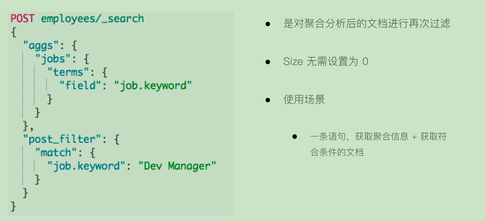
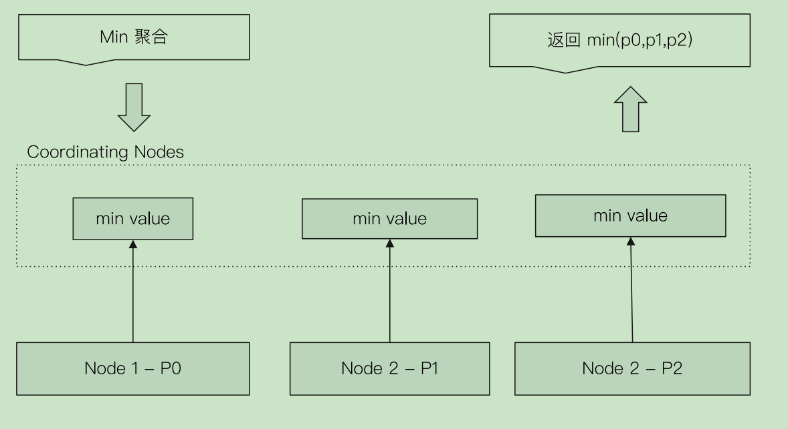

# 基于词项和基与全文的搜索

## 基于Term的查询

- Term的重要性
  - Term是表达语意的最小单位。搜索和利用统计语言模型进行行自然语言处理都需要处理Term
- 特点
  - Term Level Query: Term Query / Range Query / Exists Query / Prefix Query /Wildcard Query
  - 在ES中,Term查询,对输入不做分词。会将输入作为一个整体,在倒排索引中查找准确的词项,并
  且使用相关度算分公式为每个包含该词项的文档进行相关度算分-例如"Apple Store"
  - 可以通过ConstantScore将查询转换成一个Filtering,避免算分,并利用缓存,提高性能


## 关于Term查询的例子

```
DELETE products
PUT products
{
  "settings": {
    "number_of_shards": 1
  }
}


POST /products/_bulk
{ "index": { "_id": 1 }}
{ "productID" : "XHDK-A-1293-#fJ3","desc":"iPhone" }
{ "index": { "_id": 2 }}
{ "productID" : "KDKE-B-9947-#kL5","desc":"iPad" }
{ "index": { "_id": 3 }}
{ "productID" : "JODL-X-1937-#pV7","desc":"MBP" }

GET /products

## iPhone 查询不出来，因为经过分词处理后单词变为小写iphone，此处term查询，不会对查询条件做分词，故匹配不上
POST /products/_search
{
  "query": {
    "term": {
      "desc": {
        //"value": "iPhone"
        "value":"iphone"
      }
    }
  }
}

POST /products/_search
{
  "query": {
    "term": {
      "desc.keyword": {
        //"value": "iPhone"
        //"value":"iphone"
      }
    }
  }
}


POST /products/_search
{
  "query": {
    "term": {
      "productID": {
        "value": "XHDK-A-1293-#fJ3"
      }
    }
  }
}

#多字段Mapping和Term查询

POST /products/_search
{
  //"explain": true,
  "query": {
    "term": {
      "productID.keyword": {
        "value": "XHDK-A-1293-#fJ3"
      }
    }
  }
}
```

## 复合查询一ConstantScore转为Filter

- 将Query转成Filter,忽略TF-IDF计算,避免相关性算分的开销
- Filter可以有效利用缓存

```
POST /products/_search
{
  "explain": true,
  "query": {
    "constant_score": {
      "filter": {
        "term": {
          "productID.keyword": "XHDK-A-1293-#fJ3"
        }
      }

    }
  }
}


#设置 position_increment_gap
DELETE groups
PUT groups
{
  "mappings": {
    "properties": {
      "names":{
        "type": "text",
        "position_increment_gap": 0
      }
    }
  }
}

GET groups/_mapping

POST groups/_doc
{
  "names": [ "John Water", "Water Smith"]
}

POST groups/_search
{
  "query": {
    "match_phrase": {
      "names": {
        "query": "Water Water",
        "slop": 100
      }
    }
  }
}


POST groups/_search
{
  "query": {
    "match_phrase": {
      "names": "Water Smith"
    }
  }
}

```

## 基于全文的查询
- 基于全文本的查找
  - Match Query / Match Phrase Query / Query String Query
- 特点
  - 索引和搜索时都会进行分词,查询字符串先传递到一个合适的分词器,然后生成一个供查询的词项列表
  - 查询时候,先会对输入的查询进行分词,然后每个词项逐个进行底层的查询,最终将结果进行合并。并为每个文档生成一个算分。
    例如查"Matrix reloaded",会查到包括Matrix或者 reload的所有结果。


```dtd
POST movies/_search
{
  "profile": "true", 
  "query": {
    "match": {
      "title": "Matrix reloaded"
    }
  }
}


POST movies/_search
{
  "profile": "true", 
  "query": {
    "match": {
      "title": {
        "query": "Matrix reloaded",
        "operator": "and"
      }
    }
  }
}


POST movies/_search
{
  "profile": "true", 
  "query": {
    "match": {
      "title": {
        "query": "Matrix reloaded",
        "minimum_should_match": 2
      }
    }
  }
}


POST movies/_search
{
  "profile": "true", 
  "query": {
    "match_phrase": {
      "title": {
        "query": "Matrix reloaded",
        "slop": 1
      }
    }
  }
}

```

## Match Query查询过程

- 基于全文本的查找
  - Match Query / Match Phrase Query / Query String Query
- 基于全文本的查询的特点
  - 索引和搜索时都会进行分词,查询字符串先传递到一个合
  适的分词器,然后生成一个供查询的词项列表
  - 查询会对每个词项逐个进行底层的查询,再将结果进行1合
  并。并为每个文档生成一个算分

# 结构化搜索

## 结构化数据

- 结构化搜索(Structured search)是指对结构化数据的搜索
  - 日期,布尔类型和数字都是结构化的
- 文本也可以是结构化的。
  - 如彩色笔可以有离散的颜色集合:红(red)、绿(green)、蓝(blue)
  - 一个博客可能被标记了标签,例如,分布式(distributed) 和搜索(search)
  - 电商网站上的商品都有UPCs (通用产品码Universal Product Codes)或其他的唯一标
  识,它们都需要遵从严格规定的、结构化的格式。

## ES中的结构化搜索

- 布尔,时间,日期和数字这类结构化数据:有精确的格式,我们可以对这些格式进行逻辑操
作。包括比较数字或时间的范围,或判定两个值的大小。
- 结构化的文本可以做精确匹配或者部分匹配
  - Term查询/Prefix前缀查询
- 结构化结果只有"是"或"否"两个值
  - 根据场景需要,可以决定结构化搜索是否需要打分


## demo
```
#结构化搜索，精确匹配
DELETE products
POST /products/_bulk
{ "index": { "_id": 1 }}
{ "price" : 10,"avaliable":true,"date":"2018-01-01", "productID" : "XHDK-A-1293-#fJ3" }
{ "index": { "_id": 2 }}
{ "price" : 20,"avaliable":true,"date":"2019-01-01", "productID" : "KDKE-B-9947-#kL5" }
{ "index": { "_id": 3 }}
{ "price" : 30,"avaliable":true, "productID" : "JODL-X-1937-#pV7" }
{ "index": { "_id": 4 }}
{ "price" : 30,"avaliable":false, "productID" : "QQPX-R-3956-#aD8" }

GET products/_mapping


#对布尔值 match 查询，有算分
POST products/_search
{
  "profile": "true",
  "explain": true,
  "query": {
    "term": {
      "avaliable": true
    }
  }
}


#对布尔值，通过constant score 转成 filtering，没有算分
POST products/_search
{
  "profile": "true",
  "explain": true,
  "query": {
    "constant_score": {
      "filter": {
        "term": {
          "avaliable": true
        }
      }
    }
  }
}


#数字类型 Term
POST products/_search
{
  "profile": "true",
  "explain": true,
  "query": {
    "term": {
      "price": 30
    }
  }
}

#数字类型 terms
POST products/_search
{
  "query": {
    "constant_score": {
      "filter": {
        "terms": {
          "price": [
            "20",
            "30"
          ]
        }
      }
    }
  }
}

#数字 Range 查询
GET products/_search
{
    "query" : {
        "constant_score" : {
            "filter" : {
                "range" : {
                    "price" : {
                        "gte" : 20,
                        "lte"  : 30
                    }
                }
            }
        }
    }
}


# 日期 range
POST products/_search
{
    "query" : {
        "constant_score" : {
            "filter" : {
                "range" : {
                    "date" : {
                      "gte" : "now-1y"
                    }
                }
            }
        }
    }
}


#exists查询
POST products/_search
{
  "query": {
    "constant_score": {
      "filter": {
        "exists": {
          "field": "date"
        }
      }
    }
  }
}

#处理多值字段
POST /movies/_bulk
{ "index": { "_id": 1 }}
{ "title" : "Father of the Bridge Part II","year":1995, "genre":"Comedy"}
{ "index": { "_id": 2 }}
{ "title" : "Dave","year":1993,"genre":["Comedy","Romance"] }


#处理多值字段，term 查询是包含，而不是等于，如果想解决，可以加一个字段记录count，然后结合bool查询组合
POST movies/_search
{
  "query": {
    "constant_score": {
      "filter": {
        "term": {
          "genre.keyword": "Comedy"
        }
      }
    }
  }
}


#字符类型 terms
POST products/_search
{
  "query": {
    "constant_score": {
      "filter": {
        "terms": {
          "productID.keyword": [
            "QQPX-R-3956-#aD8",
            "JODL-X-1937-#pV7"
          ]
        }
      }
    }
  }
}


POST products/_search
{
  "profile": "true",
  "explain": true,
  "query": {
    "match": {
      "price": 30
    }
  }
}


POST products/_search
{
  "profile": "true",
  "explain": true,
  "query": {
    "term": {
      "date": "2019-01-01"
    }
  }
}

POST products/_search
{
  "profile": "true",
  "explain": true,
  "query": {
    "match": {
      "date": "2019-01-01"
    }
  }
}


POST products/_search
{
  "profile": "true",
  "explain": true,
  "query": {
    "constant_score": {
      "filter": {
        "term": {
          "productID.keyword": "XHDK-A-1293-#fJ3"
        }
      }
    }
  }
}

POST products/_search
{
  "profile": "true",
  "explain": true,
  "query": {
    "term": {
      "productID.keyword": "XHDK-A-1293-#fJ3"
    }
  }
}

#对布尔数值
POST products/_search
{
  "query": {
    "constant_score": {
      "filter": {
        "term": {
          "avaliable": "false"
        }
      }
    }
  }
}

POST products/_search
{
  "query": {
    "term": {
      "avaliable": {
        "value": "false"
      }
    }
  }
}

POST products/_search
{
  "profile": "true",
  "explain": true,
  "query": {
    "term": {
      "price": {
        "value": "20"
      }
    }
  }
}

POST products/_search
{
  "profile": "true",
  "explain": true,
  "query": {
    "match": {
      "price": "20"
    }
    }
}


POST products/_search
{
  "query": {
    "constant_score": {
      "filter": {
        "bool": {
          "must_not": {
            "exists": {
              "field": "date"
            }
          }
        }
      }
    }
  }
}


```

# 搜索的相关性算分

## 相关性和相关性算分

- 相关性-Relevance
  - 搜索的相关性算分,描述了一个文档和查询语句匹配的程度。ES会对每个匹配查询条件的结
  果进行算分_score
  - 打分的本质是排序,需要把最符合用户需求的文档排在前面。ES5之前,默认的相关性算分
  采用TF-IDF,现在采用BM25

## 词频TF

- Term Frequency:检索词在一篇文档中出现的频率
  - 检索词出现的次数除以文档的总字数
- 度量一条查询和结果文档相关性的简单方法:简单将搜索中每一个词的TF进行相加
  - TF(区块链)+TF(的)+TF(应用)
- Stop Word
  - "的"在文档中出现了很多次,但是对贡献相关度几乎没有用处上,不应该考虑他们的TF

## 逆文档频率IDF

- DF:检索词在所有文档中出现的频率
  - "区块链"在相对比较少的文档中出现
  - "应用"在相对比较多的文档中出现
  - "Stop Word"在大量的文档中出现
- Inverse Document Frequency:简单说=log(全部文档数/检索词出现过的文档总数）
- TF-IDF本质上就是将TF求和变成了加权求和
  - TF(区块链)*IDF(区块链)+TF(的)*IDF(的)+TF(应用)*IDF(应用）

## BM 25
- 从ES 5开始,默认算法改为 BM 25
- 和经典的TF-IDF相比,当TF无限增加时, BM25算分会趋于一个数值

## 定制 Similarity

- K默认值是1.2,数值越小,饱和度越高,b默认值是0.75(取值范围0-1),0代表禁止Normalization

## Boosting Relevance
- Boosting是控制相关度的一种手段
索引,字段或查询子条件
- 参数boost的含义
  - 当boost>1时,打分的相关度相对性提升
  - 当0<boost<1时,打分的权重相对性降低
  - 当boost<0时,贡献负分


## demo

```dtd
PUT testscore
{
  "settings": {
    "number_of_shards": 1
  },
  "mappings": {
    "properties": {
      "content": {
        "type": "text"
      }
    }
  }
}

PUT testscore/_bulk
{ "index": { "_id": 1 }}
{ "content":"we use Elasticsearch to power the search" }
{ "index": { "_id": 2 }}
{ "content":"we like elasticsearch" }
{ "index": { "_id": 3 }}
{ "content":"The scoring of documents is caculated by the scoring formula" }
{ "index": { "_id": 4 }}
{ "content":"you know, for search" }

POST /testscore/_search
{
  //"explain": true,
  "query": {
    "match": {
      "content":"you"
      //"content": "elasticsearch"
      //"content":"the"
      //"content": "the elasticsearch"
    }
  }
}

POST testscore/_search
{
    "query": {
        "boosting" : {
            "positive" : {
                "term" : {
                    "content" : "elasticsearch"
                }
            },
            "negative" : {
                 "term" : {
                     "content" : "like"
                }
            },
            "negative_boost" : 0.2
        }
    }
}

```


# Query&Filtering与多字符串多字段查询

- 在Elasticsearch中,有Query和Filter两种不同的Context
  - Query Context:相关性算分
  - Filter Context:不需要算分(Yes or No) ,可以利用Cache,获得更好的性能


## bool查询
- 一个bool查询,是一个或者多个查询子句的组合
  - 总共包括4种子句。其中2种会影响算分,2种不影响算分
- 相关性并不只是全文本检索的专利。也适用于yes|no的子句,匹配的子句越多,相关性评分
越高。如果多条查询子句被合并为一条复合查询语句,比如bool查询,则每个查询子句计算
得出的评分会被合并到总的相关性评分中。


## bool查询语法
- 子查询可以任意顺序出现
- 可以嵌套多个查询
- 如果你的bool查询中,没有must条件, should中必须至少满足一条查询


## demo

```
POST /products/_bulk
{ "index": { "_id": 1 }}
{ "price" : 10,"avaliable":true,"date":"2018-01-01", "productID" : "XHDK-A-1293-#fJ3" }
{ "index": { "_id": 2 }}
{ "price" : 20,"avaliable":true,"date":"2019-01-01", "productID" : "KDKE-B-9947-#kL5" }
{ "index": { "_id": 3 }}
{ "price" : 30,"avaliable":true, "productID" : "JODL-X-1937-#pV7" }
{ "index": { "_id": 4 }}
{ "price" : 30,"avaliable":false, "productID" : "QQPX-R-3956-#aD8" }


#基本语法
POST /products/_search
{
  "query": {
    "bool" : {
      "must" : {
        "term" : { "price" : "30" }
      },
      "filter": {
        "term" : { "avaliable" : "true" }
      },
      "must_not" : {
        "range" : {
          "price" : { "lte" : 10 }
        }
      },
      "should" : [
        { "term" : { "productID.keyword" : "JODL-X-1937-#pV7" } },
        { "term" : { "productID.keyword" : "XHDK-A-1293-#fJ3" } }
      ],
      "minimum_should_match" :1
    }
  }
}

#改变数据模型，增加字段。解决数组包含而不是精确匹配的问题
POST /newmovies/_bulk
{ "index": { "_id": 1 }}
{ "title" : "Father of the Bridge Part II","year":1995, "genre":"Comedy","genre_count":1 }
{ "index": { "_id": 2 }}
{ "title" : "Dave","year":1993,"genre":["Comedy","Romance"],"genre_count":2 }

#must，有算分
POST /newmovies/_search
{
  "query": {
    "bool": {
      "must": [
        {"term": {"genre.keyword": {"value": "Comedy"}}},
        {"term": {"genre_count": {"value": 1}}}

      ]
    }
  }
}

#Filter。不参与算分，结果的score是0
POST /newmovies/_search
{
  "query": {
    "bool": {
      "filter": [
        {"term": {"genre.keyword": {"value": "Comedy"}}},
        {"term": {"genre_count": {"value": 1}}}
        ]

    }
  }
}


#Filtering Context 不影响算分
POST _search
{
  "query": {
    "bool" : {

      "filter": {
        "term" : { "avaliable" : "true" }
      },
      "must_not" : {
        "range" : {
          "price" : { "lte" : 10 }
        }
      }
    }
  }
}


#Query Context 
POST /products/_bulk
{ "index": { "_id": 1 }}
{ "price" : 10,"avaliable":true,"date":"2018-01-01", "productID" : "XHDK-A-1293-#fJ3" }
{ "index": { "_id": 2 }}
{ "price" : 20,"avaliable":true,"date":"2019-01-01", "productID" : "KDKE-B-9947-#kL5" }
{ "index": { "_id": 3 }}
{ "price" : 30,"avaliable":true, "productID" : "JODL-X-1937-#pV7" }
{ "index": { "_id": 4 }}
{ "price" : 30,"avaliable":false, "productID" : "QQPX-R-3956-#aD8" }


POST /products/_search
{
  "query": {
    "bool": {
      "should": [
        {
          "term": {
            "productID.keyword": {
              "value": "JODL-X-1937-#pV7"}}
        },
        {"term": {"avaliable": {"value": true}}
        }
      ]
    }
  }
}


#嵌套，实现了 should not 逻辑
POST /products/_search
{
  "query": {
    "bool": {
      "must": {
        "term": {
          "price": "30"
        }
      },
      "should": [
        {
          "bool": {
            "must_not": {
              "term": {
                "avaliable": "false"
              }
            }
          }
        }
      ],
      "minimum_should_match": 1
    }
  }
}


#Controll the Precision
POST _search
{
  "query": {
    "bool" : {
      "must" : {
        "term" : { "price" : "30" }
      },
      "filter": {
        "term" : { "avaliable" : "true" }
      },
      "must_not" : {
        "range" : {
          "price" : { "lte" : 10 }
        }
      },
      "should" : [
        { "term" : { "productID.keyword" : "JODL-X-1937-#pV7" } },
        { "term" : { "productID.keyword" : "XHDK-A-1293-#fJ3" } }
      ],
      "minimum_should_match" :2
    }
  }
}


# 查询语句的结构,会对相关度算分产生影响
# 同一层级下的竞争字段,具有相同的权重
# 通过嵌套bool查询,可以改变对算分的影响

POST /animals/_search
{
  "query": {
    "bool": {
      "should": [
        { "term": { "text": "brown" }},
        { "term": { "text": "red" }},
        { "term": { "text": "quick"   }},
        { "term": { "text": "dog"   }}
      ]
    }
  }
}

POST /animals/_search
{
  "query": {
    "bool": {
      "should": [
        { "term": { "text": "quick" }},
        { "term": { "text": "dog"   }},
        {
          "bool":{
            "should":[
               { "term": { "text": "brown" }},
                 { "term": { "text": "brown" }},
            ]
          }

        }
      ]
    }
  }
}


DELETE blogs
POST /blogs/_bulk
{ "index": { "_id": 1 }}
{"title":"Apple iPad", "content":"Apple iPad,Apple iPad" }
{ "index": { "_id": 2 }}
{"title":"Apple iPad,Apple iPad", "content":"Apple iPad" }


POST blogs/_search
{
  "query": {
    "bool": {
      "should": [
        {"match": {
          "title": {
            "query": "apple,ipad",
            "boost": 1.1
          }
        }},

        {"match": {
          "content": {
            "query": "apple,ipad",
            "boost":
          }
        }}
      ]
    }
  }
}


DELETE news
POST /news/_bulk
{ "index": { "_id": 1 }}
{ "content":"Apple Mac" }
{ "index": { "_id": 2 }}
{ "content":"Apple iPad" }
{ "index": { "_id": 3 }}
{ "content":"Apple employee like Apple Pie and Apple Juice" }

# 要求苹果公司的产品信息优先

POST news/_search
{
  "query": {
    "bool": {
      "must": {
        "match":{"content":"apple"}
      }
    }
  }
}

# Boosting Query

POST news/_search
{
  "query": {
    "bool": {
      "must": {
        "match":{"content":"apple"}
      },
      "must_not": {
        "match":{"content":"pie"}
      }
    }
  }
}

POST news/_search
{
  "query": {
    "boosting": {
      "positive": {
        "match": {
          "content": "apple"
        }
      },
      "negative": {
        "match": {
          "content": "pie"
        }
      },
      "negative_boost": 0.5
    }
  }
}

```


# 单字符串多字段查询:Dis Max Query


## demo

```

PUT /blogs/_doc/1
{
    "title": "Quick brown rabbits",
    "body":  "Brown rabbits are commonly seen."
}

PUT /blogs/_doc/2
{
    "title": "Keeping pets healthy",
    "body":  "My quick brown fox eats rabbits on a regular basis."
}

POST /blogs/_search
{
    "query": {
        "bool": {
            "should": [
                { "match": { "title": "Brown fox" }},
                { "match": { "body":  "Brown fox" }}
            ]
        }
    }
}
```
## 算分过程
- 查询should语句中的两个查询
- 加和两个查询的评分
- 乘以匹配语句的总数
- 除以所有语句的总数

```
POST blogs/_search
{
    "query": {
        "dis_max": {
            "queries": [
                { "match": { "title": "Quick pets" }},
                { "match": { "body":  "Quick pets" }}
            ]
        }
    }
}

```


## Disjunction Max Query查询

- 上例中,title和body相互竞争
  - 不应该将分数简单叠加,而是应该找到单个最佳匹配的字段的评分
- Disjunction Max Query
  - 将任何与任一查询匹配的文档作为结果返回。采用字段上最匹配的评分最终评分返回

- 有一些情况下,同时匹配title和body字段的文档比只与一个字段匹配的文档的相关度更高
- 但disjunction max query查询只会简单地使用单个最佳匹配语句的评分_score作为整体评分。怎么办?

1. 获得最佳匹配语句的评分_score。
2. 将其他匹配语句的评分与tie_breaker相乘 对以上评分求和并规范化
3. TierBreaker是一个介于0-1之间的浮点数。0
代表使用最佳匹配;1代表所有语句同等重要。

```dtd

POST blogs/_search
{
    "query": {
        "dis_max": {
            "queries": [
                { "match": { "title": "Quick pets" }},
                { "match": { "body":  "Quick pets" }}
            ],
            "tie_breaker": 0.2
        }
    }
}

```

# 单字符串多字段查询:Multi Match

## 三种场景

- 最佳字段(BestFields)
  - 当字段之间相互竞争,又相互关联。例如title和body这样的字段。评分来自最匹配字段
- 多数字段(Most Fields)
  - 处理英文内容时:一种常见的手段是,在主字段(English Analyzer),抽取词干,加入同义词,以
  匹配更多的文档。相同的文本,加入子字段(Standard Analyzer),以提供更加精确的内匹配。其他字
  段作为匹配文档提高相关度的信号。匹配字段越多则越好
- 混合字段(Cross Field)
  - 对于某些实体,例如人名,地址,图书信息。需要在多个字段中确定信息,单个字段只能作为整体
  的一部分。希望在任何这些列出的字段中找到尽可能多的词


## demo

### Multi Match Query

- Best Fields是默认类型,可以不用指定
- Minimum should match等参数可以传递到生成的query中

```

POST blogs/_search
{
  "query": {
    "multi_match": {
      "type": "best_fields",
      "query": "Quick pets",
      "fields": ["title","body"],
      "tie_breaker": 0.2,
      "minimum_should_match": "20%"
    }
  }
}

```


### 英文分词器,导致精确度降低,时态信息丢失


```

PUT /titles
{
  "mappings": {
    "properties": {
      "title": {
        "type": "text",
        "analyzer": "english"
      }
    }
  }
}

POST titles/_bulk
{ "index": { "_id": 1 }}
{ "title": "My dog barks" }
{ "index": { "_id": 2 }}
{ "title": "I see a lot of barking dogs on the road " }


GET titles/_search
{
  "query": {
    "match": {
      "title": "barking dogs"
    }
  }
}

```
#### 使用多数字段匹配解决

- 用广度匹配字段title包括尽可能多的文档--以提
升召回率--同时又使用字段title.std作为信号将
相关度更高的文档置于结果顶部。
- 每个字段对于最终评分的贡献可以通过自定义
值boost来控制。比如,使title字段更为重要,
这样同时也降低了其他信号字段的作用:


```
DELETE /titles
PUT /titles
{
  "mappings": {
    "properties": {
      "title": {
        "type": "text",
        "analyzer": "english",
        "fields": {"std": {"type": "text","analyzer": "standard"}}
      }
    }
  }
}

POST titles/_bulk
{ "index": { "_id": 1 }}
{ "title": "My dog barks" }
{ "index": { "_id": 2 }}
{ "title": "I see a lot of barking dogs on the road " }

GET /titles/_search
{
   "query": {
        "multi_match": {
            "query":  "barking dogs",
            "type":   "most_fields",
            "fields": [ "title", "title.std" ]
        }
    }
}

GET /titles/_search
{
   "query": {
        "multi_match": {
            "query":  "barking dogs",
            "type":   "most_fields",
            "fields": [ "title^10", "title.std" ]
        }
    }
}

```

# 多语言及中文分词与检索

## 自然语言与查询Recall

- 当处理人类自然语言时,有些情况,尽管搜索和原文不完全匹配,但是希望搜到一些内容
  - Quick brown fox 和 fast brown fox / Jumping fox 和 Jumpedfoxes
- 一些可采取的优化
  - 归一化词元:清除变音符号,如rôle的时候也会匹配role
  - 抽取词根:清除单复数和时态的差异
  - 包含同义词
  - 拼写错误:拼写错误,或者同音异形词

## 混合多语言的挑战

- 一些具体的多语言场景
  - 不同的索引使用不同的语言/同一个索引中,不同的字段使用不同的语言/一个
  文档的一个字段内混合不同的语言
- 混合语言存在的一些挑战
  - 词干提取:以色列文档,包含了希伯来语,阿拉伯语,俄语和英文
  - 不正确的文档频率-英文为主的文章中,德文算分高(稀有)
  - 需要判断用户搜索时使用的语言,语言识别(Compact Language Detector
    - 例如,根据语言,查询不同的索引


## 分词的挑战

- 英文分词:You're分成一个还是多个?Half-baked
- 中文分词
  - 分词标准:哈工大标准中,姓和名分开。HanLP是在一起的。,具体情况需制定不同的标准
  - 歧义(组合型歧义,交集型歧义,真歧义)
    - 中华人民共和国/美国会通过对台售武法案/上海仁和服装厂 

## 中文分词方法的演变-字典法

- 查字典-最容易想到的分词方法(北京航空大学的梁南元教授提出
  - 一个句子从左到右扫描一遍。遇到有的词就标示出来。找到复合词,就找最长的
  - 不认识的字串就分割成单字词
- 最小词数的分词理论-哈工大王晓龙博士把查字典的方法理论化
  - 一句话应该分成数量最少的词串
  - 遇到二义性的分割,无能为力(例如:"发展中国家"/"上海力大学城书店")
  - 用各种文化规则来解决二义性,都并不成功


## demo

```
#stop word

DELETE my_index
PUT /my_index/_doc/1
{ "title": "I'm happy for this fox" }

PUT /my_index/_doc/2
{ "title": "I'm not happy about my fox problem" }


POST my_index/_search
{
  "query": {
    "match": {
      "title": "not happy fox"
    }
  }
}


#虽然通过使用 english （英语）分析器，使得匹配规则更加宽松，
我们也因此提高了召回率，但却降低了精准匹配文档的能力。为了获得两方面的优势，
我们可以使用multifields（多字段）对 title 字段建立两次索引： 一次使用 `english`（英语）分析器，另一次使用 `standard`（标准）分析器:

DELETE my_index

PUT /my_index
{
  "mappings": {
    "blog": {
      "properties": {
        "title": {
          "type": "string",
          "analyzer": "english"
        }
      }
    }
  }
}

PUT /my_index
{
  "mappings": {
    "blog": {
      "properties": {
        "title": {
          "type": "string",
          "fields": {
            "english": {
              "type":     "string",
              "analyzer": "english"
            }
          }
        }
      }
    }
  }
}


PUT /my_index/blog/1
{ "title": "I'm happy for this fox" }

PUT /my_index/blog/2
{ "title": "I'm not happy about my fox problem" }

GET /_search
{
  "query": {
    "multi_match": {
      "type":     "most_fields",
      "query":    "not happy foxes",
      "fields": [ "title", "title.english" ]
    }
  }
}


#安装插件
./elasticsearch-plugin install https://github.com/medcl/elasticsearch-analysis-ik/releases/download/v7.1.0/elasticsearch-analysis-ik-7.1.0.zip
#安装插件
./elasticsearch-plugin install https://github.com/KennFalcon/elasticsearch-analysis-hanlp/releases/download/v7.1.0/elasticsearch-analysis-hanlp-7.1.0.zip


#ik_max_word
#ik_smart
#hanlp: hanlp默认分词
#hanlp_standard: 标准分词
#hanlp_index: 索引分词
#hanlp_nlp: NLP分词
#hanlp_n_short: N-最短路分词
#hanlp_dijkstra: 最短路分词
#hanlp_crf: CRF分词（在hanlp 1.6.6已开始废弃）
#hanlp_speed: 极速词典分词

POST _analyze
{
  "analyzer": "hanlp_standard",
  "text": ["剑桥分析公司多位高管对卧底记者说，他们确保了唐纳德·特朗普在总统大选中获胜"]

}     

#Pinyin
PUT /artists/
{
    "settings" : {
        "analysis" : {
            "analyzer" : {
                "user_name_analyzer" : {
                    "tokenizer" : "whitespace",
                    "filter" : "pinyin_first_letter_and_full_pinyin_filter"
                }
            },
            "filter" : {
                "pinyin_first_letter_and_full_pinyin_filter" : {
                    "type" : "pinyin",
                    "keep_first_letter" : true,
                    "keep_full_pinyin" : false,
                    "keep_none_chinese" : true,
                    "keep_original" : false,
                    "limit_first_letter_length" : 16,
                    "lowercase" : true,
                    "trim_whitespace" : true,
                    "keep_none_chinese_in_first_letter" : true
                }
            }
        }
    }
}


GET /artists/_analyze
{
  "text": ["刘德华 张学友 郭富城 黎明 四大天王"],
  "analyzer": "user_name_analyzer"
}


```

# 综合排序:Function Score Query优化算分


## 算分与排序

- Elasticsearch默认会以文档的相关度算分进行排序
- 可以通过指定一个或者多个字段进行排序
- 使用相关度算分(score)排序,不能满足某些特定条件
  - 无法针对相关度,对排序实现更多的控制


## Function Score Query

- Function Score Query
  - 可以在查询结束后,对每一个匹配的文档进行一系列的重新算分,根据新生成的分数进行排序。
- 提供了几种默认的计算分值的函数
  - Weight:为每一个文档设置一个简单而不被规范化的权重
  - Field Value Factor:使用该数值来修改_score,例如将"热度"和"点赞数"作为算分的参考因素
  - Random Score:为每一个用户使用一个不同的,随机算分结果果
  - 衰减函数:以某个字段的值为标准,距离某个值越近,得分越搞
  - Script Score:自定义脚本完全控制所需逻辑

## 按受欢迎度提升权重

- 希望能够将点赞多的blog,放在搜索列表相对靠前的位置。同时搜索的评分,还是要作为排序的主要依据
- 新的算分=老的算分*投票数
  - 投票数为0
  - 投票数很大时


```dtd
DELETE blogs
PUT /blogs/_doc/1
{
  "title":   "About popularity",
  "content": "In this post we will talk about...",
  "votes":   0
}

PUT /blogs/_doc/2
{
  "title":   "About popularity",
  "content": "In this post we will talk about...",
  "votes":   100
}

PUT /blogs/_doc/3
{
  "title":   "About popularity",
  "content": "In this post we will talk about...",
  "votes":   1000000
}


POST /blogs/_search
{
  "query": {
    "function_score": {
      "query": {
        "multi_match": {
          "query":    "popularity",
          "fields": [ "title", "content" ]
        }
      },
      "field_value_factor": {
        "field": "votes"
      }
    }
  }
}

```
## 使用Modifier平滑曲线

- 新的算分=老的算分*log(1+投票数)


```dtd

POST /blogs/_search
{
  "query": {
    "function_score": {
      "query": {
        "multi_match": {
          "query":    "popularity",
          "fields": [ "title", "content" ]
        }
      },
      "field_value_factor": {
        "field": "votes",
        "modifier": "log1p"
      }
    }
  }
}

```

## 引入Factor


```

POST /blogs/_search
{
  "query": {
    "function_score": {
      "query": {
        "multi_match": {
          "query":    "popularity",
          "fields": [ "title", "content" ]
        }
      },
      "field_value_factor": {
        "field": "votes",
        "modifier": "log1p" ,
        "factor": 0.1
      }
    }
  }
}

```

## Boost Mode和Max Boost

- Boost Mode
  - Multiply:算分与函数值的乘积
  - Sum:算分与函数的和
  - Min/Max:算分与函数取最小/最大值
  - Replace:使用函数值取代算分
- Max Boost可以将算分控制在一个最大值

```dtd
POST /blogs/_search
{
  "query": {
    "function_score": {
      "query": {
        "multi_match": {
          "query":    "popularity",
          "fields": [ "title", "content" ]
        }
      },
      "field_value_factor": {
        "field": "votes",
        "modifier": "log1p" ,
        "factor": 0.1
      },
      "boost_mode": "sum",
      "max_boost": 3
    }
  }
}

```


## 一致性随机函数

- 使用场景:网站的广告需要提高展现率
- 具体需求:让每个用户能看到不同的随机排名,但是也希望同一个用户访问时,结果的相对顺序,保持一致(Consistently Random)


```dtd

POST /blogs/_search
{
  "query": {
    "function_score": {
      "random_score": {
        "seed": 911119
      }
    }
  }
}
```

# Term & Phrase Suggester

## 什么是搜索建议

- 现代的搜索引擎,一般都会提供Suggest as you type的功能
- 帮助用户在输入搜索的过程中,进行自动补全
或者纠错。通过协助用户输入更加精准的关键
词,提高后续搜索阶段文档匹配的程度
- 在google上搜索,一开始会自动补全。当输入
到一定长度,如因为单词拼写错误无法补全,
就会开始提示相似的词或者句子

## Elasticsearch Suggester API

- 搜索引擎中类似的功能,在Elasticsearch中是通过SuggesterAPI实现的
- 原理:将输入的文本分解为Token,然后在索引的字典里查找相似的Term并返回
- 根据不同的使用场景,Elasticsearch设计了4种类别的Suggesters
  - Term & Phrase Suggester
  - Complete & Context Suggester


## Term Suggester

- Suggester就是一种特殊类型的搜索。"text"里是
调用时候提供的文本,通常来自于用户界面上用户
输入的内容
- 用户输入的"lucen"是一个错误的拼写
- 会到指定的字段"body"上搜索,当无法搜索到结
果时(missing),返回建议的词

```dtd

POST articles/_bulk
{"index":{}}
{"body": "lucene is very cool"}
{"index":{}}
{"body": "Elasticsearch builds on top of lucene"}
{"index":{}}
{"body": "Elasticsearch rocks"}
{"index":{}}
{"body": "elastic is the company behind ELK stack"}
{"index":{}}
{"body": "Elk stack rocks"}
{"index":{}}
{"body": "elasticsearch is rock solid"}


```

## Term Suggester - Missing Mode

- 搜索"lucen rock":
  - 每个建议都包含了一个算分,相似性是通过 Levenshtein
  Edit Distance的算法实现的。核心思想就是一个词改动
  多少字符就可以和另外一个词一致。提供了很多可选参数
  来控制相似性的模糊程度。例如"max_edits"
- 几种Suggestion Mode
  - Missing-如索引中已经存在,就不提供建议
  - Popular-推荐出现频率更加高的词
  - Always-无论是否存在,都提供建议

```dtd
POST /articles/_search
{
    "size":1,
    "query":{
        "match":{
            "body":"lucen rock"
        }
    },
    "suggest":{
        "term-suggestion":{
            "text":"lucen rock",
            "term":{
                "suggest_mode":"missing",
                "field":"body"
            }
        }
    }
}
```

```dtd


"suggest" : {
    "term-suggestion" : [
      {
        "text" : "lucen",
        "offset" : 0,
        "length" : 5,
        "options" : [
          {
            "text" : "lucene",
            "score" : 0.8,
            "freq" : 2
          }
        ]
      },
      {
        "text" : "rock",
        "offset" : 6,
        "length" : 4,
        "options" : [ ]
      }
    ]
  }

```

## Term Suggester - Popular Mode

```dtd
POST /articles/_search
{
    "size":1,
    "query":{
        "match":{
            "body":"lucen rock"
        }
    },
    "suggest":{
        "term-suggestion":{
            "text":"lucen rock",
            "term":{
                "suggest_mode":"popular",
                "field":"body"
            }
        }
    }
}

```


```dtd
"suggest" : {
    "term-suggestion" : [
      {
        "text" : "lucen",
        "offset" : 0,
        "length" : 5,
        "options" : [
          {
            "text" : "lucene",
            "score" : 0.8,
            "freq" : 2
          }
        ]
      },
      {
        "text" : "rock",
        "offset" : 6,
        "length" : 4,
        "options" : [
          {
            "text" : "rocks",
            "score" : 0.75,
            "freq" : 2
          }
        ]
      }
    ]
  }
```

## Sorting by Frequency & Prefix Length

- 默认按照 score排序,也可以按照"frequency"
- 默认首字母不一致就不会匹配推荐,但
是如果将prefix_length设置为0,就
会为hock建议rock

```dtd
POST /articles/_search
{
    "size":1,
    "query":{
        "match":{
            "body":"lucen hock"
        }
    },
    "suggest":{
        "term-suggestion":{
            "text":"lucen hock",
            "term":{
                "suggest_mode":"always",
                "field":"body",
                "prefix_length":0,
                "sort": "frequency"
            }
        }
    }
}

```

```dtd
"suggest" : {
    "term-suggestion" : [
      {
        "text" : "lucen",
        "offset" : 0,
        "length" : 5,
        "options" : [
          {
            "text" : "lucene",
            "score" : 0.8,
            "freq" : 2
          }
        ]
      },
      {
        "text" : "hock",
        "offset" : 6,
        "length" : 4,
        "options" : [
          {
            "text" : "rock",
            "score" : 0.75,
            "freq" : 1
          }
        ]
      }
    ]
  }

```
## Phrase Suggester


- Phrase Suggester在Term Suggester上增加了一
些额外的逻辑
- 一些参数
  - Suggest Mode : missing, popular, always
  - Max Errors:最多可以拼错的Terms数
  - Confidence:限制返回结果数,默认为1


```dtd
POST /articles/_search
{
    "suggest":{
        "my-suggestion":{
            "text":"lucne and elasticsear rock",
            "phrase":{
                "field":"body",
                "max_errors":2,
                "confidence":2,
                "highlight":{
                  "pre_tag":"<em>",
                  "post_tag":"</em>"
                }
            }
        }
    }
}

```


```dtd

POST /articles/_search
{
    "suggest":{
        "my-suggestion":{
            "text":"lucne and elasticsear rock",
            "phrase":{
                "field":"body",
                "max_errors":2,
                "confidence":0,
                "highlight":{
                  "pre_tag":"<em>",
                  "post_tag":"</em>"
                }
            }
        }
    }
}

```

# 自动补全与基于上下文的提示

## The Completion Suggester

- Completion Suggester提供了"自动完成"(Auto Complete)的功能。用户每输入一个
字符,就需要即时发送一个查询请求到后段查找匹配项
- 对性能要求比较苛刻。Elasticsearch采用了不同的数据结构,并非通过倒排索引来完成。
而是将Analyze的数据编码成FST和索引一起存放。FST会被ES整个加载进内存,
速度很快
- FST只能用于前缀查找


## 使用 Completion Suggester的一些步骤

- 定义Mapping,使用"completion" type
- 索引数据
- 运行"suggest"查询,得到搜索建议

```dtd


DELETE articles
PUT articles
{
  "mappings": {
    "properties": {
      "title_completion":{
        "type": "completion"
      }
    }
  }
}

POST articles/_bulk
{ "index" : { } }
{ "title_completion": "lucene is very cool"}
{ "index" : { } }
{ "title_completion": "Elasticsearch builds on top of lucene"}
{ "index" : { } }
{ "title_completion": "Elasticsearch rocks"}
{ "index" : { } }
{ "title_completion": "elastic is the company behind ELK stack"}
{ "index" : { } }
{ "title_completion": "Elk stack rocks"}
{ "index" : {} }


POST articles/_search?pretty
{
  "size": 0,
  "suggest": {
    "article-suggester": {
      "prefix": "elk ",
      "completion": {
        "field": "title_completion"
      }
    }
  }
}

```

## 什么是 Context Suggester

- Completion Suggester的扩展
- 可以在搜索中加入更多的上下文信息,例如,输入"star"
  - 咖啡相关:建议"Starbucks"
  - 电影相关:"starwars"


## 实现ContextSuggester

- 可以定义两种类型的Context
  - Category-任意的字符串
  - Geo-地理位置信息
- 实现ContextSuggester的具体步骤
  - 定制一个Mapping
  - 索引数据,并且为每个文档加入Context信息
  - 结合Context进行Suggestion查询


```dtd
DELETE comments

PUT comments
{
  "mappings": {
    "properties":{
        "comment_autocomplete":{
            "type":"completion",
            "contexts":[
                {
                    "type":"category",
                    "name":"comment_category"
                }
            ]
        }
    }
  }
}

GET comments/_mapping


POST comments/_doc
{
    "comment":"I love the star war movies",
    "comment_autocomplete":{
        "input":[
            "star wars"
        ],
        "contexts":{
            "comment_category":"movies"
        }
    }
}


POST comments/_doc
{
    "comment":"Where can I find a Starbucks",
    "comment_autocomplete":{
        "input":[
            "starbucks"
        ],
        "contexts":{
            "comment_category":"coffee"
        }
    }
}

POST comments/_search
{
    "suggest":{
        "MY_SUGGESTION":{
            "prefix":"sta",
            "completion":{
                "field":"comment_autocomplete",
                "contexts":{
                    "comment_category":"movies"
                }
            }
        }
    }
}


```

## 精准度和召回率

- 精准度
  - Completion > Phrase > Term
- 召回率
  - Term > Phrase > Completion
- 性能
  - Completion > Phrase > Term

## 本节知识点回顾

- Completion Suggester,对性能要求比较苛刻。采用了不同的数据结构,并非通过倒排
索引来完成。而是将Analyze的数据编码成FST和索引一起存放。FST会被ES整个
加载进内存,速度很快
- 需要设置特定的Mapping
- Context Completion Suggester支持结合不同的上下文,给出推荐

# 跨集群搜索

## 水平扩展的痛点

- 单集群-当水平扩展时,节点数不能无限增加
  - 当集群的meta信息(节点,索引,集群状态)过多,会导致更新压力变力,单个Active Master会成为性能瓶颈,导致整个集群无法正常工作
- 早期版本,通过Tribe Node可以实现多集群访问的需求,但是还存在一定的问题
  - Tribe Node会以 Client Node的方式加入每个集群。集群中Master节点的任务变更需要Tribe Node的回应才能继续
  - Tribe Node不保存Cluster State信息,一旦重启,初始化很慢
  - 当多个集群存在索引重名的情况时,只能设置一种Prefer规则

## 跨集群搜索-Cross Cluster Search

- 早期Tribe Node的方案存在一定的问题,现已被Deprecatedde
- Elasticsearch 5.3引入了跨集群搜索的功能(Cross Cluster Search),推荐使用
  - 允许任何节点扮演federated节点,以轻量的方式,将搜索请求进行代理
  - 不需要以 Client Node的形式加入其他集群


```
//启动3个集群
docker run -d --name elasticsearch0 -p 9203:9200 -p 9303:9300 -e "discovery.type=single-node" -e "cluster.name=cluster0" -e  "node.name=cluster0node" docker.elastic.co/elasticsearch/elasticsearch:7.1.0
docker run -d --name elasticsearch1 -p 9204:9200 -p 9304:9300 -e "discovery.type=single-node" -e "cluster.name=cluster1" -e  "node.name=cluster1node" docker.elastic.co/elasticsearch/elasticsearch:7.1.0
docker run -d --name elasticsearch2 -p 9205:9200 -p 9305:9300 -e "discovery.type=single-node" -e "cluster.name=cluster2" -e  "node.name=cluster2node" docker.elastic.co/elasticsearch/elasticsearch:7.1.0

//在每个集群上设置动态的设置
PUT _cluster/settings
{
  "persistent": {
    "cluster": {
      "remote": {
        "cluster0": {
          "seeds": [
            "127.0.0.1:9303"
          ],
          "transport.ping_schedule": "30s"
        },
        "cluster1": {
          "seeds": [
            "127.0.0.1:9304"
          ],
          "transport.compress": true,
          "skip_unavailable": true
        },
        "cluster2": {
          "seeds": [
            "127.0.0.1:9305"
          ]
        }
      }
    }
  }
}

curl --location --request PUT 'http://192.168.56.112:9203/_cluster/settings' \
--header 'Content-Type: application/json' \
--data '{
    "persistent": {
        "cluster": {
            "remote": {
                "cluster0": {
                    "seeds": [
                        "192.168.56.112:9303"
                    ],
                    "transport.ping_schedule": "30s"
                },
                "cluster1": {
                    "seeds": [
                        "192.168.56.112:9304"
                    ],
                    "transport.compress": true,
                    "skip_unavailable": true
                },
                "cluster2": {
                    "seeds": [
                        "192.168.56.112:9305"
                    ]
                }
            }
        }
    }
}'

curl --location --request PUT 'http://192.168.56.112:9204/_cluster/settings' \
--header 'Content-Type: application/json' \
--data '{
    "persistent": {
        "cluster": {
            "remote": {
                "cluster0": {
                    "seeds": [
                        "192.168.56.112:9303"
                    ],
                    "transport.ping_schedule": "30s"
                },
                "cluster1": {
                    "seeds": [
                        "192.168.56.112:9304"
                    ],
                    "transport.compress": true,
                    "skip_unavailable": true
                },
                "cluster2": {
                    "seeds": [
                        "192.168.56.112:9305"
                    ]
                }
            }
        }
    }
}'

curl --location --request PUT 'http://192.168.56.112:9205/_cluster/settings' \
--header 'Content-Type: application/json' \
--data '{
    "persistent": {
        "cluster": {
            "remote": {
                "cluster0": {
                    "seeds": [
                        "192.168.56.112:9303"
                    ],
                    "transport.ping_schedule": "30s"
                },
                "cluster1": {
                    "seeds": [
                        "192.168.56.112:9304"
                    ],
                    "transport.compress": true,
                    "skip_unavailable": true
                },
                "cluster2": {
                    "seeds": [
                        "192.168.56.112:9305"
                    ]
                }
            }
        }
    }
}'


#创建测试数据
curl -XPOST "http://localhost:9203/users/_doc" -H 'Content-Type: application/json' -d'
{"name":"user1","age":10}'

curl -XPOST "http://localhost:9204/users/_doc" -H 'Content-Type: application/json' -d'
{"name":"user2","age":20}'

curl -XPOST "http://localhost:9205/users/_doc" -H 'Content-Type: application/json' -d'
{"name":"user3","age":30}'


#查询
curl --location --request GET 'http://192.168.56.112:9203/users,cluster1:users,cluster2:users/_search' \
--header 'Content-Type: application/json' \
--data '{
  "query": {
    "range": {
      "age": {
        "gte": 20,
        "lte": 40
      }
    }
  }
}'

```


# 集群分布式模型及选主与脑裂问题

## 分布式特性

- Elasticsearch的分布式架构带来的好处
  - 存储的水平扩容,支持PB级数据
  - 提高系统的可用性,部分节点停止服务,整个集群的服务不受景彩响
- Elasticsearch的分布式架构
  - 不同的集群通过不同的名字来区分,默认名字"elasticsearch
  - 通过配置文件修改,或者在命令行中-E cluster.name=geektime进行设定

## 节点

- 节点是一个Elasticsearch的实例
  - 其本质上就是一个JAVA进程
  - 一台机器上可以运行多个Elasticsearch进程,但是生产环境一般建议一台机器上就运行一个Elasticsearch实例
- 每一个节点都有名字,通过配置文件配置,或者启动时候-E node.name=geektime 指定
- 每一个节点在启动之后,会分配一个UID,保存在data目录下


## Coordinating Node

- 处理请求的节点,叫Coordinating Node
  - 路由请求到正确的节点,例如创建索引的请求,需要路由到Master节点
- 所有节点默认都是Coordinating Node
- 通过将其他类型设置成False,使其成为Dedicated Coordinating Node


## Data Node

- 可以保存数据的节点,叫做Data Node
  - 节点启动后,默认就是数据节点。可以设置node.data: false禁止
- Data Node的职责
  - 保存分片数据。在数据扩展上起到了至关重要的作用(由Master Node决定如何把分片分发到数据节点上)
- 通过增加数据节点
  - 可以解决数据水平扩展和解决数据单点问题

## Master Node

- Master Node的职责
  - 处理创建,删除索引等请求/决定分片被分配到哪个节点/负责索引的创建与删除
  - 维护并且更新ClusterState
- Master Node的最佳实践
  - Master节点非常重要,在部署上需要考虑解决单点的问题
  - 为一个集群设置多个Master节点/每个节点只承担Master的单一角色

## Master Eligible Nodes & 选主流程

- 一个集群,支持配置多个Master Eligible节点。这些节点可以在必要时(如Master节点出
现故障,网络故障时)参与选主流程,成为Master节点
- 每个节点启动后,默认就是一个Master eligible节点
  - 可以设置node.master:false禁止
- 当集群内第一个Master eligible节点启动时候,它会将自己选举成Master节点

## 集群状态

- 集群状态信息(ClusterState),维护了一个集群中,必要的信息
  - 所有的节点信息
  - 所有的索引和其相关的Mapping与Setting信息
  - 分片的路由信息
- 在每个节点上都保存了集群的状态信息
- 但是,只有Master节点才能修改集群的状态信息,并负责同步给其他节点
  - 因为,任意节点都能修改信息会导致Cluster State信息的的不一致

## Master Eligible Nodes&选主的过程

- 互相Ping对方,Node id低的会成为被选举的节点
- 其他节点会加入集群,但是不承担 Master节点的角色。一旦发现被选中的主节点丢失,
就会选举出新的Master节点


## 脑裂问题

- Split-Brain,分布式系统的经典网络问题,当出现网络问题,一个节点和其他节点无法连接
- Node 2 和 Node 3 会重新选举 Master
- Node1自己还是作为Master,组成一个集群,同时更新Cluster State
- 导致2个master,维护不同的Cluster state。当网络恢复时,无法选择正确恢复


## 如何避免脑裂问题

- 限定一个选举条件,设置quorum(仲裁),只有在Master eligible节点数大于quorum时,才能进行选举
  - Quorum = (master节点总数/2)+1
  - 当3个master eligible时,设置discovery.zen.minimum_master__nodes为2,即可避免脑裂
- 从7.0开始,无需这个配置
  - 移除minimum_master_nodes参数,让Elasticsearch自己选择可以形成仲裁的节点。
  - 典型的主节点选举现在只需要很短的时间就可以完成。集群的伸缩变得更安全、更容易,并且可能造成丢
  失数据的系统配置选项更少了。
  - 节点更清楚地记录它们的状态,有助于诊断为什么它们不能加入集群或为什么无法选举出主节点

## 配置节点类型

- 一个节点默认情况下是一个Master eligible,data and ingest node


# 分片与集群的故障转移

## Primary Shard-提升系统存储容量

- 分片是Elasticsearch分布式存储的基石
  - 主分片/副本分片
- 通过主分片,将数据分布在所有节点上
  - Primary Shard,可以将一份索引的数据,分散在多个Data Nodle上,实现存储的水平扩展
  - 主分片(Primary Shard)数在索引创建时候指定,后续默认不能修改,如要修改,需重建索引

## Replica Shard-提高数据可用性

- 数据可用性
  - 通过引入副本分片(Replica Shard)提高数据的可用性。一旦主王分片丢失,副本分片可以Promote成主分
  片。副本分片数可以动态调整。每个节点上都有完备的数据。如果不设置副本分片,一旦出现节点硬件故
  障,就有可能造成数据丢失
- 提升系统的读取性能
  - 副本分片由主分片(Primary Shard)同步。通过支持增加Replica个数,一定程度可以提高读取的吞吐量

## 单节点集群

```dtd

docker run -d --name elasticsearch0 -p 9203:9200 -p 9303:9300 -e "discovery.seed_hosts=192.168.56.112" -e "cluster.initial_master_nodes=cluster0node" -e "cluster.name=cluster_a" -e  "node.name=cluster0node" docker.elastic.co/elasticsearch/elasticsearch:7.1.0

curl --location --request PUT 'http://192.168.56.112:9203/tmdb' \
--header 'Content-Type: application/json' \
--data '{
"settings": {
"number_of_shards": 1,
"number_of_replicas": 2
}
}'

http://192.168.56.112:9203/_cluster/health
{
    "cluster_name": "cluster_a",
    "status": "yellow",
    "timed_out": false,
    "number_of_nodes": 1,
    "number_of_data_nodes": 1,
    "active_primary_shards": 1,
    "active_shards": 1,
    "relocating_shards": 0,
    "initializing_shards": 0,
    "unassigned_shards": 2, //未分片数量
    "delayed_unassigned_shards": 0,
    "number_of_pending_tasks": 0,
    "number_of_in_flight_fetch": 0,
    "task_max_waiting_in_queue_millis": 0,
    "active_shards_percent_as_number": 25.0
}


docker run -d --name elasticsearch1 -p 9204:9200 -p 9304:9300 -e "transport.tcp.port=9303" -e "discovery.seed_hosts=192.168.56.112" -e "cluster.initial_master_nodes=cluster0node" -e "cluster.name=cluster_a" -e  "node.name=cluster1node" docker.elastic.co/elasticsearch/elasticsearch:7.1.0

docker run -d --name elasticsearch2 -p 9205:9200 -p 9305:9300 -e "transport.tcp.port=9303" -e "discovery.seed_hosts=192.168.56.112" -e "cluster.initial_master_nodes=cluster0node" -e "cluster.name=cluster_a" -e  "node.name=cluster2node" docker.elastic.co/elasticsearch/elasticsearch:7.1.0

http://192.168.56.112:9203/_cluster/health
{
    "cluster_name": "cluster_a",
    "status": "green",
    "timed_out": false,
    "number_of_nodes": 3,
    "number_of_data_nodes": 3,
    "active_primary_shards": 1,
    "active_shards": 3,
    "relocating_shards": 0,
    "initializing_shards": 0,
    "unassigned_shards": 0,
    "delayed_unassigned_shards": 0,
    "number_of_pending_tasks": 0,
    "number_of_in_flight_fetch": 0,
    "task_max_waiting_in_queue_millis": 0,
    "active_shards_percent_as_number": 100.0
}


```


## 故障转移

- 3个节点共同组成。包含了1个索引,索引设
置了3个Primary Shard和1个Replica
- 节点1是Master节点,节点意外出现故障。集
群重新选举Master节点
- Node 3上的R0提升成P0,集群变黄
- R0和R1分配,集群变绿


```dtd

curl --location --request PUT 'http://192.168.56.112:9203/tmdb' \
--header 'Content-Type: application/json' \
--data '{
    "settings": {
        "number_of_shards": 3,
        "number_of_replicas": 1
    }
}'

docker stop elasticsearch0


{
    "cluster_name": "cluster_a",
    "status": "yellow",
    "timed_out": false,
    "number_of_nodes": 2,
    "number_of_data_nodes": 2,
    "active_primary_shards": 3,
    "active_shards": 4,
    "relocating_shards": 0,
    "initializing_shards": 0,
    "unassigned_shards": 2, //未分片数量为2
    "delayed_unassigned_shards": 2,
    "number_of_pending_tasks": 0,
    "number_of_in_flight_fetch": 0,
    "task_max_waiting_in_queue_millis": 0,
    "active_shards_percent_as_number": 66.66666666666666
}

过一会观察
{
  "cluster_name":"cluster_a",
  "status":"green", //集群变为绿色
  "timed_out":false,
  "number_of_nodes":2,
  "number_of_data_nodes":2,
  "active_primary_shards":3,
  "active_shards":6,
  "relocating_shards":0,
  "initializing_shards":0,
  "unassigned_shards":0,
  "delayed_unassigned_shards":0,
  "number_of_pending_tasks":0,
  "number_of_in_flight_fetch":0,
  "task_max_waiting_in_queue_millis":0,
  "active_shards_percent_as_number":100
}

```


## 集群健康状态


- Green: 健康状态,所有的主分片和副本分片都可用
- Yellow: 亚健康,所有的主分片可用,部分副本分片不可用
- Red: 不健康状态,部分主分片不可用

# 文档分布式存储

## 文档存储在分片上

- 文档会存储在具体的某个主分片和副本分片上:例如文档1,会存储在PO和R0分片上
- 文档到分片的映射算法
  - 确保文档能均匀分布在所用分片上,充分利用硬件资源,避免部分机器空闲,部分机器繁忙
  - 潜在的算法
    - 随机/Round Robin。当查询文档1,分片数很多,需要多次查询才可能查到 文档1
    - 维护文档到分片的映射关系、当文档数据量大的时候,维护成本高
    - 实时计算,通过文档1,自动算出,需要去那个分片上获取文档

## 文档到分片的路由算法

* shard = hash(_routing) % number_of_primary_shards

## 更新一个文档


## 删除一个文档


# 分片及其生命周期

## 分片的内部原理

- 什么是ES的分片
  - ES中最小的工作单元/是一个Lucene的Index
- 一些问题:
  - 为什么ES的搜索是近实时的(1秒后被搜到)
  - ES如何保证在断电时数据也不会丢失
  - 为什么删除文档,并不会立刻释放空间

## 倒排索引不可变性


- 倒排索引采用Immutable Design,一旦生成,不可更改
- 不可变性,带来了的好处如下:
  - 无需考虑并发写文件的问题,避免了锁机制带来的性能问题
  - 一旦读入内核的文件系统缓存,便留在哪里。只要文件系统存有足够的?空间,大部分请求就会直接请求内
  存,不会命中磁盘,提升了很大的性能
  - 缓存容易生成和维护/数据可以被压缩
- 不可变更性,带来了的挑战:如果需要让一个新的文档可以被搜索,需要重建整个索引。

## Lucene Index


- 在Lucene中,单个倒排索引文件被称为
Segment。Segment是自包含的,不可变更的。
多个Segments汇总在一起,称为Lucene的
Index,其对应的就是ES中的Shard
- 当有新文档写入时,会生成新Segment,查询
时会同时查询所有Segments,并且对结果汇
总。Lucene中有一个文件,用来记录所有
Segments信息,叫做Commit Point
- 删除的文档信息,保存在".del"文件中


## 什么是 Refresh


- 将Index buffer写入Segment的过程叫Refresh。Refresh不执行fsync操作
- Refresh频率:默认1秒发生一次,可通过index.refresh_interval 配置。Refresh后, 数据就可以被搜索到了。这也是为什么Elasticsearch被称为近实时搜索
- 如果系统有大量的数据写入,那就会产生很
多的Segment
- Index Buffer被占满时,会触发Refresh,默
认值是JVM的10%

## 什么是 Transaction Log


- Segment写入磁盘的过程相对耗时,借助文件系统缓存,Refresh时,先将
Segment写入缓存以开放查询
- 为了保证数据不会丢失。所以在Index文档时,同时写Transaction Log,高版本开始,Transaction Log默认落盘。每个
分片有一个Transaction Log
- 在ES Refresh时,IndexBuffer被清空, Transaction log不会清空

## 什么是Flush


- ES Flush & Lucene Commit
  - 调用Refresh,IndexBuffer清空并且Refresh
  - 调用fsync,将缓存中的Segments写入磁盘
  - 清空(删除)Transaction Log
  - 默认30分钟调用一次
  - Transaction Log满 (默认512 MB)

## Merge

- Segment很多,需要被定期被合并
  - 减少 Segments/删除已经删除的文档
- ES 和 Lucene会自动进行 Merge操作
  - POST my_index/_forcemerge

# 剖析分布式查询及相关性算分

## 分布式搜索的运行机制

- Elasticsearch的搜索,会分两阶段进行
  - 第一阶段-Query
  - 第二阶段-Fetch
- Query-then-Fetch


## Query 阶段


- 用户发出搜索请求到ES节点。节点收到请求
后,会以Coordinating节点的身份,在6个
主副分片中随机选择3个分片,发送查询请求


- 被选中的分片执行查询,进行排序。然后,每
个分片都会返回 From+Size个排序后的文
档ld和排序值 给Coordinating节点

## Fetch 阶段


- Coordinating Node会将 Query阶段,从每个分片获取的排序后的文档id列表,重新进行排序。选取From到From+Size
个文档的id

- 以multiget请求的方式,到相应的分片获取详细的文档数据

## Query Then Fetch潜在的问题

- 性能问题
  - 每个分片上需要查的文档个数=from+size
  - 最终协调节点需要处理:number_of_shard*(from+size)
  - 深度分页
- 相关性算分
  - 每个分片都基于自己的分片上的数据进行相关度计算。这会导致打分偏离的情况,特别是
  数据量很少时。相关性算分在分片之间是相互独立。当文档总数很少的情况下,如果主分
  片大于1,主分片数越多,相关性算分会越不准

## 解决算分不准的方法

- 数据量不大的时候,可以将主分片数设置为1
  - 当数据量足够大时候,只要保证文档均匀分散在各个分片上,结果一般就不会出现偏差
- 使用 DFS Query Then Fetch
  - 搜索的URL中指定参数"_search?search_type=dfs_query_then_fetch"
  - 到每个分片把各分片的词频和文档频率进行搜集,然后完整的进行一次相关性算分,
  耗费更加多的CPU和内存,执行性能低下,一般不建议使用


## 相关性算分问题 Demo

- 写入3条记录"Good"/"Good morning"/"good morning everyone"
- 使用1个主分片测试,Good应该排在第一,Good DF数值应该是3
- 和20个主分片,测试
- 当多个个主分片时,3个文档的算分都一样。可以通过Explain API进行分析
- 在3个主分片上 执行 DFS Query Then Fetch,结果和一个分分片上一致


```
DELETE message
PUT message
{
  "settings": {
    "number_of_shards": 20
  }
}

GET message

POST message/_doc?routing=1
{
  "content":"good"
}

POST message/_doc?routing=2
{
  "content":"good morning"
}

POST message/_doc?routing=3
{
  "content":"good morning everyone"
}

POST message/_search
{
  "explain": true,
  "query": {
    "match_all": {}
  }
}


POST message/_search
{
  "explain": true,
  "query": {
    "term": {
      "content": {
        "value": "good"
      }
    }
  }
}


POST message/_search?search_type=dfs_query_then_fetch
{

  "query": {
    "term": {
      "content": {
        "value": "good"
      }
    }
  }
}

```

# 排序及 Doc Values & Field Data

## 排序

- Elasticsearch默认采用相关性算分对结果进行降序排序
- 可以通过设定sorting参数,自行设定排序
- 如果不指定_score,算分为Null


```dtd
#单字段排序
POST /kibana_sample_data_ecommerce/_search
{
  "size": 5,
  "query": {
    "match_all": {

    }
  },
  "sort": [
    {"order_date": {"order": "desc"}}
  ]
}


"_index" : "kibana_sample_data_ecommerce",
"_type" : "_doc",
"_id" : "lxir9owB9m0Sn7L_kWhR",
"_score" : null, // 算分为Null

```

## 多字段进行排序


- 组合多个条件
- 优先考虑写在前面的排序
- 支持对相关性算分进行排序

```

#多字段排序
POST /kibana_sample_data_ecommerce/_search
{
  "size": 5,
  "query": {
    "match_all": {

    }
  },
  "sort": [
    {"order_date": {"order": "desc"}},
    {"_doc":{"order": "asc"}},
    {"_score":{ "order": "desc"}}
  ]
}

```

## 对 Text 类型排序

### 打开 Field data

- 默认关闭,可以通过Mapping设置打开。修改设置后,即时生效,无需重建索引
- 其他字段类型不支持,只支持对Text进行设定打开后,可以对Text字段进行排序。但是是对
- 分词后的term排序,所以,结果往往无法满足预期,不建议使用
- 部分情况下打开,满足一些聚合分析的特定需求

```
#对 text 字段进行排序。默认会报错，需打开fielddata
POST /kibana_sample_data_ecommerce/_search
{
  "size": 5,
  "query": {
    "match_all": {

    }
  },
  "sort": [
    {"customer_full_name": {"order": "desc"}}
  ]
}

Fielddata is disabled on text fields by default. 
Set fielddata=true on [customer_full_name] in order to load fielddata in memory by uninverting the inverted index. 
Note that this can however use significant memory. Alternatively use a keyword field instead


#打开 text的 fielddata
PUT kibana_sample_data_ecommerce/_mapping
{
  "properties": {
    "customer_full_name" : {
          "type" : "text",
          "fielddata": true,
          "fields" : {
            "keyword" : {
              "type" : "keyword",
              "ignore_above" : 256
            }
          }
        }
  }
}
```


## Doc Values vs Field Data


## 关闭 Doc Values


- 默认启用,可以通过Mapping设置关闭
  - 增加索引的速度/减少磁盘空间
- 如果重新打开,需要重建索引
- 什么时候需要关闭
  - 明确不需要做排序及聚合分析


```dtd
#关闭 keyword的 doc values
PUT test_keyword
PUT test_keyword/_mapping
{
  "properties": {
    "user_name":{
      "type": "keyword",
      "doc_values":false
    }
  }
}

DELETE test_keyword

```

## 获取Doc Values & Field data中存储的内容

- Text 类型的不支持 Doc Values
- Text类型打开 Field data后,可以查看分词后的数据

```dtd

DELETE temp_users
PUT temp_users
PUT temp_users/_mapping
{
  "properties": {
    "name":{"type": "text","fielddata": true},
    "desc":{"type": "text","fielddata": true}
  }
}

Post temp_users/_doc
{"name":"Jack","desc":"Jack is a good boy!","age":10}

#打开fielddata 后，查看 docvalue_fields数据
POST  temp_users/_search
{
  "docvalue_fields": [
    "name","desc"
    ]
}

#查看整型字段的docvalues
POST  temp_users/_search
{
  "docvalue_fields": [
    "age"
    ]
}

```

# 分页与遍历-From,Size,Search After&Scroll API

## From / Size

- 默认情况下,查询按照相关度算分排序,返回前10条记录
- 容易理解的分页方案
  - From:开始位置
  - Size:期望获取文档的总数

## 分布式系统中深度分页的问题

- ES天生就是分布式的。查询信息,但是数据分别保存在多个分片,多台机器上,ES天生就需要满足排序的需要(按照相关性算分)
- 当一个查询:From=990,Size=10
  - 会在每个分片上先都获取1000个文档。然后通过Coordinating Node聚合所有结果。最后再通过排序选取前1000个文档
  - 页数越深,占用内存越多。为了避免深度分页带来的内存开销。ES有一个设定,默认限定到10000个文档Index.max_result_window

## Search After避免深度分页的问题


- 避免深度分页的性能问题,可以实时获取下一页文档信息
  - 不支持指定页数(From)
  - 只能往下翻
- 第一步搜索需要指定sort,并且保证值是唯一的(可以通过加入_id保证唯一性)
- 然后使用上一次,最后一个文档的sort值进行查询


```dtd

#Search After
DELETE users

POST users/_doc
{"name":"user1","age":10}

POST users/_doc
{"name":"user2","age":11}


POST users/_doc
{"name":"user2","age":12}

POST users/_doc
{"name":"user2","age":13}

POST users/_count

POST users/_search
{
    "size": 1,
    "query": {
        "match_all": {}
    },
    "sort": [
        {"age": "desc"} ,
        {"_id": "asc"}    
    ]
}

POST users/_search
{
    "size": 1,
    "query": {
        "match_all": {}
    },
    "search_after":
        [
          10,
          "ZQ0vYGsBrR8X3IP75QqX"],
    "sort": [
        {"age": "desc"} ,
        {"_id": "asc"}    
    ]
}

```
## Search After是如何解决深度分页的问题

- 假定Size是10
- 当查询990-1000
- 通过唯一排序值定位,将每次要处理的文档数都控制在10


## Scroll API

- 创建一个快照,有新的数据写入以后,无法被查到
- 每次查询后,输入上一次的Scroll Id

```dtd
<!--        插入4条记录-->
<!--        调用Scroll API-->
<!--        插入一条新的记录-->
<!--        发现只能查到4条数据-->

#Scroll API
DELETE users
POST users/_doc
{"name":"user1","age":10}

POST users/_doc
{"name":"user2","age":20}

POST users/_doc
{"name":"user3","age":30}

POST users/_doc
{"name":"user4","age":40}

POST /users/_search?scroll=5m
{
    "size": 1,
    "query": {
        "match_all" : {
        }
    }
}


POST users/_doc
{"name":"user5","age":50}
POST /_search/scroll
{
    "scroll" : "1m",
    "scroll_id" : "DXF1ZXJ5QW5kRmV0Y2gBAAAAAAAAAWAWbWdoQXR2d3ZUd2kzSThwVTh4bVE0QQ=="
}

```

## 不同的搜索类型和使用场景

- Search After
  - 需要实时获取顶部的部分文档。例如查询最新的订单
- Scroll
  - 需要全部文档,例如导出全部数据
- Pagination
  - From 和Size
  - 如果需要深度分页,则选用SearchAfter

# 处理并发读写操作

## 并发控制的必要性

- 两个Web程序同时更新某个文档,如果缺乏有效的并发,会导致更改的数据丢失
- 悲观并发控制
  - 假定有变更冲突的可能。会对资源加锁,防止冲突。例如数据库行锁
- 乐观并发控制
  - 假定冲突是不会发生的,不会阻塞正在尝试的操作。如果数据在读写中被修改,更新将会失败。应用程序决定如何解决冲突,例如
  重试更新,使用新的数据,或者将错误报告给用户
  - ES采用的是乐观并发控制

## ES的乐观并发控制

- ES中的文档是不可变更的。如果你更新一个文档,会将就文档标记为删除,同时增加一个全新的文档。同时文是的version字段加1
- 内部版本控制
  - If_seq_no + If_primary_term
- 使用外部版本(使用其他数据库作为主要数据存储)
  - version + version_type=external
- 外部版版本version&version_type=external

```

DELETE products
PUT products

PUT products/_doc/1
{
  "title":"iphone",
  "count":100
}


GET products/_doc/1

PUT products/_doc/1?if_seq_no=1&if_primary_term=1
{
  "title":"iphone",
  "count":100
}


PUT products/_doc/1?version=30000&version_type=external
{
  "title":"iphone",
  "count":100
}

```


# Bucket&Metric聚合分析及嵌套聚合


```
DELETE /employees
PUT /employees/
{
  "mappings" : {
      "properties" : {
        "age" : {
          "type" : "integer"
        },
        "gender" : {
          "type" : "keyword"
        },
        "job" : {
          "type" : "text",
          "fields" : {
            "keyword" : {
              "type" : "keyword",
              "ignore_above" : 50
            }
          }
        },
        "name" : {
          "type" : "keyword"
        },
        "salary" : {
          "type" : "integer"
        }
      }
    }
}

PUT /employees/_bulk
{ "index" : {  "_id" : "1" } }
{ "name" : "Emma","age":32,"job":"Product Manager","gender":"female","salary":35000 }
{ "index" : {  "_id" : "2" } }
{ "name" : "Underwood","age":41,"job":"Dev Manager","gender":"male","salary": 50000}
{ "index" : {  "_id" : "3" } }
{ "name" : "Tran","age":25,"job":"Web Designer","gender":"male","salary":18000 }
{ "index" : {  "_id" : "4" } }
{ "name" : "Rivera","age":26,"job":"Web Designer","gender":"female","salary": 22000}
{ "index" : {  "_id" : "5" } }
{ "name" : "Rose","age":25,"job":"QA","gender":"female","salary":18000 }
{ "index" : {  "_id" : "6" } }
{ "name" : "Lucy","age":31,"job":"QA","gender":"female","salary": 25000}
{ "index" : {  "_id" : "7" } }
{ "name" : "Byrd","age":27,"job":"QA","gender":"male","salary":20000 }
{ "index" : {  "_id" : "8" } }
{ "name" : "Foster","age":27,"job":"Java Programmer","gender":"male","salary": 20000}
{ "index" : {  "_id" : "9" } }
{ "name" : "Gregory","age":32,"job":"Java Programmer","gender":"male","salary":22000 }
{ "index" : {  "_id" : "10" } }
{ "name" : "Bryant","age":20,"job":"Java Programmer","gender":"male","salary": 9000}
{ "index" : {  "_id" : "11" } }
{ "name" : "Jenny","age":36,"job":"Java Programmer","gender":"female","salary":38000 }
{ "index" : {  "_id" : "12" } }
{ "name" : "Mcdonald","age":31,"job":"Java Programmer","gender":"male","salary": 32000}
{ "index" : {  "_id" : "13" } }
{ "name" : "Jonthna","age":30,"job":"Java Programmer","gender":"female","salary":30000 }
{ "index" : {  "_id" : "14" } }
{ "name" : "Marshall","age":32,"job":"Javascript Programmer","gender":"male","salary": 25000}
{ "index" : {  "_id" : "15" } }
{ "name" : "King","age":33,"job":"Java Programmer","gender":"male","salary":28000 }
{ "index" : {  "_id" : "16" } }
{ "name" : "Mccarthy","age":21,"job":"Javascript Programmer","gender":"male","salary": 16000}
{ "index" : {  "_id" : "17" } }
{ "name" : "Goodwin","age":25,"job":"Javascript Programmer","gender":"male","salary": 16000}
{ "index" : {  "_id" : "18" } }
{ "name" : "Catherine","age":29,"job":"Javascript Programmer","gender":"female","salary": 20000}
{ "index" : {  "_id" : "19" } }
{ "name" : "Boone","age":30,"job":"DBA","gender":"male","salary": 30000}
{ "index" : {  "_id" : "20" } }
{ "name" : "Kathy","age":29,"job":"DBA","gender":"female","salary": 20000}

# Metric 聚合，找到最低的工资
POST employees/_search
{
  "size": 0,
  "aggs": {
    "min_salary": {
      "min": {
        "field":"salary"
      }
    }
  }
}

# Metric 聚合，找到最高的工资
POST employees/_search
{
  "size": 0,
  "aggs": {
    "max_salary": {
      "max": {
        "field":"salary"
      }
    }
  }
}

# 多个 Metric 聚合，找到最低最高和平均工资
POST employees/_search
{
  "size": 0,
  "aggs": {
    "max_salary": {
      "max": {
        "field": "salary"
      }
    },
    "min_salary": {
      "min": {
        "field": "salary"
      }
    },
    "avg_salary": {
      "avg": {
        "field": "salary"
      }
    }
  }
}

# 一个聚合，输出多值
POST employees/_search
{
  "size": 0,
  "aggs": {
    "stats_salary": {
      "stats": {
        "field":"salary"
      }
    }
  }
}


# 对keword 进行聚合
POST employees/_search
{
  "size": 0,
  "aggs": {
    "jobs": {
      "terms": {
        "field":"job.keyword"
      }
    }
  }
}


# 对 Text 字段进行 terms 聚合查询，失败
POST employees/_search
{
  "size": 0,
  "aggs": {
    "jobs": {
      "terms": {
        "field":"job"
      }
    }
  }
}

# 对 Text 字段打开 fielddata，支持terms aggregation
PUT employees/_mapping
{
  "properties" : {
    "job":{
       "type":     "text",
       "fielddata": true
    }
  }
}


# 对 Text 字段进行 terms 分词。分词后的terms
POST employees/_search
{
  "size": 0,
  "aggs": {
    "jobs": {
      "terms": {
        "field":"job"
      }
    }
  }
}

POST employees/_search
{
  "size": 0,
  "aggs": {
    "jobs": {
      "terms": {
        "field":"job.keyword"
      }
    }
  }
}


# 对job.keyword 和 job 进行 terms 聚合，分桶的总数并不一样
POST employees/_search
{
  "size": 0,
  "aggs": {
    "cardinate": {
      "cardinality": {
        "field": "job"
      }
    }
  }
}


# 对 性别的 keyword 进行聚合
POST employees/_search
{
  "size": 0,
  "aggs": {
    "gender": {
      "terms": {
        "field":"gender"
      }
    }
  }
}


#指定 bucket 的 size
POST employees/_search
{
  "size": 0,
  "aggs": {
    "ages_5": {
      "terms": {
        "field":"age",
        "size":3
      }
    }
  }
}


# 指定size，不同工种中，年纪最大的3个员工的具体信息
POST employees/_search
{
  "size": 0,
  "aggs": {
    "jobs": {
      "terms": {
        "field":"job.keyword"
      },
      "aggs":{
        "old_employee":{
          "top_hits":{
            "size":3,
            "sort":[
              {
                "age":{
                  "order":"desc"
                }
              }
            ]
          }
        }
      }
    }
  }
}


#Salary Ranges 分桶，可以自己定义 key
POST employees/_search
{
  "size": 0,
  "aggs": {
    "salary_range": {
      "range": {
        "field":"salary",
        "ranges":[
          {
            "to":10000
          },
          {
            "from":10000,
            "to":20000
          },
          {
            "key":">20000",
            "from":20000
          }
        ]
      }
    }
  }
}


#Salary Histogram,工资0到10万，以 5000一个区间进行分桶
POST employees/_search
{
  "size": 0,
  "aggs": {
    "salary_histrogram": {
      "histogram": {
        "field":"salary",
        "interval":5000,
        "extended_bounds":{
          "min":0,
          "max":100000

        }
      }
    }
  }
}


# 嵌套聚合1，按照工作类型分桶，并统计工资信息
POST employees/_search
{
  "size": 0,
  "aggs": {
    "Job_salary_stats": {
      "terms": {
        "field": "job.keyword"
      },
      "aggs": {
        "salary": {
          "stats": {
            "field": "salary"
          }
        }
      }
    }
  }
}

# 多次嵌套。根据工作类型分桶，然后按照性别分桶，计算工资的统计信息
POST employees/_search
{
  "size": 0,
  "aggs": {
    "Job_gender_stats": {
      "terms": {
        "field": "job.keyword"
      },
      "aggs": {
        "gender_stats": {
          "terms": {
            "field": "gender"
          },
          "aggs": {
            "salary_stats": {
              "stats": {
                "field": "salary"
              }
            }
          }
        }
      }
    }
  }
}

```

# Pipeline聚合分析


## 一个例子:Pipeline:min_bucket

- 在员工数最多的工种里,找出平均工资最低的工种

## Pipeline

- 管道的概念:支持对聚合分析的结果,再次进行聚合分析听
- Pipeline的分析结果会输出到原结果中,根据位置的不同,分为两两类
  - Sibling-结果和现有分析结果同级
    - Max,min,Avg & Sum Bucket
    - Stats, Extended Status Bucket
    - Percentiles Bucket
- Parent-结果内嵌到现有的聚合分析结果之中
  - Derivative (求导)
  - cumulative Sum (累计求和)
  - MovingFunction(滑动窗口)


```
DELETE employees
PUT /employees/_bulk
{ "index" : {  "_id" : "1" } }
{ "name" : "Emma","age":32,"job":"Product Manager","gender":"female","salary":35000 }
{ "index" : {  "_id" : "2" } }
{ "name" : "Underwood","age":41,"job":"Dev Manager","gender":"male","salary": 50000}
{ "index" : {  "_id" : "3" } }
{ "name" : "Tran","age":25,"job":"Web Designer","gender":"male","salary":18000 }
{ "index" : {  "_id" : "4" } }
{ "name" : "Rivera","age":26,"job":"Web Designer","gender":"female","salary": 22000}
{ "index" : {  "_id" : "5" } }
{ "name" : "Rose","age":25,"job":"QA","gender":"female","salary":18000 }
{ "index" : {  "_id" : "6" } }
{ "name" : "Lucy","age":31,"job":"QA","gender":"female","salary": 25000}
{ "index" : {  "_id" : "7" } }
{ "name" : "Byrd","age":27,"job":"QA","gender":"male","salary":20000 }
{ "index" : {  "_id" : "8" } }
{ "name" : "Foster","age":27,"job":"Java Programmer","gender":"male","salary": 20000}
{ "index" : {  "_id" : "9" } }
{ "name" : "Gregory","age":32,"job":"Java Programmer","gender":"male","salary":22000 }
{ "index" : {  "_id" : "10" } }
{ "name" : "Bryant","age":20,"job":"Java Programmer","gender":"male","salary": 9000}
{ "index" : {  "_id" : "11" } }
{ "name" : "Jenny","age":36,"job":"Java Programmer","gender":"female","salary":38000 }
{ "index" : {  "_id" : "12" } }
{ "name" : "Mcdonald","age":31,"job":"Java Programmer","gender":"male","salary": 32000}
{ "index" : {  "_id" : "13" } }
{ "name" : "Jonthna","age":30,"job":"Java Programmer","gender":"female","salary":30000 }
{ "index" : {  "_id" : "14" } }
{ "name" : "Marshall","age":32,"job":"Javascript Programmer","gender":"male","salary": 25000}
{ "index" : {  "_id" : "15" } }
{ "name" : "King","age":33,"job":"Java Programmer","gender":"male","salary":28000 }
{ "index" : {  "_id" : "16" } }
{ "name" : "Mccarthy","age":21,"job":"Javascript Programmer","gender":"male","salary": 16000}
{ "index" : {  "_id" : "17" } }
{ "name" : "Goodwin","age":25,"job":"Javascript Programmer","gender":"male","salary": 16000}
{ "index" : {  "_id" : "18" } }
{ "name" : "Catherine","age":29,"job":"Javascript Programmer","gender":"female","salary": 20000}
{ "index" : {  "_id" : "19" } }
{ "name" : "Boone","age":30,"job":"DBA","gender":"male","salary": 30000}
{ "index" : {  "_id" : "20" } }
{ "name" : "Kathy","age":29,"job":"DBA","gender":"female","salary": 20000}


# 平均工资最低的工作类型
POST employees/_search
{
  "size": 0,
  "aggs": {
    "jobs": {
      "terms": {
        "field": "job.keyword",
        "size": 10
      },
      "aggs": {
        "avg_salary": {
          "avg": {
            "field": "salary"
          }
        }
      }
    },
    "min_salary_by_job":{
      "min_bucket": {
        "buckets_path": "jobs>avg_salary"
      }
    }
  }
}


# 平均工资最高的工作类型
POST employees/_search
{
  "size": 0,
  "aggs": {
    "jobs": {
      "terms": {
        "field": "job.keyword",
        "size": 10
      },
      "aggs": {
        "avg_salary": {
          "avg": {
            "field": "salary"
          }
        }
      }
    },
    "max_salary_by_job":{
      "max_bucket": {
        "buckets_path": "jobs>avg_salary"
      }
    }
  }
}


# 平均工资的平均工资
POST employees/_search
{
  "size": 0,
  "aggs": {
    "jobs": {
      "terms": {
        "field": "job.keyword",
        "size": 10
      },
      "aggs": {
        "avg_salary": {
          "avg": {
            "field": "salary"
          }
        }
      }
    },
    "avg_salary_by_job":{
      "avg_bucket": {
        "buckets_path": "jobs>avg_salary"
      }
    }
  }
}


# 平均工资的统计分析
POST employees/_search
{
  "size": 0,
  "aggs": {
    "jobs": {
      "terms": {
        "field": "job.keyword",
        "size": 10
      },
      "aggs": {
        "avg_salary": {
          "avg": {
            "field": "salary"
          }
        }
      }
    },
    "stats_salary_by_job":{
      "stats_bucket": {
        "buckets_path": "jobs>avg_salary"
      }
    }
  }
}

# 计算工资的分位值
GET /employees/_search
{
  "size": 0,
  "aggs": {
    "percentiles_agg": {
      "percentiles": {
        "field": "salary",
        "percents": [90,50,95]
      }
    }
  }
}

# 平均工资的百分位数
POST employees/_search
{
  "size": 0,
  "aggs": {
    "jobs": {
      "terms": {
        "field": "job.keyword",
        "size": 10
      },
      "aggs": {
        "avg_salary": {
          "avg": {
            "field": "salary"
          }
        }
      }
    },
    "percentiles_salary_by_job":{
      "percentiles_bucket": {
        "buckets_path": "jobs>avg_salary"
      }
    }
  }
}


#按照年龄对平均工资求导
POST employees/_search
{
  "size": 0,
  "aggs": {
    "age": {
      "histogram": {
        "field": "age",
        "min_doc_count": 1,
        "interval": 1
      },
      "aggs": {
        "avg_salary": {
          "avg": {
            "field": "salary"
          }
        },
        "derivative_avg_salary":{
          "derivative": {
            "buckets_path": "avg_salary"
          }
        }
      }
    }
  }
}


#Cumulative_sum
POST employees/_search
{
  "size": 0,
  "aggs": {
    "age": {
      "histogram": {
        "field": "age",
        "min_doc_count": 1,
        "interval": 1
      },
      "aggs": {
        "avg_salary": {
          "avg": {
            "field": "salary"
          }
        },
        "cumulative_salary":{
          "cumulative_sum": {
            "buckets_path": "avg_salary"
          }
        }
      }
    }
  }
}

#Moving Function
POST employees/_search
{
  "size": 0,
  "aggs": {
    "age": {
      "histogram": {
        "field": "age",
        "min_doc_count": 1,
        "interval": 1
      },
      "aggs": {
        "avg_salary": {
          "avg": {
            "field": "salary"
          }
        },
        "moving_avg_salary":{
          "moving_fn": {
            "buckets_path": "avg_salary",
            "window":10,
            "script": "MovingFunctions.min(values)"
          }
        }
      }
    }
  }
}

```

# 聚合的作用范围

## 聚合的作用范围及排序

- ES 聚合分析的默认作用范围是query的查询结果集
- 同时ES还支持以下方式改变聚合的作用范围
  - Filter
  - Post_Filter
  - Global

## Filter


## Post_Filter



## Global


## 排序


```
DELETE /employees
PUT /employees/
{
  "mappings" : {
      "properties" : {
        "age" : {
          "type" : "integer"
        },
        "gender" : {
          "type" : "keyword"
        },
        "job" : {
          "type" : "text",
          "fields" : {
            "keyword" : {
              "type" : "keyword",
              "ignore_above" : 50
            }
          }
        },
        "name" : {
          "type" : "keyword"
        },
        "salary" : {
          "type" : "integer"
        }
      }
    }
}

PUT /employees/_bulk
{ "index" : {  "_id" : "1" } }
{ "name" : "Emma","age":32,"job":"Product Manager","gender":"female","salary":35000 }
{ "index" : {  "_id" : "2" } }
{ "name" : "Underwood","age":41,"job":"Dev Manager","gender":"male","salary": 50000}
{ "index" : {  "_id" : "3" } }
{ "name" : "Tran","age":25,"job":"Web Designer","gender":"male","salary":18000 }
{ "index" : {  "_id" : "4" } }
{ "name" : "Rivera","age":26,"job":"Web Designer","gender":"female","salary": 22000}
{ "index" : {  "_id" : "5" } }
{ "name" : "Rose","age":25,"job":"QA","gender":"female","salary":18000 }
{ "index" : {  "_id" : "6" } }
{ "name" : "Lucy","age":31,"job":"QA","gender":"female","salary": 25000}
{ "index" : {  "_id" : "7" } }
{ "name" : "Byrd","age":27,"job":"QA","gender":"male","salary":20000 }
{ "index" : {  "_id" : "8" } }
{ "name" : "Foster","age":27,"job":"Java Programmer","gender":"male","salary": 20000}
{ "index" : {  "_id" : "9" } }
{ "name" : "Gregory","age":32,"job":"Java Programmer","gender":"male","salary":22000 }
{ "index" : {  "_id" : "10" } }
{ "name" : "Bryant","age":20,"job":"Java Programmer","gender":"male","salary": 9000}
{ "index" : {  "_id" : "11" } }
{ "name" : "Jenny","age":36,"job":"Java Programmer","gender":"female","salary":38000 }
{ "index" : {  "_id" : "12" } }
{ "name" : "Mcdonald","age":31,"job":"Java Programmer","gender":"male","salary": 32000}
{ "index" : {  "_id" : "13" } }
{ "name" : "Jonthna","age":30,"job":"Java Programmer","gender":"female","salary":30000 }
{ "index" : {  "_id" : "14" } }
{ "name" : "Marshall","age":32,"job":"Javascript Programmer","gender":"male","salary": 25000}
{ "index" : {  "_id" : "15" } }
{ "name" : "King","age":33,"job":"Java Programmer","gender":"male","salary":28000 }
{ "index" : {  "_id" : "16" } }
{ "name" : "Mccarthy","age":21,"job":"Javascript Programmer","gender":"male","salary": 16000}
{ "index" : {  "_id" : "17" } }
{ "name" : "Goodwin","age":25,"job":"Javascript Programmer","gender":"male","salary": 16000}
{ "index" : {  "_id" : "18" } }
{ "name" : "Catherine","age":29,"job":"Javascript Programmer","gender":"female","salary": 20000}
{ "index" : {  "_id" : "19" } }
{ "name" : "Boone","age":30,"job":"DBA","gender":"male","salary": 30000}
{ "index" : {  "_id" : "20" } }
{ "name" : "Kathy","age":29,"job":"DBA","gender":"female","salary": 20000}


# Query
POST employees/_search
{
  "size": 0,
  "query": {
    "range": {
      "age": {
        "gte": 20
      }
    }
  },
  "aggs": {
    "jobs": {
      "terms": {
        "field":"job.keyword"
        
      }
    }
  }
}


#Filter
POST employees/_search
{
  "size": 0,
  "aggs": {
    "older_person": {
      "filter":{
        "range":{
          "age":{
            "from":35
          }
        }
      },
      "aggs":{
         "jobs":{
           "terms": {
        "field":"job.keyword"
      }
      }
    }},
    "all_jobs": {
      "terms": {
        "field":"job.keyword"
        
      }
    }
  }
}


#Post field. 一条语句，找出所有的job类型。还能找到聚合后符合条件的结果
POST employees/_search
{
  "aggs": {
    "jobs": {
      "terms": {
        "field": "job.keyword"
      }
    }
  },
  "post_filter": {
    "match": {
      "job.keyword": "Dev Manager"
    }
  }
}


#global
POST employees/_search
{
  "size": 0,
  "query": {
    "range": {
      "age": {
        "gte": 40
      }
    }
  },
  "aggs": {
    "jobs": {
      "terms": {
        "field":"job.keyword"
        
      }
    },
    
    "all":{
      "global":{},
      "aggs":{
        "salary_avg":{
          "avg":{
            "field":"salary"
          }
        }
      }
    }
  }
}


#排序 order
#count and key
POST employees/_search
{
  "size": 0,
  "query": {
    "range": {
      "age": {
        "gte": 20
      }
    }
  },
  "aggs": {
    "jobs": {
      "terms": {
        "field":"job.keyword",
        "order":[
          {"_count":"asc"},
          {"_key":"desc"}
          ]
        
      }
    }
  }
}


#排序 order
#count and key 基于子聚合排序
POST employees/_search
{
  "size": 0,
  "aggs": {
    "jobs": {
      "terms": {
        "field":"job.keyword",
        "order":[  {
            "avg_salary":"desc"
          }]
        
        
      },
    "aggs": {
      "avg_salary": {
        "avg": {
          "field":"salary"
        }
      }
    }
    }
  }
}


#排序 order
#count and key
POST employees/_search
{
  "size": 0,
  "aggs": {
    "jobs": {
      "terms": {
        "field":"job.keyword",
        "order":[  {
            "stats_salary.min":"desc"
          }]
        
        
      },
    "aggs": {
      "stats_salary": {
        "stats": {
          "field":"salary"
        }
      }
    }
    }
  }
}
```

# 聚合的精准度问题

## 分布式系统的近似统计算法


## Min聚合分析的执行流程



## Terms Aggregation的返回值


## Terms 聚合分析的执行流程


## Terms不正确的案例


https://learnku.com/elasticsearch/t/47303

doc_count_error_upper_bound 是这样计算出来的：size = 3，协调节点会将各个分片的排第三的 term 的文档数相加起来
（根据上面的例子就是 4+3=7），得出的结果便是 doc_count_error_upper_bound 。

## 如何解决Terms不准的问题:提升shard_size的参数

- Terms聚合分析不准的原因,数据分散在多个分片上,Coordinating Node无法获取数据全貌
- 解决方案1:当数据量不大时,设置Primary Shard为1;实现准确性
- 方案2:在分布式数据上,设置 shard_size参数,提高精确度
  - 原理:每次从Shard上额外多获取数据,提升准确率

## 打开 show_term_doc_count_error

```
DELETE my_flights
PUT my_flights
{
  "settings": {
    "number_of_shards": 20
  },
  "mappings" : {
      "properties" : {
        "AvgTicketPrice" : {
          "type" : "float"
        },
        "Cancelled" : {
          "type" : "boolean"
        },
        "Carrier" : {
          "type" : "keyword"
        },
        "Dest" : {
          "type" : "keyword"
        },
        "DestAirportID" : {
          "type" : "keyword"
        },
        "DestCityName" : {
          "type" : "keyword"
        },
        "DestCountry" : {
          "type" : "keyword"
        },
        "DestLocation" : {
          "type" : "geo_point"
        },
        "DestRegion" : {
          "type" : "keyword"
        },
        "DestWeather" : {
          "type" : "keyword"
        },
        "DistanceKilometers" : {
          "type" : "float"
        },
        "DistanceMiles" : {
          "type" : "float"
        },
        "FlightDelay" : {
          "type" : "boolean"
        },
        "FlightDelayMin" : {
          "type" : "integer"
        },
        "FlightDelayType" : {
          "type" : "keyword"
        },
        "FlightNum" : {
          "type" : "keyword"
        },
        "FlightTimeHour" : {
          "type" : "keyword"
        },
        "FlightTimeMin" : {
          "type" : "float"
        },
        "Origin" : {
          "type" : "keyword"
        },
        "OriginAirportID" : {
          "type" : "keyword"
        },
        "OriginCityName" : {
          "type" : "keyword"
        },
        "OriginCountry" : {
          "type" : "keyword"
        },
        "OriginLocation" : {
          "type" : "geo_point"
        },
        "OriginRegion" : {
          "type" : "keyword"
        },
        "OriginWeather" : {
          "type" : "keyword"
        },
        "dayOfWeek" : {
          "type" : "integer"
        },
        "timestamp" : {
          "type" : "date"
        }
      }
    }
}


POST _reindex
{
  "source": {
    "index": "kibana_sample_data_flights"
  },
  "dest": {
    "index": "my_flights"
  }
}

GET kibana_sample_data_flights/_count
GET my_flights/_count

get kibana_sample_data_flights/_search


GET kibana_sample_data_flights/_search
{
  "size": 0,
  "aggs": {
    "weather": {
      "terms": {
        "field":"OriginWeather",
        "size":5,
        "show_term_doc_count_error":true
      }
    }
  }
}


GET my_flights/_search
{
  "size": 0,
  "aggs": {
    "weather": {
      "terms": {
        "field":"OriginWeather",
        "size":1,
        "shard_size":1,
        "show_term_doc_count_error":true
      }
    }
  }
}

```

## shard_size设定

- 调整shard size大小,降低doc_count_error_upper_bound来是升准确度
  - 增加整体计算量,提高了准确度,但会降低相应时间
- Shard Size默认大小设定
  - shard size = size *1.5 +10


# 对象及 Nested对象

## 数据的关联关系

- 真实世界中有很多重要的关联关系
  - 博客/作者/评论
  - 银行账户有多次交易记录
  - 客户有多个银行账户
  - 目录文件有多个文件和子目录

## 关系型数据库的范式化设计


- 范式化设计(Normalization)的主要目标是"减少不必要的更新"
- 副作用:一个完全范式化设计的数据库会经常面临"查询缓慢"的问题
  - 数据库越范式化,就需要Join越多的表
- 范式化节省了存储空间,但是存储空间却越来越便宜
- 范式化简化了更新,但是数据"读"取操作可能更多


## Denormalize

- 反范式化设计
  - 数据"Flattening",不使用关联关系,而是在文档中保存冗余的数据拷贝
- 优点:无需处理Joins操作,数据读取性能好
  - Elasticsearch通过压缩_source字段,减少磁盘空间的开销
- 缺点:不适合在数据频繁修改的场景
  - 一条数据(用户名)的改动,可能会引起很多数据的更新

## 在Elasticsearch中处理关系

- 关系型数据库,一般会考虑Normalize数据;在Elasticsearch,往往考虑Denormalize数据
- Denormalize的好处:读的速度变快/无需表连接/无需行锁
- Elasticsearch并不擅长处理关联关系。我们一般采用以下四种方法处理关联
  - 对象类型
  - 嵌套对象(Nested Object)
  - 父子关联关系(Parent/Child)
  - 应用端关联

## 案例1:博客和其作者信息

- 对象类型
  - 在每一博客的文档中都保留作者的信息
  - 如果作者信息发生变化,需要修改相关的博客文档

```dtd
DELETE blog
# 设置blog的 Mapping
PUT /blog
{
  "mappings": {
    "properties": {
      "content": {
        "type": "text"
      },
      "time": {
        "type": "date"
      },
      "user": {
        "properties": {
          "city": {
            "type": "text"
          },
          "userid": {
            "type": "long"
          },
          "username": {
            "type": "keyword"
          }
        }
      }
    }
  }
}


# 插入一条 Blog 信息
PUT blog/_doc/1
{
  "content":"I like Elasticsearch",
  "time":"2019-01-01T00:00:00",
  "user":{
    "userid":1,
    "username":"Jack",
    "city":"Shanghai"
  }
}
```


- 通过一条查询即可获取到博客和作者信息


```dtd

# 查询 Blog 信息
POST blog/_search
{
  "query": {
    "bool": {
      "must": [
        {"match": {"content": "Elasticsearch"}},
        {"match": {"user.username": "Jack"}}
      ]
    }
  }
}

```

## 案例2:包含对象数组的文档

```dtd

DELETE my_movies

# 电影的Mapping信息
PUT my_movies
{
      "mappings" : {
      "properties" : {
        "actors" : {
          "properties" : {
            "first_name" : {
              "type" : "keyword"
            },
            "last_name" : {
              "type" : "keyword"
            }
          }
        },
        "title" : {
          "type" : "text",
          "fields" : {
            "keyword" : {
              "type" : "keyword",
              "ignore_above" : 256
            }
          }
        }
      }
    }
}


# 写入一条电影信息
POST my_movies/_doc/1
{
  "title":"Speed",
  "actors":[
    {
      "first_name":"Keanu",
      "last_name":"Reeves"
    },

    {
      "first_name":"Dennis",
      "last_name":"Hopper"
    }

  ]
}


```

## 搜索包含对象数组的文档


```

# 查询电影信息
POST my_movies/_search
{
  "query": {
    "bool": {
      "must": [
        {"match": {"actors.first_name": "Keanu"}},
        {"match": {"actors.last_name": "Hopper"}}
      ]
    }
  }

}

```


## 为什么会搜到不需要的结果?
- 存储时,内部对象的边界并没有考虑在内,JSON格式被处理成扁平式键值对的结构
- 当对多个字段进行查询时,导致了意外的搜索结果
- 可以用 Nested Data Type 解决这个问题

## 什么是 Nested Data Type


- Nested数据类型:允许对象数组中的对象被独立索引
- 使用nested和properties关键字,将所有actors索引到多个分隔的文档
- 在内部,Nested文档会被保存在两个Lucene文档中,在查询时做Join处理

```
DELETE my_movies
# 创建 Nested 对象 Mapping
PUT my_movies
{
      "mappings" : {
      "properties" : {
        "actors" : {
          "type": "nested",
          "properties" : {
            "first_name" : {"type" : "keyword"},
            "last_name" : {"type" : "keyword"}
          }},
        "title" : {
          "type" : "text",
          "fields" : {"keyword":{"type":"keyword","ignore_above":256}}
        }
      }
    }
}

POST my_movies/_doc/1
{
  "title":"Speed",
  "actors":[
    {
      "first_name":"Keanu",
      "last_name":"Reeves"
    },

    {
      "first_name":"Dennis",
      "last_name":"Hopper"
    }

  ]
}

# Nested 查询
POST my_movies/_search
{
  "query": {
    "bool": {
      "must": [
        {"match": {"title": "Speed"}},
        {
          "nested": {
            "path": "actors",
            "query": {
              "bool": {
                "must": [
                  {"match": {
                    "actors.first_name": "Keanu"
                  }},
                  {"match": {
                    "actors.last_name": "Hopper"
                  }}
                ]
              }
            }
          }
        }
      ]
    }
  }
}

```

### 嵌套聚合

```

POST my_movies/_search
{
  "size": 20, 
  "aggs": {
    "actors": {
      "nested": {
        "path": "actors"
      },
      "aggs": {
        "actor_name": {
          "terms": {
            "field": "actors.first_name",
            "size": 10
          }
        }
      }
    }
  }
}

```

- 在Elasticsearch中,往往会Denormalize数据的方式建模(使用对象的方式)
  - 好处是:读写的速度变快/无需表连接/无需行锁
- 如果文档的更新并不频繁,可以在文档中使用对象
- 当对象包含了多值对象时
  - 可以使用嵌套对象(Nested Object)解决查询正确性的问题


