# 文档的父子关系

## Parent / Child

- 对象和Nested对象的局限性
  - 每次更新,需要重新索引整个对象(包括根对象和嵌套对象)
- ES提供了类似关系型数据库中Join的实现。使用Join数据类型实现,可以通过维护Parent/Child的关系,从而分离两个对象
  - 父文档和子文档是两个独立的文档
  - 更新父文档无需重新索引子文档。子文档被添加,更新或者删除也不会影响到父文档和其他的子文档

## 父子关系

- 定义父子关系的几个步骤
  - 设置索引的Mapping
  - 索引父文档
  - 索引子文档
  - 按需查询文档

### 设置Mapping

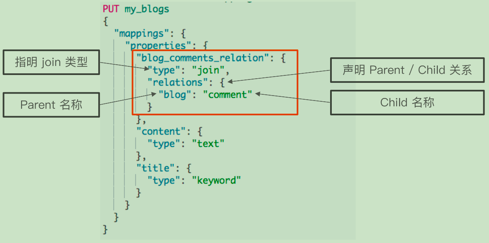
```dtd

DELETE my_blogs

# 设定 Parent/Child Mapping
PUT my_blogs
{
  "settings": {
    "number_of_shards": 2
  },
  "mappings": {
    "properties": {
      "blog_comments_relation": {
        "type": "join",
        "relations": {
          "blog": "comment"
        }
      },
      "content": {
        "type": "text"
      },
      "title": {
        "type": "keyword"
      }
    }
  }
}

```
### 索引父文档

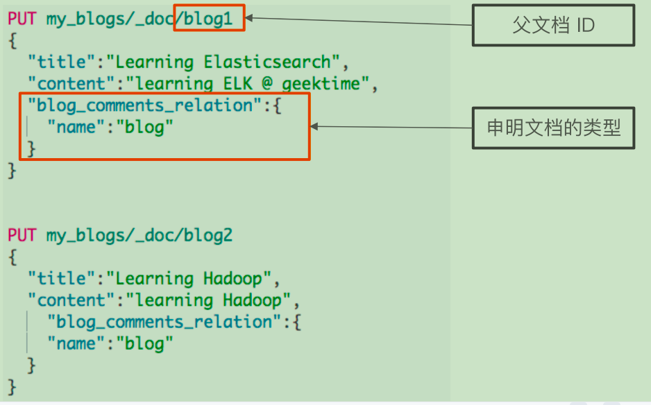

```dtd

#索引父文档
PUT my_blogs/_doc/blog1
{
  "title":"Learning Elasticsearch",
  "content":"learning ELK @ geektime",
  "blog_comments_relation":{
    "name":"blog"
  }
}

#索引父文档
PUT my_blogs/_doc/blog2
{
  "title":"Learning Hadoop",
  "content":"learning Hadoop",
    "blog_comments_relation":{
    "name":"blog"
  }
}


```

### 索引子文档

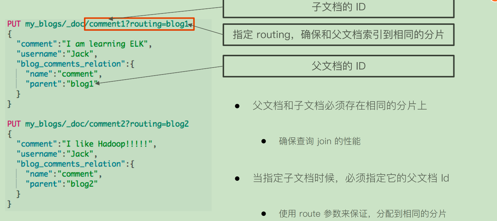

```dtd
#索引子文档
PUT my_blogs/_doc/comment1?routing=blog1
{
  "comment":"I am learning ELK",
  "username":"Jack",
  "blog_comments_relation":{
    "name":"comment",
    "parent":"blog1"
  }
}

#索引子文档
PUT my_blogs/_doc/comment2?routing=blog2
{
  "comment":"I like Hadoop!!!!!",
  "username":"Jack",
  "blog_comments_relation":{
    "name":"comment",
    "parent":"blog2"
  }
}

#索引子文档
PUT my_blogs/_doc/comment3?routing=blog2
{
  "comment":"Hello Hadoop",
  "username":"Bob",
  "blog_comments_relation":{
    "name":"comment",
    "parent":"blog2"
  }
}

# 查询所有文档
POST my_blogs/_search
{

}

```

## Parent /Child所支持的查询

- 查询所有文档
- ParentId查询
- Has Child查询
- Has Parent查询

## 使用has_child查询

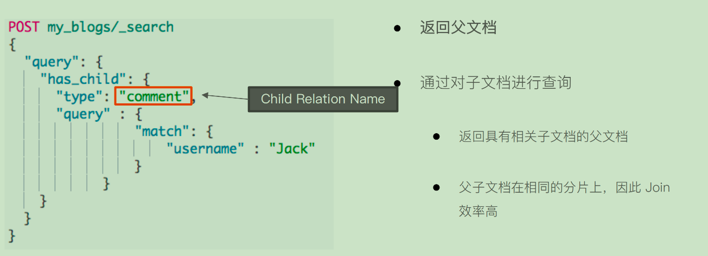


```dtd

# Has Child 查询,返回父文档
POST my_blogs/_search
{
  "query": {
    "has_child": {
      "type": "comment",
      "query" : {
                "match": {
                    "username" : "Jack"
                }
            }
    }
  }
}

```
## 使用has_parent查询

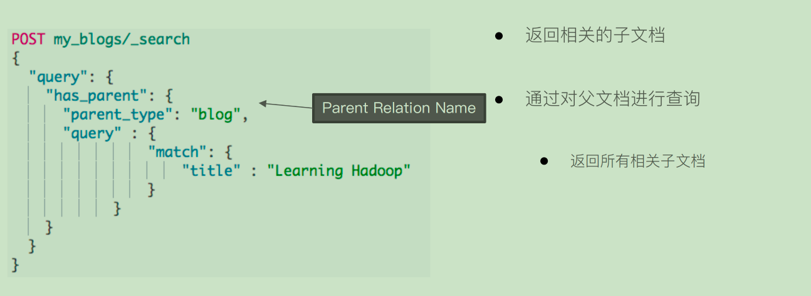

```dtd

# Has Parent 查询，返回相关的子文档
POST my_blogs/_search
{
  "query": {
    "has_parent": {
      "parent_type": "blog",
      "query" : {
                "match": {
                    "title" : "Learning Hadoop"
                }
            }
    }
  }
}

```

## 使用parent_id查询

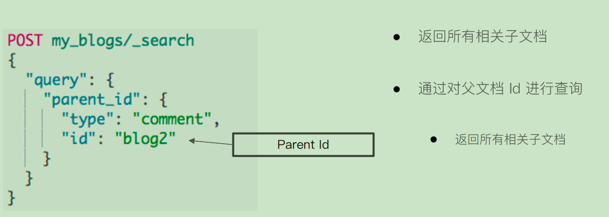

```dtd

#根据父文档ID查看
GET my_blogs/_doc/blog2

# Parent Id 查询
POST my_blogs/_search
{
  "query": {
    "parent_id": {
      "type": "comment",
      "id": "blog2"
    }
  }
}

```

## 访问子文档

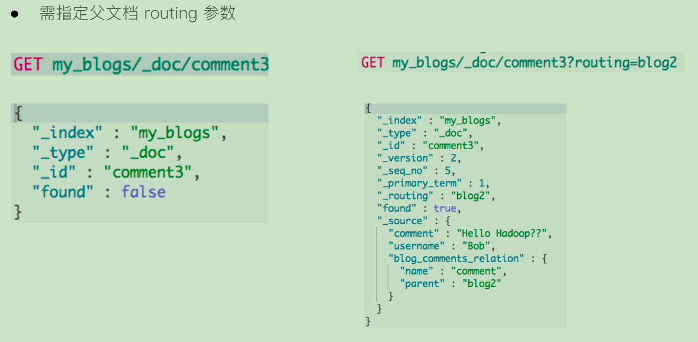

```dtd

#通过ID ，访问子文档
GET my_blogs/_doc/comment3
#通过ID和routing ，访问子文档
GET my_blogs/_doc/comment3?routing=blog2

```

## 更新子文档

- 更新子文档不会影响到父文档


```dtd

#更新子文档
PUT my_blogs/_doc/comment3?routing=blog2
{
    "comment": "Hello Hadoop??",
    "blog_comments_relation": {
      "name": "comment",
      "parent": "blog2"
    }
}
```
## 嵌套对象V.S父子文档


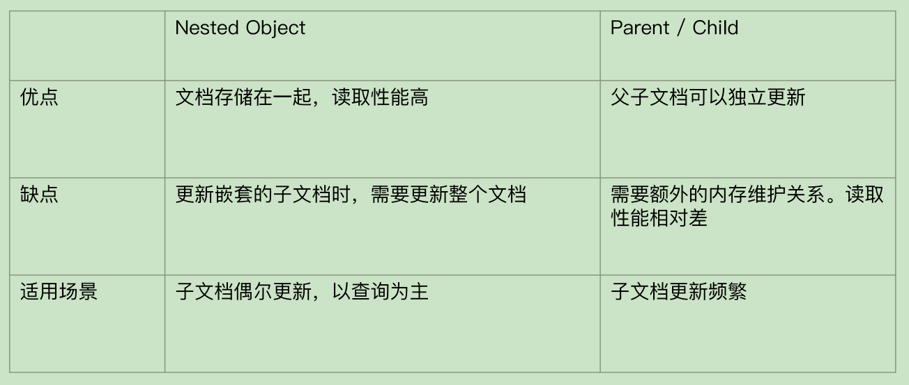

# Update By Query & Reindex API

## 使用场景

- 一般在以下几种情况时,我们需要重建索引
  - 索引的Mappings发生变更:字段类型更改,分词器及字典更新
  - 索引的Settings发生变更:索引的主分片数发生改变
  - 集群内,集群间需要做数据迁移
- Elasticsearch的内置提供的 API
  - UpdateBy Query:在现有索引上重建
  - Reindex:在其他索引上重建索引

## 案例1:为索引增加子字段

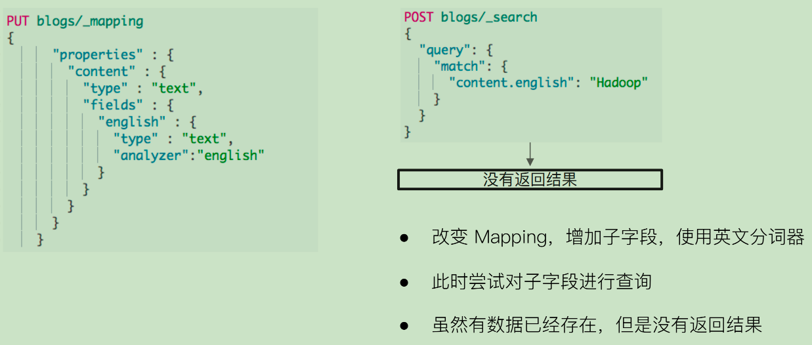

```dtd

DELETE blogs/

# 写入文档
PUT blogs/_doc/1
{
  "content":"Hadoop is cool",
  "keyword":"hadoop"
}

# 查看 Mapping
GET blogs/_mapping

# 修改 Mapping，增加子字段，使用英文分词器
PUT blogs/_mapping
{
      "properties" : {
        "content" : {
          "type" : "text",
          "fields" : {
            "english" : {
              "type" : "text",
              "analyzer":"english"
            }
          }
        }
      }
    }


# 写入文档
PUT blogs/_doc/2
{
  "content":"Elasticsearch rocks",
    "keyword":"elasticsearch"
}

# 查询新写入文档
POST blogs/_search
{
  "query": {
    "match": {
      "content.english": "Elasticsearch"
    }
  }

}

# 查询 Mapping 变更前写入的文档
POST blogs/_search
{
  "query": {
    "match": {
      "content.english": "Hadoop"
    }
  }
}


# Update所有文档
POST blogs/_update_by_query
{

}

# 查询之前写入的文档
POST blogs/_search
{
  "query": {
    "match": {
      "content.english": "Hadoop"
    }
  }
}


```

## 案例2:更改已有字段类型的Mappings

- ES不允许在原有Mapping上对字段类型进行修改
- 只能创建新的索引,并且设定正确的字段类型,再重新导入数据


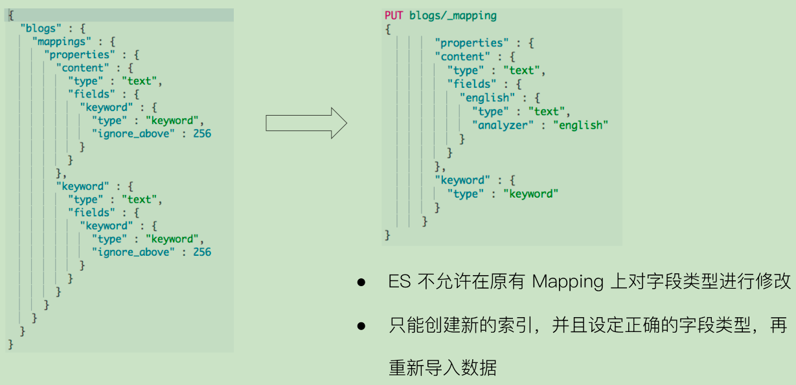

```dtd

GET blogs/_mapping

PUT blogs/_mapping
{
        "properties" : {
        "content" : {
          "type" : "text",
          "fields" : {
            "english" : {
              "type" : "text",
              "analyzer" : "english"
            }
          }
        },
        "keyword" : {
          "type" : "keyword"
        }
      }
}


```

## Reindex API

- Reindex API支持把文档从一个索引拷贝到另外一个索引
- 使用Reindex API的一些场景
  - 修改索引的主分片数
  - 改变字段的Mapping中的字段类型
  - 集群内数据迁移/跨集群的数据迁移

```dtd
# 查询
GET blogs/_mapping

PUT blogs/_mapping
{
        "properties" : {
        "content" : {
          "type" : "text",
          "fields" : {
            "english" : {
              "type" : "text",
              "analyzer" : "english"
            }
          }
        },
        "keyword" : {
          "type" : "keyword"
        }
      }
}


DELETE blogs_fix

# 创建新的索引并且设定新的Mapping
PUT blogs_fix/
{
  "mappings": {
        "properties" : {
        "content" : {
          "type" : "text",
          "fields" : {
            "english" : {
              "type" : "text",
              "analyzer" : "english"
            }
          }
        },
        "keyword" : {
          "type" : "keyword"
        }
      }    
  }
}

# Reindx API
POST  _reindex
{
  "source": {
    "index": "blogs"
  },
  "dest": {
    "index": "blogs_fix"
  }
}

GET  blogs_fix/_doc/1

# 测试 Term Aggregation
POST blogs_fix/_search
{
  "size": 0,
  "aggs": {
    "blog_keyword": {
      "terms": {
        "field": "keyword",
        "size": 10
      }
    }
  }
}


# Reindx API，version Type Internal
POST  _reindex
{
  "source": {
    "index": "blogs"
  },
  "dest": {
    "index": "blogs_fix",
    "version_type": "internal"
  }
}

# 文档版本号增加
GET  blogs_fix/_doc/1

# Reindx API，version Type Internal
POST  _reindex
{
  "source": {
    "index": "blogs"
  },
  "dest": {
    "index": "blogs_fix",
    "version_type": "external"
  }
}


# Reindx API，version Type Internal
POST  _reindex
{
  "source": {
    "index": "blogs"
  },
  "dest": {
    "index": "blogs_fix",
    "version_type": "external"
  },
  "conflicts": "proceed"
}

# Reindx API，version Type Internal
POST  _reindex
{
  "source": {
    "index": "blogs"
  },
  "dest": {
    "index": "blogs_fix",
    "op_type": "create"
  }
}


GET _tasks?detailed=true&actions=*reindex

```

## OP Type

- _reindex只会创建不存在的文档
- 文档如果已经存在,会导致版本冲突


## 本节回顾

- Update By Query 的使用场景:为字段新增子字段;字段更换分词器,或更新分词器词库
- Reindex API的使用场景:修改字段类型
- 需要先对新索引设置Mapping,索引的设置和映射关系不会被复制
- 通过查看TaskAPI,了解Reindex的状况
- Remote Reindex,需要修改 elasticsearch.yml 配置并且重启


# Ingest Pipeline 与 Painless Script

## Ingest Node

- Elasticsearch5.0后,引入的一种新的节点类型。默认配置下,每个节点都是Ingest Node
  - 具有预处理数据的能力,可拦截Index或BulkAPI的请求
  - 对数据进行转换,并重新返回给Index或BulkAPI
- 无需Logstash,就可以进行数据的预处理,例如
  - 为某个字段设置默认值;重命名某个字段的字段名;对字段值进行Split操作
  - 支持设置Painless脚本,对数据进行更加复杂的加工

```dtd
#########Demo for Pipeline###############

DELETE tech_blogs

#Blog数据，包含3个字段，tags用逗号间隔
PUT tech_blogs/_doc/1
{
  "title":"Introducing big data......",
  "tags":"hadoop,elasticsearch,spark",
  "content":"You konw, for big data"
}


# 测试split tags
POST _ingest/pipeline/_simulate
{
  "pipeline": {
    "description": "to split blog tags",
    "processors": [
      {
        "split": {
          "field": "tags",
          "separator": ","
        }
      }
    ]
  },
  "docs": [
    {
      "_index": "index",
      "_id": "id",
      "_source": {
        "title": "Introducing big data......",
        "tags": "hadoop,elasticsearch,spark",
        "content": "You konw, for big data"
      }
    },
    {
      "_index": "index",
      "_id": "idxx",
      "_source": {
        "title": "Introducing cloud computering",
        "tags": "openstack,k8s",
        "content": "You konw, for cloud"
      }
    }
  ]
}


#同时为文档，增加一个字段。blog查看量
POST _ingest/pipeline/_simulate
{
  "pipeline": {
    "description": "to split blog tags",
    "processors": [
      {
        "split": {
          "field": "tags",
          "separator": ","
        }
      },

      {
        "set":{
          "field": "views",
          "value": 0
        }
      }
    ]
  },

  "docs": [
    {
      "_index":"index",
      "_id":"id",
      "_source":{
        "title":"Introducing big data......",
  "tags":"hadoop,elasticsearch,spark",
  "content":"You konw, for big data"
      }
    },


    {
      "_index":"index",
      "_id":"idxx",
      "_source":{
        "title":"Introducing cloud computering",
  "tags":"openstack,k8s",
  "content":"You konw, for cloud"
      }
    }

    ]
}


# 为ES添加一个 Pipeline
PUT _ingest/pipeline/blog_pipeline
{
  "description": "a blog pipeline",
  "processors": [
      {
        "split": {
          "field": "tags",
          "separator": ","
        }
      },

      {
        "set":{
          "field": "views",
          "value": 0
        }
      }
    ]
}

#查看Pipleline
GET _ingest/pipeline/blog_pipeline


#测试pipeline
POST _ingest/pipeline/blog_pipeline/_simulate
{
  "docs": [
    {
      "_source": {
        "title": "Introducing cloud computering",
        "tags": "openstack,k8s",
        "content": "You konw, for cloud"
      }
    }
  ]
}

#不使用pipeline更新数据
PUT tech_blogs/_doc/1
{
  "title":"Introducing big data......",
  "tags":"hadoop,elasticsearch,spark",
  "content":"You konw, for big data"
}

#使用pipeline更新数据
PUT tech_blogs/_doc/2?pipeline=blog_pipeline 
{
  "title": "Introducing cloud computering",
  "tags": "openstack,k8s",
  "content": "You konw, for cloud"
}


#查看两条数据，一条被处理，一条未被处理
POST tech_blogs/_search
{}

#update_by_query 会导致错误
POST tech_blogs/_update_by_query?pipeline=blog_pipeline
{
}

#增加update_by_query的条件
POST tech_blogs/_update_by_query?pipeline=blog_pipeline
{
    "query": {
        "bool": {
            "must_not": {
                "exists": {
                    "field": "views"
                }
            }
        }
    }
}


#########Demo for Painless###############

# 增加一个 Script Prcessor
POST _ingest/pipeline/_simulate
{
  "pipeline": {
    "description": "to split blog tags",
    "processors": [
      {
        "split": {
          "field": "tags",
          "separator": ","
        }
      },
      {
        "script": {
          "source": """
          if(ctx.containsKey("content")){
            ctx.content_length = ctx.content.length();
          }else{
            ctx.content_length=0;
          }


          """
        }
      },

      {
        "set":{
          "field": "views",
          "value": 0
        }
      }
    ]
  },

  "docs": [
    {
      "_index":"index",
      "_id":"id",
      "_source":{
        "title":"Introducing big data......",
  "tags":"hadoop,elasticsearch,spark",
  "content":"You konw, for big data"
      }
    },


    {
      "_index":"index",
      "_id":"idxx",
      "_source":{
        "title":"Introducing cloud computering",
  "tags":"openstack,k8s",
  "content":"You konw, for cloud"
      }
    }

    ]
}


DELETE tech_blogs
PUT tech_blogs/_doc/1
{
  "title":"Introducing big data......",
  "tags":"hadoop,elasticsearch,spark",
  "content":"You konw, for big data",
  "views":0
}

POST tech_blogs/_update/1
{
  "script": {
    "source": "ctx._source.views += params.new_views",
    "params": {
      "new_views":100
    }
  }
}

# 查看views计数
POST tech_blogs/_search
{

}

#保存脚本在 Cluster State
POST _scripts/update_views
{
  "script":{
    "lang": "painless",
    "source": "ctx._source.views += params.new_views"
  }
}

POST tech_blogs/_update/1
{
  "script": {
    "id": "update_views",
    "params": {
      "new_views":1000
    }
  }
}


GET tech_blogs/_search
{
  "script_fields": {
    "rnd_views": {
      "script": {
        "lang": "painless",
        "source": """
          java.util.Random rnd = new Random();
          doc['views'].value+rnd.nextInt(1000);
        """
      }
    }
  },
  "query": {
    "match_all": {}
  }
}

```


# Elasticsearch数据建模最佳实践


# Elasticsearch数据建模最佳实践


## 建模建议(一):如何处理关联关系

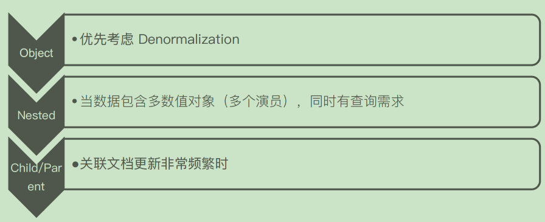


## 建模建议(二):避免过多字段


- 一个文档中,最好避免大量的字段
- 过多的字段数不容易维护
- Mapping信息保存在Cluster State中,数据量过大,对集群性能会有影响 (Cluster State信息需要和所有的节点同步)
- 删除或者修改数据需要reindex
- 默认最大字段数是1000,可以设置index.mapping.total_fields.limit限定最大字段数。
  - 什么原因会导致文档中有成百上千的字段?

## Dynamic v.s Strict

- Dynamic(生产环境中,尽量不要打开 Dynamic)
  - true-未知字段会被自动加入
  - false-新字段不会被索引。但是会保存在_source
  - strict-新增字段不会被索引,文档写入失败
- Strict
  - 可以控制到字段级别

## 一个例子:Cookie Service的数据

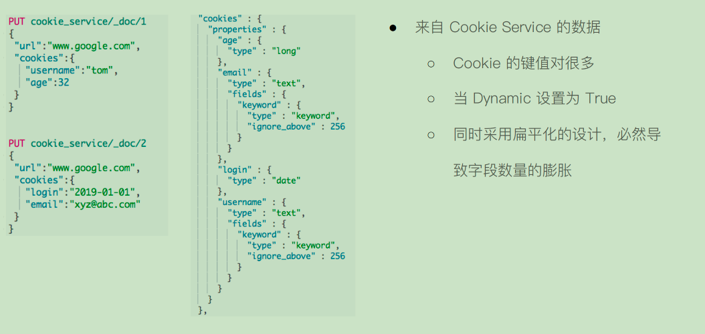


### 解决方案:Nested Object&Key Value

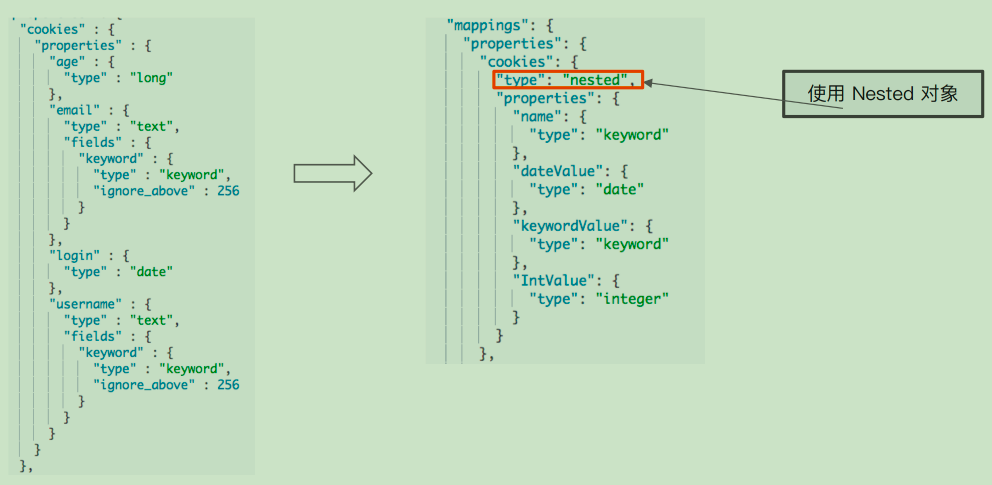

### 写入&查询

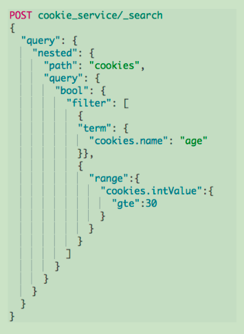

## 建模建议(三):避免正则查询

- 问题:
  - 正则,通配符查询,前缀查询属于Term查询,但是性能不够8好
  - 特别是将通配符放在开头,会导致性能的灾难
- 案例:
  - 文档中某个字段包含了Elasticsearch的版本信息,例如version: "7.1.0"
  - 搜索所有是bugfix的版本?每个主要版本号所关联的文档?

## 解决方案:将字符串转换为对象

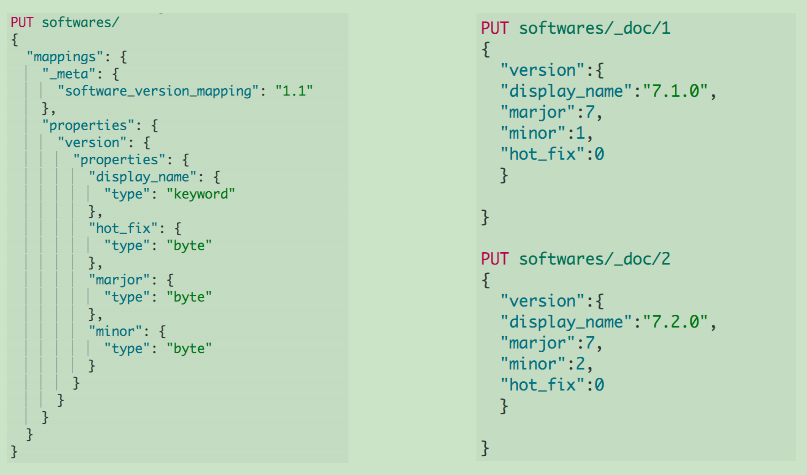


### 搜索过滤

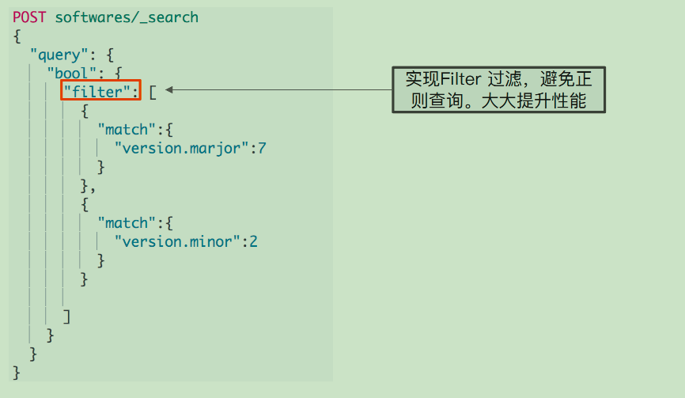

## 建模建议(四):避免空值引起的聚合不准

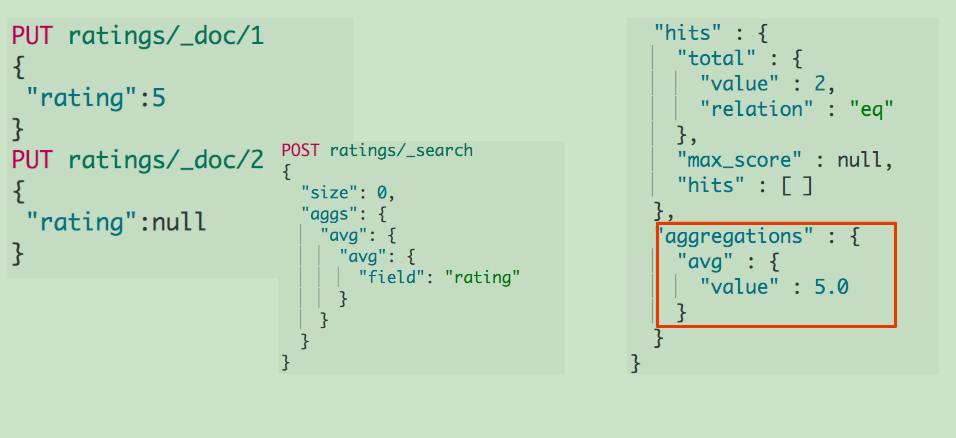

### 使用Null_Value解决空值的问题
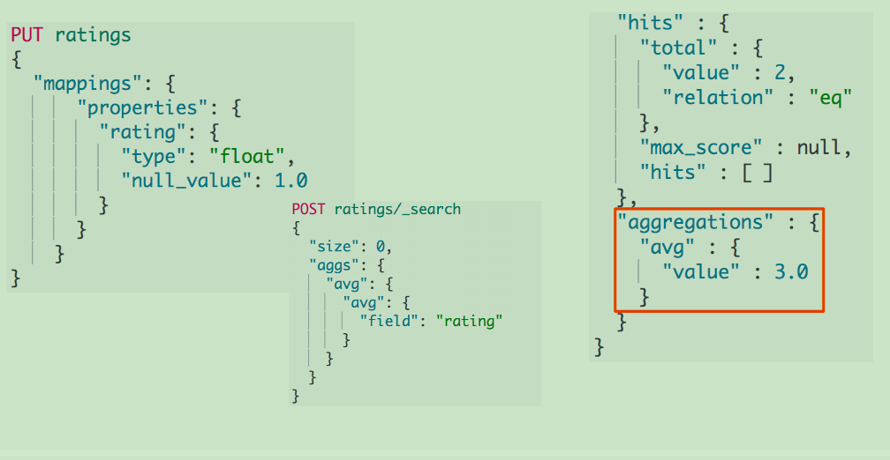


## 建模建议(五):为索引的Mapping加入Meta信息

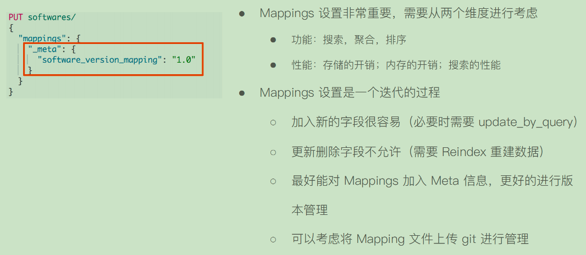

### 本章支持点

- 数据建模对于功能与性能至关重要。Mapping文件需要考虑加入片版本管理
- 通过2个例子,了解如何通过建模,提高系统的性能
  - 使用Inner Object避免了低性能的正则匹配
  - 使用 Nested Object和将Dynamic Mapping设为Strict避免字段数量过多带来的问题
- 通过1个例子,了解如何通过建模,提高聚合结果的准确度度
  - 设置 Null Value


```dtd

###### Data Modeling Example

# Index 一本书的信息
PUT books/_doc/1
{
  "title":"Mastering ElasticSearch 5.0",
  "description":"Master the searching, indexing, and aggregation features in ElasticSearch Improve users’ search experience with Elasticsearch’s functionalities and develop your own Elasticsearch plugins",
  "author":"Bharvi Dixit",
  "public_date":"2017",
  "cover_url":"https://images-na.ssl-images-amazon.com/images/I/51OeaMFxcML.jpg"
}


#查询自动创建的Mapping
GET books/_mapping

DELETE books

#优化字段类型
PUT books
{
      "mappings" : {
      "properties" : {
        "author" : {"type" : "keyword"},
        "cover_url" : {"type" : "keyword","index": false},
        "description" : {"type" : "text"},
        "public_date" : {"type" : "date"},
        "title" : {
          "type" : "text",
          "fields" : {
            "keyword" : {
              "type" : "keyword",
              "ignore_above" : 100
            }
          }
        }
      }
    }
}

#Cover URL index 设置成false，无法对该字段进行搜索
POST books/_search
{
  "query": {
    "term": {
      "cover_url": {
        "value": "https://images-na.ssl-images-amazon.com/images/I/51OeaMFxcML.jpg"
      }
    }
  }
}

#Cover URL index 设置成false，依然支持聚合分析
POST books/_search
{
  "aggs": {
    "cover": {
      "terms": {
        "field": "cover_url",
        "size": 10
      }
    }
  }
}


DELETE books
#新增 Content字段。数据量很大。选择将Source 关闭
PUT books
{
      "mappings" : {
      "_source": {"enabled": false},
      "properties" : {
        "author" : {"type" : "keyword","store": true},
        "cover_url" : {"type" : "keyword","index": false,"store": true},
        "description" : {"type" : "text","store": true},
         "content" : {"type" : "text","store": true},
        "public_date" : {"type" : "date","store": true},
        "title" : {
          "type" : "text",
          "fields" : {
            "keyword" : {
              "type" : "keyword",
              "ignore_above" : 100
            }
          },
          "store": true
        }
      }
    }
}


# Index 一本书的信息,包含Content
PUT books/_doc/1
{
  "title":"Mastering ElasticSearch 5.0",
  "description":"Master the searching, indexing, and aggregation features in ElasticSearch Improve users’ search experience with Elasticsearch’s functionalities and develop your own Elasticsearch plugins",
  "content":"The content of the book......Indexing data, aggregation, searching.    something else. something in the way............",
  "author":"Bharvi Dixit",
  "public_date":"2017",
  "cover_url":"https://images-na.ssl-images-amazon.com/images/I/51OeaMFxcML.jpg"
}

#查询结果中，Source不包含数据
POST books/_search
{}

#搜索，通过store 字段显示数据，同时高亮显示 conent的内容
POST books/_search
{
  "stored_fields": ["title","author","public_date"],
  "query": {
    "match": {
      "content": "searching"
    }
  },

  "highlight": {
    "fields": {
      "content":{}
    }
  }

}

```


