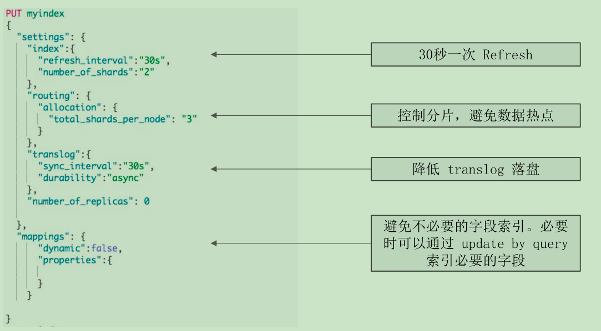

# 集群身份认证与用户鉴权


```dtd

docker run -d --name elasticsearch0 -p 9203:9200 -p 9303:9300 -e "discovery.type=single-node" -e "cluster.name=cluster0" -e  "node.name=cluster0node" -e "xpack.security.enabled=true" docker.elastic.co/elasticsearch/elasticsearch:7.1.0

#运行密码设定的命令，设置ES内置用户及其初始密码。
bin/elasticsearch-setup-passwords interactive

curl -u elastic 'localhost:9203/_cat/nodes?pretty'


```

# 集群内部间的安全通信


```dtd
```
docker run -d --name elasticsearch0 -p 9203:9200 -p 9303:9300 -e "discovery.seed_hosts=192.168.56.112" -e "cluster.initial_master_nodes=cluster0node" -e "cluster.name=cluster_a" -e  "node.name=cluster0node" docker.elastic.co/elasticsearch/elasticsearch:7.1.0

# 生成证书
# 为您的Elasticsearch 集群创建一个证书颁发机构。例如，使用elasticsearch-certutil ca命令：
bin/elasticsearch-certutil ca

#为群集中的每个节点生成证书和私钥。例如，使用elasticsearch-certutil cert 命令：
bin/elasticsearch-certutil cert --ca elastic-stack-ca.p12

#将证书拷贝到 config/certs目录下
elastic-certificates.p12

# 将容器的证书拷贝到宿主机上
docker cp fa0ac54de1c5:/usr/share/elasticsearch/elastic-stack-ca.p12 /root/es-study

docker run -v /root/es-study/elastic-stack-ca.p12:/usr/share/elasticsearch/config/elastic-stack-ca.p12 -d --name elasticsearch1 -p 9204:9200 -p 9304:9300 -e "transport.tcp.port=9303" -e "discovery.seed_hosts=192.168.56.112" -e "cluster.initial_master_nodes=cluster0node" -e "cluster.name=cluster_a" -e  "node.name=cluster1node" -e "xpack.security.enabled=true" -e "xpack.security.transport.ssl.enabled=true" -e "xpack.security.transport.ssl.verification_mode=certificate" -e "xpack.security.transport.ssl.keystore.path=elastic-stack-ca.p12" -e "xpack.security.transport.ssl.truststore.path=elastic-stack-ca.p12" docker.elastic.co/elasticsearch/elasticsearch:7.1.0

docker run -d --name elasticsearch2 -p 9205:9200 -p 9305:9300 -e "transport.tcp.port=9303" -e "discovery.seed_hosts=192.168.56.112" -e "cluster.initial_master_nodes=cluster0node" -e "cluster.name=cluster_a" -e  "node.name=cluster2node" docker.elastic.co/elasticsearch/elasticsearch:7.1.0

docker run -d --name elasticsearch1 -p 9204:9200 -p 9304:9300 -e "discovery.type=single-node" -e "cluster.name=cluster1" -e  "node.name=cluster1node"  -E "xpack.security.enabled=true" -E "xpack.security.transport.ssl.enabled=true" -E "xpack.security.transport.ssl.verification_mode=certificate" -E "xpack.security.transport.ssl.keystore.path=/root/es-study/elastic-stack-ca.p12" -E "xpack.security.transport.ssl.truststore.path=/root/es-study/elastic-stack-ca.p12" docker.elastic.co/elasticsearch/elasticsearch:7.1.0


bin/elasticsearch -E node.name=node0 -E cluster.name=geektime -E path.data=node0_data -E http.port=9200 -E xpack.security.enabled=true -E xpack.security.transport.ssl.enabled=true -E xpack.security.transport.ssl.verification_mode=certificate -E xpack.security.transport.ssl.keystore.path=certs/elastic-certificates.p12 -E xpack.security.transport.ssl.truststore.path=certs/elastic-certificates.p12

bin/elasticsearch -E node.name=node1 -E cluster.name=geektime -E path.data=node1_data -E http.port=9201 -E xpack.security.enabled=true -E xpack.security.transport.ssl.enabled=true -E xpack.security.transport.ssl.verification_mode=certificate -E xpack.security.transport.ssl.keystore.path=certs/elastic-certificates.p12 -E xpack.security.transport.ssl.truststore.path=certs/elastic-certificates.p12


#不提供证书的节点，无法加入
bin/elasticsearch -E node.name=node2 -E cluster.name=geektime -E path.data=node2_data -E http.port=9202 -E xpack.security.enabled=true -E xpack.security.transport.ssl.enabled=true -E xpack.security.transport.ssl.verification_mode=certificate


```


```
## elasticsearch.yml 配置

#xpack.security.transport.ssl.enabled: true
#xpack.security.transport.ssl.verification_mode: certificate

#xpack.security.transport.ssl.keystore.path: certs/elastic-certificates.p12
#xpack.security.transport.ssl.truststore.path: certs/elastic-certificates.p12

```

```

# 集群写性能优化

## 提高写入性能的方法

- 写性能优化的目标:增大写吞吐量(EventsPer Second),,越高越好
- 客户端:多线程,批量写
  - 可以通过性能测试,确定最佳文档数量
  - 多线程:需要观察是否有HTTP429返回,实现Retry以及线程数量的自动调节
- 服务器端:单个性能问题,往往是多个因素造成的。需要先分解问题,在单个节点上进行调整并 且结合测试,尽可能压榨硬件资源,以达到最高吞吐量
  - 使用更好的硬件。观察CPU/I0Block
  - 线程切换/堆栈状况


## 服务器端优化写入性能的一些手段

- 降低I0操作
  - 使用ES自动生成的文档Id/一些相关的ES配置,如Refresh Interval
- 降低CPU和存储开销
  - 减少不必要分词/避免不需要的doc values/文档的字段尽量保证相同的顺序,可以提高文档的压缩率
- 尽可能做到写入和分片的均衡负载,实现水平扩展
  - Shard Filtering / Write Load Balancer
- 调整Bulk线程池和队列


## 优化写入性能

- ES的默认设置,已经综合考虑了数据可靠性,搜索的实时性质,写入速度,一般不要盲目修改
- 一切优化,都要基于高质量的数据建模


## 关闭无关的功能

- 只需要聚合不需要搜索,Index设置成false
- 不需要算分,Norms 设置成false
- 不要对字符串使用默认的dynamic mapping。字段数量过多,会对性能产生比较大的影响
- Index_options控制在创建倒排索引时,哪些内容会被添加到倒排索引中。优化这些设置,一定程度可以节约CPU
- 关闭 source,减少 I0操作;(适合指标型数据)


## 针对性能的取舍

- 如果需要追求极致的写入速度,可以牺牲数据可靠性及搜索实时性以换取性能
- 牺牲可靠性:将副本分片设置为0,写入完毕再调整回去
- 牺牲搜索实时性:增加RefreshInterval的时间
- 牺牲可靠性:修改Trans log的配置

## 数据写入的过程

- Refresh
  - 将文档先保存在Index buffer中,以refresh_interval为间隔时间,定期清空buffer,生成segment,借助文件系统缓存的特性,先将 segment放在文件系统缓不存中,并开放查询,以提升搜索的实时性
- Trans log
  - Segment没有写入磁盘,即便发生了当机,重启后,数据也能恢复夏,默认配置是每次请求都会落盘
- Flush
  - 删除旧的trans log文件 ,生成Segment并写入磁盘/更新commit point并写入磁盘。ES自动完成,可优化点不多

## Refresh Interval

- 降低 Refresh的频率
  - 增加 refresh interval的数值。默认为ls,如果设置成-1,会禁止自动refresh
    - 避免过于频繁的refresh,而生成过多的 segment文件
    - 但是会降低搜索的实时性
  - 增大静态配置参数indices.memory.index buffer size
    - 默认是10%,会导致自动触发refresh

## Trans log

- 降低写磁盘的频率,但是会降低容灾能力
  - Index.translog.durability:默认是request,每个请求都落盘。设投置成async,异步写入
  - Index.translog.sync_interval设置为60s,每分钟执行一次
  - Index.translog.flush_threshold_size:默认512mb,可以适当调大。当trans log超过该值,会触发flush

## 分片设定

- 副本在写入时设为0,完成后再增加
- 合理设置主分片数,确保均匀分配在所有数据节点上
  - Index.routing.allocation.total_share_per_node:限定每个索引[在每个节点上可分配的主分片数
  - 5个节点的集群。索引有5个主分片,1个副本,应该如何设置?
    - (5+5)/ 5 = 2
    - 生产环境中要适当调大这个数字,避免有节点下线时,分片无法正常迁移

## Bulk,线程池和队列大小

- 客户端
  - 单个bulk请求体的数据量不要太大,官方建议大约5-15mb
  - 写入端的bulk请求超时需要足够长,建议60s以上
  - 写入端尽量将数据轮询打到不同节点。
- 服务器端
  - 索引创建属于计算密集型任务,应该使用固定大小的线程池来配置来不及处理的放入队列,线程数应该
  - 配置成CPU核心数+1,避免过多的上下文切换
  - 队列大小可以适当增加,不要过大,否则占用的内存会成我为GC的负担

## 一个索引设定的例子




# 集群读性能优化

## 尽量 Denormalize数据

- Elasticsearch!=关系型数据库
- 尽可能Denormalize数据,从而获取最佳的性能
  - 使用Nested类型的数据。查询速度会慢几倍
  - 使用Parent/Child关系。查询速度会慢几百倍

## 数据建模

- 尽量将数据先行计算,然后保存到Elasticsearch中。尽量避免查询时的Script计算
- 尽量使用FilterContext,利用缓存机制,减少不必要的算3分
- 结合 profile,explainAPI分析慢查询的问题,持续优化数据模型
  - 严禁使用*开头通配符Terms查询

## 常见的查询性能问题-使用 Query Context


## 聚合文档消耗内存

- 聚合查询会消耗内存,特别是针对很大的数据集进行聚合运算
  - 如果可以控制聚合的数量,就能减少内存的开销
- 当需要使用不同的Query Scope,可以使用FilterBucket

## 通配符开始的正则表达

- 通配符开头的正则,性能非常糟糕,需避免使用


## 优化分片


- 避免 Over Sharing
  - 一个查询需要访问每一个分片,分片过多,会导致不必要的查询开销
- 结合应用场景,控制单个分片的尺寸
  - Search: 20GB
  - Logging: 40GB
- Force-merge Read-only索引
  - 使用基于时间序列的索引,将只读的索引进行force merge,减少segment数量

# 解决集群 Yellow 与 Red 的问题

## 集群健康度

- 分片健康
  - 红:至少有一个主分片没有分配
  - 黄:至少有一个副本没有分配
  - 绿:主副本分片全部正常分配
- 索引健康:最差的分片的状态
- 集群健康:最差的索引的状态


## 案例1 集群变红


- 分析:通过Allocation ExplainAPI发现创建索引失败,因为无法找到标记了相应boxtype的节点
- 解决:删除索引,集群变绿。重新创建索引,并且指定正确的routing box type,索引创建成功。集群保持绿色状态

```dtd
#案例1
DELETE mytest
PUT mytest
{
  "settings":{
    "number_of_shards":3,
    "number_of_replicas":0,
    "index.routing.allocation.require.box_type":"hott"
  }
}

# 检查集群状态，查看是否有节点丢失，有多少分片无法分配
GET /_cluster/health/

# 查看索引级别,找到红色的索引
GET /_cluster/health?level=indices


#查看索引的分片
GET _cluster/health?level=shards

# Explain 变红的原因
GET /_cluster/allocation/explain

GET /_cat/shards/mytest
GET _cat/nodeattrs

DELETE mytest
GET /_cluster/health/

PUT mytest
{
  "settings":{
    "number_of_shards":3,
    "number_of_replicas":0,
    "index.routing.allocation.require.box_type":"hot"
  }
}

GET /_cluster/health/

```

## 案例2 集群变黄

- 分析:通过Allocation Explain API 发现无法在相同的节点上创建副本
- 解决:将索引的副本数设置为0,或者通过增加节点解决

```dtd
#案例2, Explain 看 hot 上的 explain
DELETE mytest
PUT mytest
{
  "settings":{
    "number_of_shards":2,
    "number_of_replicas":1,
    "index.routing.allocation.require.box_type":"hot"
  }
}

GET _cluster/health
GET _cat/shards/mytest
GET /_cluster/allocation/explain

PUT mytest/_settings
{
    "number_of_replicas": 0
}
```
## 分片没有被分配的一些原因

- INDEX_CREATE:创建索引导致。在索引的全部分片分配完成之前,会有短暂的Red,不一定代表有问题
- CLUSTER_RECOVER:集群重启阶段,会有这个问题
- INDEX_REOPEN:Open一个之前Close 的索引
- DANGLING_INDEX_IMPORTED:一个节点离开集群期间,有索引被删除。这个节点重新返回时,会导致Dangling的问题


## 常见问题与解决方法

- 集群变红,需要检查是否有节点离线。如果有,通常通过重启离线的节点可以解决问题
- 由于配置导致的问题,需要修复相关的配置(例如错误的box_type,错误的副本数)
如果是测试的索引,可以直接删除
- 因为磁盘空间限制,分片规则(Shard Filtering)引发的,需要调整规则或者增加节点
- 对于节点返回集群,导致的dangling变红,可直接删除dangling 索引

## 集群 Red & Yellow 问题的总结

- Red&Yellow是集群运维中常见的问题
- 除了集群故障,一些创建,增加副本等操作, 都会导致集群短暂的Red和Yellow,所以监控和报警时需要设置一定的延时
- 通过检查节点数,使用ES提供的相关API, 找到真正的原因
- 可以指定Move或者Reallocate分片


# 段合并优化及注意事项

## Lucene Index原理回顾


- 在Lucene中,单个倒排索引文件被称为
Segment。Segment是自包含的,不可变更的。
多个Segments汇总在一起,称为 Lucene的
Index,其对应的就是ES中的Shard
- 当有新文档写入时,并且执行Refresh,就会
会生成一个新Segment。Lucene中有一个文
件,用来记录所有Segments信息,叫做
Commit Point。查询时会同时查询所有
Segments,并且对结果汇总。
- 删除的文档信息,保存在".del"文件中,查
询后会进行过滤。
- Segment 会定期 Merge,合并成一个,同时删
除已删除文档

## Merge优化

- ES 和 Lucene 会自动进行 Merge操作
- Merge操作相对比较重,需要优化,降低对系统的影响
- 优化点一:降低分段产生的数量/频率
  - 可以将RefreshInterval调整到分钟级别
  - indices.memory.index_buffer_size(默认是10%)尽量避免文档的更新操作

- 优化点二:降低最大分段大小,避免较大的分段继续参与Merge,节省系统资源。 最终会有多个分段)
  - Index.merge.policy.segments_per_tier,默认为10,越小需要越多的合并操作
  - Index.merge.policy.max_merged_segment,默认5GB,操作此大小以后,就不再参与后续的
  合并操作

## Force Merge

- Index不再有写入操作的时候,建议对其进行force merge
  - 提升查询速度/减少内存开销
    - POST geonames/_forcemerge?max_num_segments=1
    - GET_cat/segments/geonames?v
- 最终分成几个segments比较合适?
  - 越少越好,最好可以forcemerge成1个,但是,Force Merge会占用大量的网络,I0和CPU
  - 如果不能在业务高峰期之前做完,就需要考虑增大最终的分段数
    - Shard的大小/Index.merge.policy.max_merged_segment的大小

# 缓存及使用 Circuit Breaker 限制内存使用

## Inside the JVM Heap


- Elasticsearch的缓存主要分成三大类
  - Node Query Cache (Filter Context)
  - Shard QueryCache (Cache Query的结果)
  - Fielddata Cache

## Node Query Cache

- 每一个节点有一个NodeQuery缓存
  - 由该节点的所有Shard共享,只缓存FilterContext相关内容
  - Cache采用LRU算法
- 静态配置,需要设置在每个Data Node上
  - Node Level - indices.queries.cache.size: "10%"
  - Index Level: index.queries.cache.enabled: true

## Shard Request Cache

- 缓存每个分片上的查询结果
  - 只会缓存设置了size=0的查询对应的结果。不会缓存
  hits。但是会缓存 Aggregations和Suggestions
- Cache Key
  - LRU算法,将整个JSON查询串作为 Key,与JSON对象的顺序相关
- 静态配置
  - 数据节点:indices.requests.cache.size:"1%"

## Fielddata Cache

- 除了Text类型,默认都采用doc_values。节约了内存
  - Aggregation 的 Global ordinals 也保存在 Fielddata cache
- Text类型的字段需要打开Fileddata才能对其进行聚合和排序
  - Text经过分词,排序和聚合效果不佳,建议不要轻易使用
- 配置
  - 可以控制 Indices.fielddata.cache.size,避免产生GC(黑认无限制

## 缓存失效

- Node Query Cache
  - 保存的是Segment级缓存命中的结果。Segment被合并后,缓存会失效
- Shard Request Cache
  - 分片Refresh时候,Shard RequestCache会失效。如果Shard对应的数据频繁发生变化,该缓存的效
  率会很差
- Fielddata Cache
  - Segment被合并后,会失效


## 管理内存的重要性

- Elasticsearch高效运维依赖于内存的合理分配
  - 可用内存一半分配给JVM,一半留给操作系统,缓存索引文件
- 内存问题,引发的问题
  - 长时间GC,影响节点,导致集群响应缓慢
  - OOM, 导致丢节点

## 诊断内存状况

```dtd

GET _cat/nodes?v

GET _nodes/stats/indices?pretty

GET _cat/nodes?v&h=name,queryCacheMemory,queryCacheEvictions,requestCacheMemory,requestCacheHitCount,request_cache.miss_count

GET _cat/nodes?h=name,port,segments.memory,segments.index_writer_memory,fielddata.memory_size,query_cache.memory_size,request_cache.memory_size&v


```

## 一些常见的内存问题
- Segments个数过多,导致fullGC
- 现象:集群整体响应缓慢,也没有特别多的数据读写。但是发现节点在持续进行Full GC
- 分析:查看Elasticsearch的内存使用,发现segments.memory 占用很大空间
- 解决:通过 forcemerge,把segments合并成一个。
- 建议:对于不在写入和更新的索引,可以将其设置成只读。同时,进行 force merge操作。如果问题依然存在,则需要考虑扩容。此外,对索引进行fordce merge,还可以减少对
global ordinals数据结构的构建,减少对 fielddata caclhe 的开销

## 一些常见的内存问题

- Field data cache过大,导致 full GC
- 现象:集群整体响应缓慢,也没有特别多的数据读写。但是发现节点在持续进行Full GC
- 分析:查看Elasticsearch的内存使用,发现fielddata.memory.size占用很大空间。同时,
数据不存在写入和更新,也执行过 segments merge。
- 解决:将indices.fielddata.cache.size设小,重启节点,堆内存恢复正常
- 建议:Field data cache的构建比较重,Elasticsearch不会主动释放,所以这个值应该设置
的保守一些。如果业务上确实有所需要,可以通过增加节点,扩容解决


## 一些常见的内存问题


- 复杂的嵌套聚合,导致集群fullGC
- 现象:节点响应缓慢,持续进行FullGC
- 分析:导出Dump分析。发现内存中有大量bucket对象,子查看日志,发现复杂的嵌套聚合
- 解决:优化聚合
- 建议:在大量数据集上进行嵌套聚合查询,需要很大的均维内存来完成。如果业务场景确实需要。
则需要增加硬件进行扩展。同时,为了避免这类查询影响整个集群,需要设置Circuit Breaker和search.max_buckets的数值


## Circuit Breaker

- 包含多种断路器,避免不合理操作引发的00M,每个断路器可以指定内存使用的限制
  - Parent circuit breaker:设置所有的熔断器可以使用的内存的总量
  - Fielddata circuit breaker:加载 fielddata所需要的内存
  - Request circuit breaker:防止每个请求级数据结构超过一定定的内存(例如聚合计算的内存)
  - Inflight circuit breaker:Request中的断路器
  - Accounting request circuit breaker:请求结束后不能释放的对象所占用的内存


## Circuit Breaker统计信息

- GET /_nodes/stats/breaker?
  - Tripped大于0,说明有过熔断
  - limit_size与estimated_size越接近,越可能引发熔断
- 千万不要触发了熔断,就盲目调大参数,有可能会导致集群中出问题,也不因该盲目调小,需要进行评估
- 建议将集群升级到7.x,更好的Circuit Breaker实现机制
  - 增加了 indices.breaker.total.use_real_memory配置项,可以更
  加精准的分析内存状况,避免00M


# 监控 Elasticsearch集群


```
# Node Stats：
GET _nodes/stats

#Cluster Stats:
GET _cluster/stats

#Index Stats:
GET kibana_sample_data_ecommerce/_stats

#Pending Cluster Tasks API:
GET _cluster/pending_tasks

# 查看所有的 tasks，也支持 cancel task
GET _tasks


GET _nodes/thread_pool
GET _nodes/stats/thread_pool
GET _cat/thread_pool?v
GET _nodes/hot_threads
GET _nodes/stats/thread_pool


# 设置 Index Slowlogs
# the first 1000 characters of the doc's source will be logged
PUT my_index/_settings
{
  "index.indexing.slowlog":{
    "threshold.index":{
      "warn":"10s",
      "info": "4s",
      "debug":"2s",
      "trace":"0s"
    },
    "level":"trace",
    "source":1000  
  }
}

# 设置查询
DELETE my_index
//"0" logs all queries
PUT my_index/
{
  "settings": {
    "index.search.slowlog.threshold": {
      "query.warn": "10s",
      "query.info": "3s",
      "query.debug": "2s",
      "query.trace": "0s",
      "fetch.warn": "1s",
      "fetch.info": "600ms",
      "fetch.debug": "400ms",
      "fetch.trace": "0s"
    }
  }
}

GET my_index


```

# 使用Shrink与RolloverAPI管理索引


## 索引管理 API

- Open / Close Index:索引关闭后无法进行读写,但是索引数据不会被删除
- Shrink Index:可以将索引的主分片数收缩到较小的值
- SplitIndex:可以扩大主分片个数
- Rollover Index:类似Log4J记录日志的方式,索引尺寸或我者时间超过一定值后,创建新的
- Rollup Index:对数据进行处理后,重新写入,减少数据量

## Open / Close Index API

- 索引关闭后,对集群的相关开销基本降低为0
- 但是无法被读取和搜索
- 当需要的时候,可以重新打开

```dtd

# 打开关闭索引
DELETE test
#查看索引是否存在
HEAD test

PUT test/_doc/1
{
"key":"value"
}

#关闭索引
POST /test/_close
#索引存在
HEAD test
# 无法查询
POST test/_count

#打开索引
POST /test/_open
POST test/_search
{
"query": {
"match_all": {}
}
}
POST test/_count
```

## Shrink API

- ES 5.x后推出的一个新功能,使用场景
  - 索引保存的数据量比较小,需要重新设定主分片数
    - 索引从Hot移动到Warm后,需要降低主分片数
- 会使用和源索引相同的配置创建一个新的索引,仅仅降低主分片数
  - 源分片数必须是目标分片数的倍数。如果源分片数是素数,目目标分片数只能为1
  - 如果文件系统支持硬链接,会将Segments硬连接到目标索引引,所以性能好
- 完成后,可以删除源索引

- 分片必须只读
- 所有的分片必须在同一个节点上
- 集群健康状态为Green


```
# 在一个 hot-warm-cold的集群上进行测试
GET _cat/nodes
GET _cat/nodeattrs

DELETE my_source_index
DELETE my_target_index
PUT my_source_index
{
"settings": {
"number_of_shards": 4,
"number_of_replicas": 0
}
}

PUT my_source_index/_doc/1
{
"key":"value"
}

GET _cat/shards/my_source_index

# 分片数3，会失败
POST my_source_index/_shrink/my_target_index
{
"settings": {
"index.number_of_replicas": 0,
"index.number_of_shards": 3,
"index.codec": "best_compression"
},
"aliases": {
"my_search_indices": {}
}
}


# 报错，因为没有置成 readonly
POST my_source_index/_shrink/my_target_index
{
"settings": {
"index.number_of_replicas": 0,
"index.number_of_shards": 2,
"index.codec": "best_compression"
},
"aliases": {
"my_search_indices": {}
}
}

#将 my_source_index 设置为只读
PUT /my_source_index/_settings
{
"settings": {
"index.blocks.write": true
}
}

# 报错，必须都在一个节点
POST my_source_index/_shrink/my_target_index
{
"settings": {
"index.number_of_replicas": 0,
"index.number_of_shards": 2,
"index.codec": "best_compression"
},
"aliases": {
"my_search_indices": {}
}
}

DELETE my_source_index
## 确保分片都在 hot
PUT my_source_index
{
"settings": {
"number_of_shards": 4,
"number_of_replicas": 0,
"index.routing.allocation.include.box_type":"hot"
}
}

PUT my_source_index/_doc/1
{
"key":"value"
}

GET _cat/shards/my_source_index

#设置为只读
PUT /my_source_index/_settings
{
"settings": {
"index.blocks.write": true
}
}


POST my_source_index/_shrink/my_target_index
{
"settings": {
"index.number_of_replicas": 0,
"index.number_of_shards": 2,
"index.codec": "best_compression"
},
"aliases": {
"my_search_indices": {}
}
}


GET _cat/shards/my_target_index

# My target_index状态为也只读
PUT my_target_index/_doc/1
{
"key":"value"
}
```

## Split Index

```


# Split Index
DELETE my_source_index
DELETE my_target_index

PUT my_source_index
{
"settings": {
"number_of_shards": 4,
"number_of_replicas": 0
}
}

PUT my_source_index/_doc/1
{
"key":"value"
}

GET _cat/shards/my_source_index

# 必须是倍数
POST my_source_index/_split/my_target
{
"settings": {
"index.number_of_shards": 10
}
}

# 必须是只读
POST my_source_index/_split/my_target
{
"settings": {
"index.number_of_shards": 8
}
}


#设置为只读
PUT /my_source_index/_settings
{
"settings": {
"index.blocks.write": true
}
}


POST my_source_index/_split/my_target_index
{
"settings": {
"index.number_of_shards": 8,
"index.number_of_replicas":0
}
}

GET _cat/shards/my_target_index


# write block
PUT my_target_index/_doc/1
{
"key":"value"
}

```

## Rollover API

- 当满足一系列的条件,Rollover API 支持将一个 Alias 指向一个新的索引
  - 存活的时间/最大文档数/最大的文件尺寸
- 应用场景
  - 当一个索引数据量过大
- 一般需要和Index Lifecycle Management Policies结合使用
  - 只有调用RolloverAPI时,才会去做相应的检测。ES并不会自动去监控这些索引


```

#Rollover API
DELETE nginx-logs*
# 不设定 is_write_true
# 名字符合命名规范
PUT /nginx-logs-000001
{
"aliases": {
"nginx_logs_write": {}
}
}

# 多次写入文档
POST nginx_logs_write/_doc
{
"log":"something"
}


POST /nginx_logs_write/_rollover
{
"conditions": {
"max_age":   "1d",
"max_docs":  5,
"max_size":  "5gb"
}
}

GET /nginx_logs_write/_count
# 查看 Alias信息
GET /nginx_logs_write


DELETE apache-logs*


# 设置 is_write_index
PUT apache-logs1
{
"aliases": {
"apache_logs": {
"is_write_index":true
}
}
}
POST apache_logs/_count

POST apache_logs/_doc
{
"key":"value"
}

# 需要指定 target 的名字
POST /apache_logs/_rollover/apache-logs8xxxx
{
"conditions": {
"max_age":   "1d",
"max_docs":  1,
"max_size":  "5gb"
}
}


# 查看 Alias信息
GET /apache_logs

```

# 索引全生命周期管理及工具介绍


