# 重新认识IOC

## 什么是IoC?

简单地说,IoC是反转控制,类似于好莱坞原则,主要有依赖查
找和依赖注入实现

## 依赖查找和依赖注入的区别?

依赖查找是主动或手动的依赖查找方式,通常需要依赖容器或标准API实现。
而依赖注入则是手动或自动依赖绑定的方式,无需依赖特定的容器和ΑΡΙ

```dtd
org.geekbang.thinking.in.spring.ioc.overview.dependency.injection.DependencyInjectionDemo

        org.geekbang.thinking.in.spring.ioc.overview.dependency.lookup.DependencyLookupDemo
```

## 依赖查找VS.依赖注入

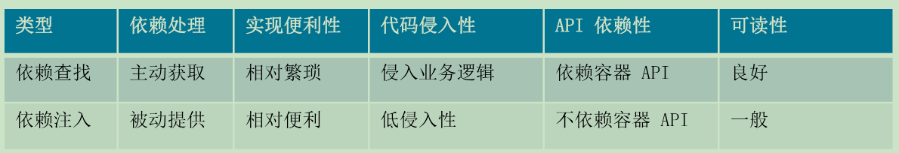

## Spring 作为 IoC 容器有什么优势?

- 典型的IoC管理,依赖查找和依赖注入
- AOP抽象
- 事务抽象
- 事件机制
- SPI扩展
- 强大的第三方整合
- 易测试性
- 更好的面向对象


## BeanFactory与FactoryBean?

- BeanFactory是IoC底层容器
- FactoryBean是创建Bean的一种方式,帮助实现复杂的初始化逻辑

## Spring IoC容器启动时做了哪些准备?

IoC配置元信息读取和解析、IoC容器生命周期、Spring事件发布
国际化等,更多答案将在后续专题章节逐一讨论

# spring bean 基础

## 初始化 Spring Bean

- Bean 初始化 (Initialization)
  - @PostConstruct标注方法
  - 实现 InitializingBean接口的afterPropertiesSet方法
  - 自定义初始化方法
    - XML配置:<bean init-method=" init".../>
    - Java注解:@Bean(initMethod="init")
    - Java API: AbstractBeanDefinition#setInitMethodName (String)
```dtd
org.geekbang.thinking.in.spring.bean.definition.BeanInitializationDemo
```

## 延迟初始化SpringBean

- Bean 延迟初始化(Lazy Initialization)
  - XML 配置:<bean lazy-init="true
  - Java注解:@Lazy(true)

```dtd
org.geekbang.thinking.in.spring.bean.definition.BeanInitializationDemo
@Lazy(value = true)
```

## 销毁 Spring Bean

- Bean 销毁(Destroy)
  - @PreDestroy标注方法
  - 实现 DisposableBean接口的 destroy()方法
  - 自定义销毁方法
    - XML配置:<beandestroy="destroy"
    - Java注解:@Bean(destroy="destroy")
    - Java API: AbstractBeanDefinition#setDestroyMethodNanme (String)

## 如何注册一个SpringBean?

通过 BeanDefinition和外部单体对象来注册
```dtd
org.geekbang.thinking.in.spring.bean.definition.SingletonBeanRegistrationDemo

```
## BeanDefinition 元信息

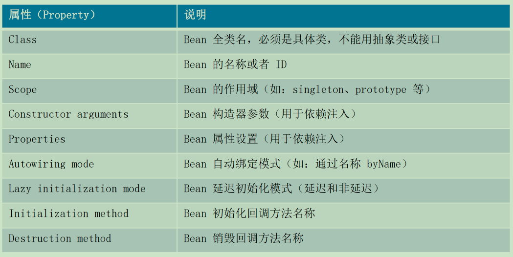

- BeanDefinition 构建
  - 通过 BeanDefinitionBuilder
  - 通过AbstractBeanDefinition以及派生类

```dtd
org.geekbang.thinking.in.spring.bean.definition.BeanDefinitionCreationDemo
```
# Spring依赖查找

## 单一类型依赖查找

- 单一类型依赖查找接口-BeanFactory
  - 根据Bean名称查找
    - getBean (String)
    - Spring 2.5覆盖默认参数:getBean(String,Object...)
  - 根据 Bean类型查找
    - Bean实时查找
      - Spring 3.0getBean (Class)
      - Spring4.1覆盖默认参数:getBean(Class, Object...)
    - Spring 5.1 Bean 延迟查找
      - getBeanProvider (Class)
      - getBeanProvider (ResolvableType)
  - 根据Bean名称+类型查找:getBean(String,Class)

```dtd
org.geekbang.thinking.in.spring.dependency.lookup.ObjectProviderDemo
org.geekbang.thinking.in.spring.ioc.overview.dependency.lookup.DependencyLookupDemo.lookupByType
```

## 集合类型依赖查找

- 集合类型依赖查找接口-ListableBeanFactory
  - 根据 Bean 类型查找
    - 获取同类型Bean名称列表
      - getBeanNamesForType (Class)
      - Spring 4.2 getBeanNamesForType (ResolvableType)
    - 获取同类型Bean实例列表
      - getBeansOfType(Class) 以及重载方法
  - 通过注解类型查找
    - Spring3.0获取标注类型Bean名称列表
      - getBeanNamesForAnnotation (Class<? extends Annotation)
    - Spring3.0获取标注类型Bean实例列表
      - getBeansWithAnnotation(Class<? extends Annotation>)
    - Spring3.0获取指定名称+标注类型Bean实例
      - findAnnotationOnBean (String, Class<? extends Annotatioon>

```dtd
org.geekbang.thinking.in.spring.ioc.overview.dependency.lookup.DependencyLookupDemo
org.geekbang.thinking.in.spring.ioc.overview.dependency.lookup.DependencyLookupDemo.lookupCollectionByType
```

## 层次性依赖查找

- 层次性依赖查找接口-HierarchicalBeanFactory
  - 双亲BeanFactory:getParentBeanFactory()
  - 层次性查找
    - 根据Bean名称查找
      - 基于containsLocalBean方法实现
    - 根据 Bean 类型查找实例列表
      - 单一类型:BeanFactoryUtils#bean0fType
      - 集合类型:BeanFactoryUtils#beansOfTypeIncludingAncesstors
    - 根据Java注解查找名称列表
      - BeanFactoryUtils#beanNamesForTypeIncludingAncesttors

```dtd
org.geekbang.thinking.in.spring.dependency.lookup.HierarchicalDependencyLookupDemo
```

### 结合部分源码

HierarchicalBeanFactory#getParentBeanFactory() 方法表明了他具有层次性，其实是一种双亲委派模式的实现。

ConfigurableBeanFactory 继承了 HierarchicalBeanFactory，从而也具有了层次性

```java
public interface ConfigurableBeanFactory extends HierarchicalBeanFactory, SingletonBeanRegistry {}
```

ConfigurableListableBeanFactory 又继承了 ConfigurableBeanFactory，通过这种组合的方式使得 ConfigurableListableBeanFactory
具有了可配置性(Configurable)、集合遍历性(Listable)、层次性(Hierarchical)等等，下面我们用这个层次性实现类来演示相关代码。

```java
public interface ConfigurableListableBeanFactory
		extends ListableBeanFactory, AutowireCapableBeanFactory, ConfigurableBeanFactory {
}

```

### LocalBean 示例

```java
private static void displayContainsLocalBean(HierarchicalBeanFactory beanFactory, String beanName) {
        System.out.printf("当前 BeanFactory[%s] 是否包含 Local Bean[name : %s] : %s\n", beanFactory, beanName,
                beanFactory.containsLocalBean(beanName));
    }
    
```

判断当前 BeanFactory 是否包含这个 Bean，不会判断父BeanFactory中是否包含

```java
private static boolean containsBean(HierarchicalBeanFactory beanFactory, String beanName) {
        BeanFactory parentBeanFactory = beanFactory.getParentBeanFactory();
        if (parentBeanFactory instanceof HierarchicalBeanFactory) {
            HierarchicalBeanFactory parentHierarchicalBeanFactory = HierarchicalBeanFactory.class.cast(parentBeanFactory);
            if (containsBean(parentHierarchicalBeanFactory, beanName)) {
                return true;
            }
        }
        return beanFactory.containsLocalBean(beanName);
}

```

### BeanFactoryUtils

Spring 中也有类似的实现，也是通过递归的方式。

org.springframework.beans.factory.BeanFactoryUtils#beanNamesForTypeIncludingAncestors()


```java

	public static String[] beanNamesForTypeIncludingAncestors(ListableBeanFactory lbf, ResolvableType type) {
		Assert.notNull(lbf, "ListableBeanFactory must not be null");
		String[] result = lbf.getBeanNamesForType(type);
		if (lbf instanceof HierarchicalBeanFactory) {
			HierarchicalBeanFactory hbf = (HierarchicalBeanFactory) lbf;
			if (hbf.getParentBeanFactory() instanceof ListableBeanFactory) {
				String[] parentResult = beanNamesForTypeIncludingAncestors(
						(ListableBeanFactory) hbf.getParentBeanFactory(), type);
				result = mergeNamesWithParent(result, parentResult, hbf);
			}
		}
		return result;
	}
```


## 实时查找

```java
org.geekbang.thinking.in.spring.ioc.overview.dependency.lookup.DependencyLookupDemo.lookupInRealTime
```

## 延迟依赖查找

- Bean 延迟依赖查找接口
  - org. springframework.beans.factory.ObjectFactory
  - org. springframework.beans.factory.ObjectProvider
    - Spring 5对 Java 8特性扩展
      - 函数式接口
        - get IfAvailable (Supplier)
        - ifAvailable (Consumer)
      - Stream 扩展-stream()


这里的延迟就是说，通过其他的对象来获取 user 对应的 Bean

```dtd

org.geekbang.thinking.in.spring.dependency.lookup.ObjectProviderDemo
org.geekbang.thinking.in.spring.ioc.overview.dependency.lookup.DependencyLookupDemo.lookupInLazy

```

## 安全依赖查找


```java
org.geekbang.thinking.in.spring.dependency.lookup.TypeSafetyDependencyLookupDemo
```

## 内建可查找的依赖

AbstractApplicationContext 内建可查找的依赖
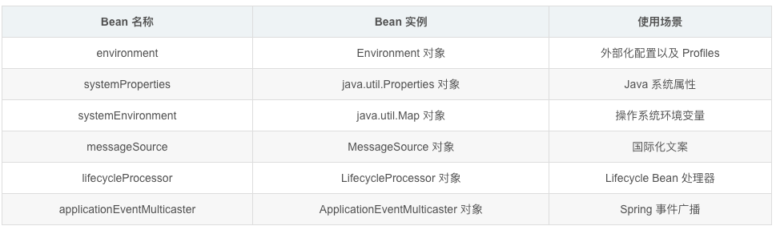

注解驱动 Spring 应用上下文内建可查找的依赖（部分）

相关细节：

org.springframework.context.annotation.AnnotationConfigUtils

- registerAnnotationConfigProcessors()

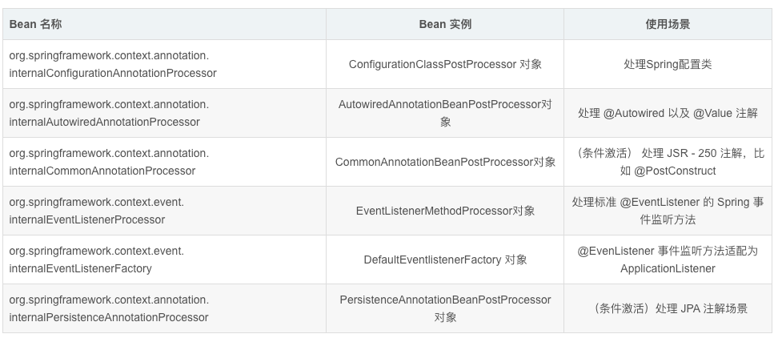

## 依赖查找中的经典异常

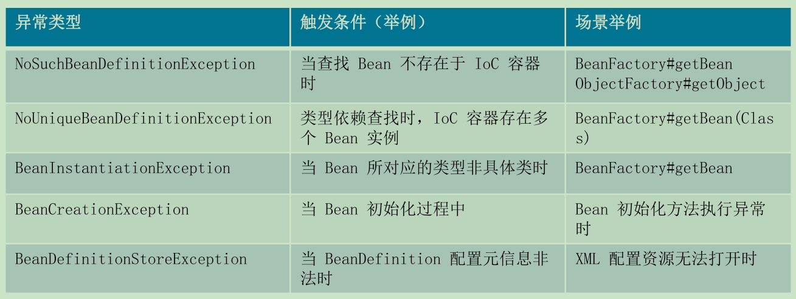

- NoUniqueBeanDefinitionException 当前上下文中存在多个相同类型 Bean 的定义
  - NoUniqueBeanDefinitionExceptionDemo
- BeanInstantiationException 当 Bean 所对应的类型非具体类时，比如是一个接口CharSequence
  - BeanInstantiationExceptionDemo
- BeanCreationException  Bean 创建过程中发生异常
  - BeanCreationExceptionDemo

## ObjectFactory与BeanFactory的区别 ? 

答: 
1. ObjectFactory与BeanFactory均提供依赖查找的能力。
2. 不过ObjectFactory仅关注一个或一种类型的Bean依赖查找,并
且自身不具备依赖查找的能力,能力则由BeanFactory输出。
BeanFactory则提供了单一类型、集合类型以及层次性等多种依赖查
找方式。

## BeanFactory.getBean操作是否线程安全

答:BeanFactory.getBean方法的执行是线程安全的,换操作过程中会增加互
斥锁

# Spring IoC 依赖注入

## 手动模式 - 配置或者编程的方式

- XML 资源配置元信息
- Java 注解配置元信息
- API 配置元信息

自动模式 - 实现方提供依赖自动关联的方式，按照内建的注入规则

- Autowiring （自动绑定）


### 依赖注入类型

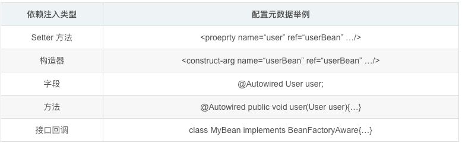

## 自动绑定（Autowiring）


Spring 容器能在合作的 Bean 之间进行自动的关系绑定。两个优点：

- Autowiring 可以有效的减少我们一些属性或者构造器参数
  - 有利有弊，节省了一些代码，但是如果引用的name或者其他属性发生变化，这个自动绑定可能会失效，其实显示的绑定比自动绑定让代码健壮性更好。
- Autowiring 可以更新我们配置，当对象是在升级的时候。
  - 简单来说，自动绑定注入的对象如果发生了变化，这个自动绑定关系也会引用到这个新的对象（其实这个应该是 Java 语言的特性）

### 自动绑定（Autowiring）模式

Autowiring modes

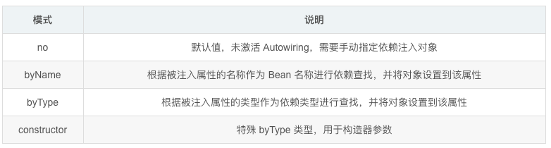


### 自动绑定（Autowiring）限制和不足

- 不支持原生类型，例如 String
- 缺乏精确性
- 如果有多个 Bean 对象，使用 byType 这种就容易出错

## Setter 方法依赖注入

实现方法

- 手动模式
  - XML 资源配置元信息
  - Java 注解配置元信息
  - API 配置元信息
- 自动模式
  - byName
  - byType

### XML 资源配置元信息

- injection.XmlDependencySetterInjectionDemo

xml 中我们配置注入ref="superUser"

### Java 注解配置元信息

这里需要说明一点

public UserHolder userHolder(User user) {... 中方法参数 user 是通过 @Bean 方法注入的方式进行的

- injection.AnnotationDependencySetterInjectionDemo

### API 配置元信息

- injection.ApiDependencySetterInjectionDemo

### 自动绑定

- autowiring-dependency-setter-injection.xml
- AutoWiringByNameDependencySetterInjectionDemo

如果将 xml 文件中的byName修改为byType,那么会根据类型找到 User 和 SuperUser 两个对象，
但是由于SuperUser中有primary属性，所以会将 SuperUser 注入到 UserHolder 对象中。

## 构造器依赖注入

实现方法

- 手动模式
  - XML 资源配置元信息
  - Java 注解配置元信息
  - API 配置元信息
- 自动模式
  - constructor

### XML 资源配置元信息

- injection.AutoWiringConstructorDependencyConstructorInjectionDemo
- autowiring-dependency-constructor-injection.xm

### Java 注解配置元信息

- injection.AnnotationDependencyConstructorInjectionDemo

### API 配置元信息

- injection.ApiDependencyConstructorInjectionDemo

### 自动绑定
只是 xml 配置文件

<bean class="injection.UserHolder" autowire="constructor即可">中的 byName 改成 constructor即可。

- injection.AutoWiringConstructorDependencyConstructorInjectionDemo

输出为SuperUser，因为SuperUser标记为primary=true，根据类型注入

## 字段注入

实现方法

- 手动模式
  - Java 注解配置元信息
    - @Autowired
    - @Resource
    - @Inject(可选) JSR-330

- injection.AnnotationDependencyFieldInjectionDemo

通过 @Autowired 和 @Resource 注入的对象其实是同一个对象，因为 Spring IoC 容器默认的 Bean 作用域是 singleton。

## 方法注入

实现方法

- 手动模式
  - Java 注解配置元信息
    - @Autowired
    - @Resource
    - @Inject(可选) JSR-330
    - @Bean

## 回调注入

Aware系列接口回调

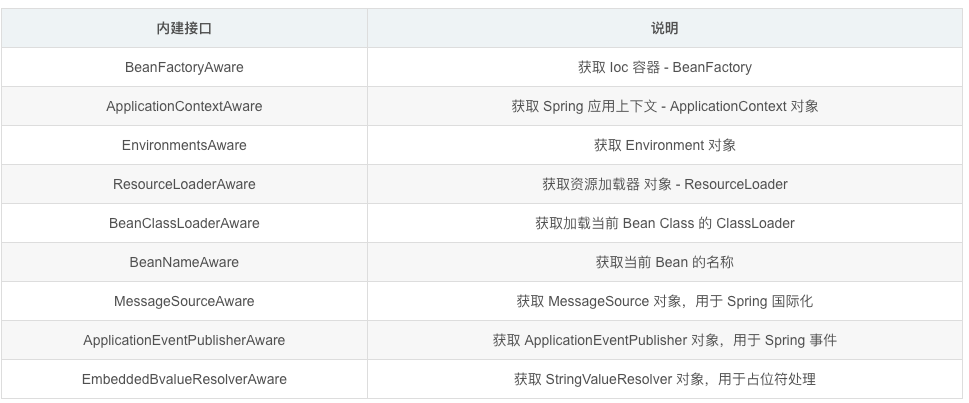

- injection.AwareInterfaceDependencyInjectionDemo

## 依赖注入类型选择

这么多的注入类型，我们平时该怎么选择和使用呢？

- 低依赖：构造器注入
  - 强制依赖注入，依赖比较少，参数比较少的情况推荐使用（官方推荐）
- 多依赖：Setter 方法注入
  - 多依赖，如果依赖之间存在前后依赖关系的话，尽量不要用这种方式注入
- 便利性：字段注入
  - 仅关注与需要注入的字段，但是这种官方并不推荐，在后续的 SpringBoot 版本中都属于淘汰状态
- 声明类：方法注入
  - 建议多使用@Bean这种方式进行注入，配合其他注入方式。


## 基础类型注入

基础类型

- 原生类型（Primitive）：boolean、byte、char、short、int、float、long、double
- 标量类型（Scalar）：Number、Character、Boolean、Enum、Locale、Charset、Currency、Porperties、UUID
- 常规类型（General）：Object、String、TimeZone、Calendar、Optional 等等
- Spring 类型：Resource、InputSource、Formatter 等等

### Enum类型

比如我们 User 类里面加一个 City 枚举类型的字段，表示这个用户是哪个城市的。

我们先建一个 Enum 类型的 City 类

```xml

<bean id="user" class="org.geekbang.thinking.in.spring.ioc.overview.domain.User">
  <property name="id" value="1"/>
  <property name="name" value="小马哥"/>
  <property name="city" value="HANGZHOU"/>
</bean>

```

### Resource 类型
在上面的基础之上

User 增加 private Resource configFileResource;和对应的 set/get 方法。

在 resources/META_INF目录下新建 user-config.properties 文件

```xml 

<bean id="user" class="org.geekbang.thinking.in.spring.ioc.overview.domain.User">
        <property name="id" value="1"/>
        <property name="name" value="小马哥"/>
        <property name="city" value="HANGZHOU"/>
        <property name="configFileLocation" value="classpath:/META-INF/user-config.properties"/>
</bean>

```

## 集合类型注入

集合类型

- 数组类型（Array）：原生类型、标量类型、常规类型、Spring类型
- 集合类型（Collection）：
  - Collection：List、Set（SortedSet、NavigableSet、EnumSet）
  - Map：Properties

Enum类型 中 User 的 private City[] cities;

Enum类型 中 User 新增字段 private List<City> lifeCities;


xml 中 新增 lifeCities 属性

```xml

  <bean id="user" class="org.geekbang.thinking.in.spring.ioc.overview.domain.User">
    <property name="workCities" value="BEIJING,HANGZHOU"/>
    <property name="lifeCities">
      <list>
        <value>BEIJING</value>
        <value>SHANGHAI</value>
      </list>
    </property>
  </bean>

```

## 限定注入

使用注解 @Qualifier 限定

- 通过 Bean 名称限定
- 通过分组限定

基于注解 @Qualifier 扩展限定

- 自定义注解 - 如 Spring Cloud @LoadBalanced


### 通过 Bean 名称限定

- injection.QualifierNameAnnotationDependencyInjectionDemo

普通的 user1 对象通过类型注入的方式，注入了 superUser 对象。

而加了 @Qualifier("user") 的 user 通过 user名称的限定，注入了 user 对象

### 分组

- injection.QualifierNameAnnotationDependencyInjectionDemo

标有 @Bean、@Qualifier的 userGroup() 方法被注入到标有 @Qualifier 的 user_group 字段上。

### 集合分组

我们再加入一个 User 的定义 和 Collection<User>，都用 @Qualifier 进行标注

### 元标注分组

- injection.QualifierNameAnnotationDependencyInjectionDemo

由结果可知

- 通过名称user限定，注入了对应的 user 对象
- 通过 @Qualifier 分组，注入了 标有@Qualifier对象，如果有多个，那么使用 @Primary 表示主要依赖
- 通过集合的方式 Collection<User> allUsers，将所有的 User 类型注入，有 6 个对象
- 通过 @Qualifier+集合的方式 Collection<User> allUsers_group ，将所有标注 @Qualifier 的User 类型注入，有 4 个对象，分别为两个 @Qualifier 标注，两个 @UserGroup 标注
- 通过 @UserGroup+集合的方式 Collection<User> allUsers_group_annotation ，将所有标注 @UserGroup 的User 类型注入，有 2 个对象

## 延迟依赖注入

使用 API ObjectFactory 延迟注入

- 单一类型
- 集合类型
- 
使用 API ObjectProvider 延迟注入（推荐）

- 单一类型
- 集合类型

### ObjectProvider

ObjectProvider 安全性高，可以减少避免一些异常

- injection.LazyAnnotationDependencyInjectionDemo

### 依赖处理过程

基础知识

- 入口 - DefaultListableBeanFactory#resolveDependency
- 依赖描述符 - DependencyDescriptor
- 自动绑定候选对象处理器 - AutowireCandidateResolver
TODO

## Java 通用注入原理

CommonAnnotationBeanPostProcessor
这个类和上面讲的的 AutowiredAnnotationBeanPostProcessor 都是处理依赖注入注解相关的类。
AutowiredAnnotationBeanPostProcessor主要是处理 @Autowired 、Value、Inject 这三个注解，
而本类主要是处理通用型的，主要包括下面三个注解和两个生命周期回调：

- 注入注解
  - javax.xml.ws.WebServiceRef
  - javax.ejb.EJB
  - javax.annotation.Resource
- 生命周期注解
  - javax.annotation.PostConstruct
  - javax.annotation.PreDestroy

### 区别1 生命周期
CommonAnnotationBeanPostProcessor 中的方法多了

postProcessMergedBeanDefinition() 多了生命周期（Lifecycle）的处理，主要指的是 PostConstruct（初始化） 和 PreDestroy（销毁） 这两个阶段。

```java
    @Override
	public void postProcessMergedBeanDefinition(RootBeanDefinition beanDefinition, Class<?> beanType, String beanName) {
		LifecycleMetadata metadata = findLifecycleMetadata(beanType);
		metadata.checkConfigMembers(beanDefinition);
	}

```

### 区别2 顺序 Order

- AutowiredAnnotationBeanPostProcessor Ordered.LOWEST_PRECEDENCE - 2
- CommonAnnotationBeanPostProcessor Ordered.LOWEST_PRECEDENCE - 3

由此可见，CommonAnnotationBeanPostProcessor 会优先执行。


## 自定义依赖注入注解

- AnnotationDependencyInjectionResolutionDemo

# Spring IoC 注入

## 入门demo

org.geekbang.thinking.in.spring.ioc.overview.dependency.injection.DependencyInjectionDemo

## 依赖注入的模式和类型

- 手动模式-配置或者编程的方式,提前安排注入规则
  - XML资源配置元信息
  - Java注解配置元信息
  - API配置元信息
- 自动模式-实现方提供依赖自动关联的方式,按照内建的注入规则
  - AutoWiring(自动绑定)

## 依赖注入的模式和类型


## 自动绑定(Autowiring)模式

模式.png)


## Setter 方法注入

- 手动模式
  - XML资源配置元信息 injection.XmlDependencySetterInjectionDemo
  - Java注解配置元信息 injection.AnnotationDependencySetterInjectionDemo
  - API 配置元信息 injection.AnnotationDependencySetterInjectionDemo
- 自动模式
  - byName injection.AutoWiringByNameDependencySetterInjectionDemo
  - byType

## 构造器注入

- 实现方法
  - 手动模式
    - XML资源配置元信息 injection.XmlDependencyConstructorInjectionDemo
    - Java注解配置元信息 injection.AnnotationDependencyConstructorInjectionDemo
    - API 配置元信息 injection.ApiDependencyConstructorInjectionDemo
- 自动模式
  - constructor injection.AutoWiringConstructorDependencyConstructorInjectionDemo


## 字段注入

- 实现方法
  - 手动模式
    - Java注解配置元信息 injection.AnnotationDependencyFieldInjectionDemo
      - @Autowired
      - @Resource 
      - @Inject(可选)

## 方法注入

- 实现方法
  - 手动模式
    - Java注解配置元信息 injection.AnnotationDependencyMethodInjectionDemo
      - @Autowired
      - @Resource
      - @Inject(可选)
      - @Bean

## 接口回调注入

- injection.AwareInterfaceDependencyInjectionDemo

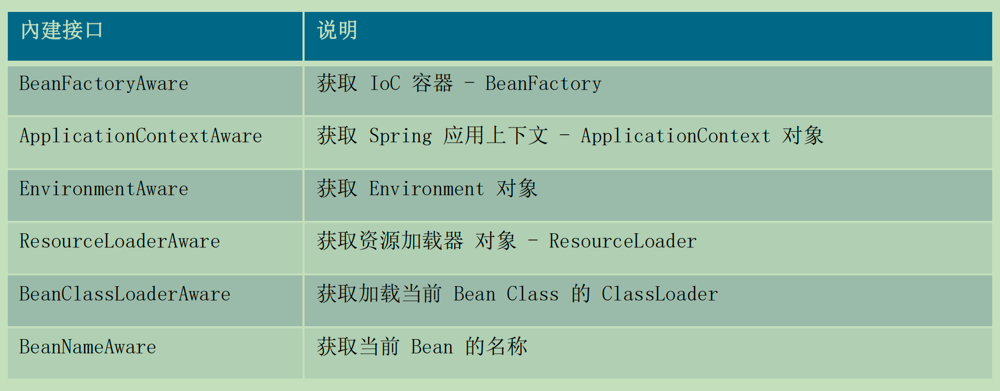

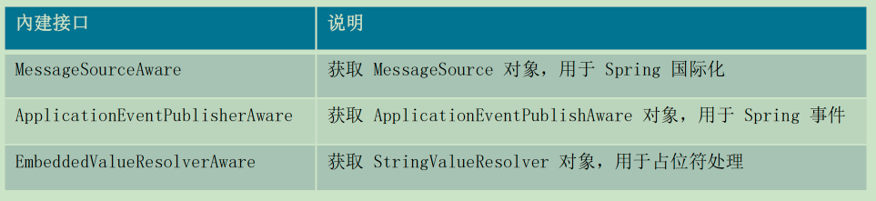

## 依赖注入类型选择

- 注入选型
  - 低依赖:构造器注入
  - 多依赖:Setter方法注入
  - 便利性:字段注入
  - 声明类:方法注入

## 基础类型注入

- 基础类型
  - 原生类型(Primitive):boolean、byte、char、short、int、float、long、double
  - 标量类型(Scalar):Number、Character、Boolean、Enum、Locale、Charset、Currency、Properties、UUID
  - 常规类型(General):Object、String、TimeZone、Calendar、Optional等
  - Spring类型:Resource、InputSource、Formatter等


## 集合类型注入

- 集合类型
  - 数组类型(Array):原生类型、标量类型、常规类型、Sprin类型
  - 集合类型(Collection)
    - Collection: List、Set (SortedSet、NavigableSet、EnuimSet
    - Map: Properties

## 限定注入

- 使用注解@Qualifier限定 injection.QualifierAnnotationDependencyInjectionDemo
  - 通过Bean名称限定
  - 通过分组限定
- 基于注解@Qualifier扩展限定
  - 自定义注解-如SpringCloud@LoadBalanced

## 延迟依赖注入
- injection.LazyAnnotationDependencyInjectionDemo

- 使用APIObjectFactory延迟注入
  - 单一类型
  - 集合类型
- 使用APIObjectProvider延迟注入(推荐)
  - 单一类型
  - 集合类型


## 依赖处理过程

- 基础知识
  - 入口 - DefaultListableBeanFactory#resolveDependenLcy
  - 依赖描述符-DependencyDescriptor
  - 自定绑定候选对象处理器-AutowireCandidateResolver


## @Autowired 注入

- @Autowired注入规则
  - 非静态字段
  - 非静态方法
  - 构造器

- @Autowired注入过程
  - 元信息解析
  - 依赖查找
  - 依赖注入(字段、方法)

## @Inject注入

- @Inject注入过程
  - 如果JSR-330存在于ClassPath中,复用AutowiredAnnotationBeanPostProcessor实现

## Java通用注解注入原理

- CommonAnnotationBeanPostProcessor
  - 注入注解
    - javax.xml.ws.WebServiceRef
    - javax.ejb.EJB
    - javax.annotation.Resource
  - 生命周期注解
    - javax.annotation.PostConstruct
    - javax.annotation.PreDestroy

## 自定义依赖注入注解

- injection.AnnotationDependencyInjectionResolutionDemo

- 基于AutowiredAnnotationBeanPostProcessor实现
- 自定义实现
  - 生命周期处理
    - InstantiationAwareBeanPostProcessor
    - MergedBeanDefinitionPostProcessor
  - 元数据
    - InjectedElement
    - InjectionMetadata

## 面试题

### 有多少种依赖注入的方式?

答:构造器注入 Setter注入 字段注入 方法注入 接口回调注入

### 你偏好构造器注入还是Setter注入?

答:两种依赖注入的方式均可使用,如果是必须依赖的话,那么推荐使用构造器注入,Setter注入用于可选依赖。

# 谁才是 Spring IoC 容器

```java
/**
 * 依赖注入示例
 */
public class DependencyInjectionDemo {
    public static void main(String[] args) {
        //配置 xml 配置文件
        //启动 spring 应用上下文
        BeanFactory beanFactory = new ClassPathXmlApplicationContext("classpath:/META-INF/dependency-injection-context.xml ");
        //自定义Bean
        UserRepository userRepository = beanFactory.getBean("userRepository", UserRepository.class);
        
        whoIsIocContainer(userRepository, beanFactory);
    }

    private static void whoIsIocContainer(UserRepository userRepository, BeanFactory beanFactory) {

        // ConfigurableApplicationContext -> ApplicationContext -> BeanFactory
        // 在上下文的实现中采用的是组合模式，org.springframework.context.support.AbstractRefreshableApplicationContext 中
        // 在接口的实现上又继承了 BeanFactory
        System.out.println("userRepository.getBeanFactory():" + userRepository.getBeanFactory());
        System.out.println("beanFactory:" + beanFactory);
        System.out.println("两者是否相等:" + (userRepository.getBeanFactory() == beanFactory));

    }

}

```

那么DefaultListableBeanFactory 和 ClassPathXmlApplicationContext这两个对象是什么关系？

ApplicationContext 就是 BeanFactory，但是他们是两个不同的对象，BeanFactory 提供框架配置和基本功能，ApplicationContext 是 BeanFactory 的一个超集，一个子接口，ApplicationContext 提供更多的企业特性。

ApplicationContext 除了 IOC 容器角色，还提供

- 面向切面 (AOP)
- 配置元信息(Configuration Metadata)
- 资源配置(Resource)
- 事件(Events)
- 国际化(i18n)
- 注解(Annotations)
- Environment 抽象(Environment Abstraction)

## 源码分析

ApplicationContext 的层次关系比较复杂，我们直接定位到相关的类

- org.springframework.context.support.AbstractRefreshableApplicationContext

```java
public abstract class AbstractRefreshableApplicationContext extends AbstractApplicationContext {

	@Nullable
	private Boolean allowBeanDefinitionOverriding;

	@Nullable
	private Boolean allowCircularReferences;

	/** Bean factory for this context. */
	@Nullable
	private DefaultListableBeanFactory beanFactory;

```

- AbstractRefreshableApplicationContext 用组合的方式，获取到 BeanFactory 的默认实现 DefaultListableBeanFactory

- 再看它的父类AbstractApplicationContext 中的 getBean()方法，其实是getBeanFactory()获取的这个 DefaultListableBeanFactory 对象，
再调用 beanFactory.getBean(name) 方法来获取 Bean 对象，最终还是 BeanFactory 来获取 Bean 对象。

由此可见，其实真正的底层 IoC 容器其实是 BeanFactory 。

```java

public abstract class AbstractApplicationContext extends DefaultResourceLoader
		implements ConfigurableApplicationContext {

    //---------------------------------------------------------------------
    // Implementation of BeanFactory interface
    //---------------------------------------------------------------------

    @Override
    public Object getBean(String name) throws BeansException {
        assertBeanFactoryActive();
        return getBeanFactory().getBean(name);
    }

    @Override
    public <T> T getBean(String name, Class<T> requiredType) throws BeansException {
        assertBeanFactoryActive();
        return getBeanFactory().getBean(name, requiredType);
    }

    @Override
    public Object getBean(String name, Object... args) throws BeansException {
        assertBeanFactoryActive();
        return getBeanFactory().getBean(name, args);
    }
}

```

## 结论

- ApplicationContext 是 BeanFactory 的一个超集，一个子接口；BeanFactory 提供框架配置和基本功能，ApplicationContext 提供更多的企业特性。

- BeanFactory 才是真正的底层的 IoC 容器，因为 ApplicationContext 最终还是通过组合 BeanFactory 来实现 getBean() 方法

# Spring Bean 定义

## 什么是 Spring Bean 的定义，或者说它是用来做什么？

Spring 应用上下文启动时，将Xml文件、注解、API等等信息解析成 BeanDefinition 。通过依赖查找 getBean() 等方式获取 Bean 的对象时，
容器获取到 Bean 定义相关的元信息，通过这些信息来创建对应 Bean 对象。

BeanDefinition 是 Spring FrameWork 中定义 Bean 的配置元信息接口

- Bean 的类名
- Bean 行为配置元素，如作用域、自动绑定模式、生命周期回调等等
- 其他Bean引用，又可称作 合作者（Collaborators）或者 依赖（Dependencies）
- 配置设置，比如Bean属性（Properties）

## BeanDefinition元信息


## Spring Bean 的命名

### Bean 名称

可以类比 xml配置文件<bean …>的 id、name 属性。

- 每个 Bean 拥有一个或者多个标识符（identifiers），这些标识符在 Bean 所在的容器必须是唯一的。通常一个 Bean 仅有一个标识符，如果需要额外的，可考虑使用别名（Alias）来扩充
- 在基于 XML 的配置元信息中，开发人员可用 id 或者 name 属性来规定 Bean 的标识符。通常 Bean 的标识符由字母组成，允许出现特殊字符；如果想要引入 Bean 的别名的话，
  可以在 name 属性使用半角逗号（,）或者分好（;）来间隔。
- Bean 的 id 或者 name 属性并非必须制定，如果留空的话，容器会为 Bean 自动生成一个唯一的名称。Bean 的命名尽管没有限制，不过官方建议采用驼峰的方式，更符合 Java 命名规范。


### Bean名称生成器

- org.springframework.beans.factory.support.BeanNameGenerator#generateBeanName（since Spring 2.0.3）
  - DefaultBeanNameGenerator
  - AnnotationBeanNameGenerator

我们可以看下其中一个实现

```java

	public static String generateBeanName(
			BeanDefinition definition, BeanDefinitionRegistry registry, boolean isInnerBean)
			throws BeanDefinitionStoreException {

		String generatedBeanName = definition.getBeanClassName();
	
		String id = generatedBeanName;
		if (isInnerBean) {//如果是内嵌的 BeanName +'#'+ hashCode
			// Inner bean: generate identity hashcode suffix.
			id = generatedBeanName + GENERATED_BEAN_NAME_SEPARATOR + ObjectUtils.getIdentityHexString(definition);
		}
		else {//如果是唯一的
			// BeanName +'#'+ 数字
			return uniqueBeanName(generatedBeanName, registry);
		}
		return id;
	}

```

### Spring Bean 的别名

Bean 别名（Alias）的价值

- 复用现有的 BeanDefinition
- 更具有场景化的命名方法

org.geekbang.thinking.in.spring.bean.definition.BeanAliasDemo

# Spring Bean 注册、实例化、初始化、销毁

## 注册 Spring Bean
BeanDefinition 注册有以下方式

- XML 配置元信息
  - <bean name="" …/>
- Java 注解配置元信息
  - @Bean
  - @Component
  - @Import
- Java API 配置元信息
  - 命名方式：BeanDefinitionRegistry#registerBeanDefinition(String,BeanDefinition)
  - 非命名方式：BeanDefinitionReaderUtils#registerWithGeneratedName
  - 配置类方式：AnnotatedBeanDefinitionReader#register(Class<?>… componentClasses)

### 注册示例

#### Java 注解配置元信息

@Bean 方式定义
@Component 方式定义
- org.geekbang.thinking.in.spring.bean.definition.AnnotationBeanDefinitionDemo

```java

@Component // 定义当前类作为 Spring Bean（组件）
    public static class Config {

        // 1. 通过 @Bean 方式定义

        /**
         * 通过 Java 注解的方式，定义了一个 Bean
         */
        @Bean(name = {"user", "xiaomage-user"})
        public User user() {
            User user = new User();
            user.setId(1L);
            user.setName("小马哥");
            return user;
        }
    }
```

#### 通过 @Import 来进行导入

```java
@Import(AnnotationBeanDefinitionDemo.Config.class)
public class AnnotationBeanDefinitionDemo {
}
```

#### Java API 配置元信息

- org.geekbang.thinking.in.spring.bean.definition.AnnotationBeanDefinitionDemo

## 实例化 Spring Bean

Bean 实例化（Instantiation）

- 常规方式
  - 通过构造器（配置元信息：XML、Java 注解和 Java API）
  - 通过静态工厂方法（配置元信息：XML和 Java API）
  - 通过 Bean 工厂方法（配置元信息：XML和 Java API）
  - 通过 FactoryBean （配置元信息：XML、Java 注解和 Java API）
- 特殊方式
  - 通过 ServiceLoaderFactoryBean（配置元信息：XML、Java 注解和 Java API）
  - 通过 AutowireCapableBeanFactory#createBean(java.lang.Class,int,boolean)
  - 通过 BeanDefinitionRegistry#registerBeanDefinition(String,BeanDefinition)

### 常规方式

**通过构造器**

- xml：<bean id=“user” …> 默认是通过构造器方式
- @Bean 在上一章已经展示过了

**通过静态工厂方法**

**通过 Bean 工厂方法**

**通过 FactoryBean**


- org.geekbang.thinking.in.spring.bean.definition.BeanInstantiationDemo

我们再新建一个bean-instantiation-context.xml文件

### 特殊方式

- org.geekbang.thinking.in.spring.bean.definition.SpecialBeanInstantiationDemo


**BeanDefinitionRegistry#registerBeanDefinition**

**ServiceLoaderFactoryBean**

special-bean-instantiation-context.xml

**AutowireCapableBeanFactory#createBean**

## 初始化 Spring Bean

**Bean 初始化（Initialization）**

- @PostConstruct 标注方法
- 实现 InitializingBean 接口的 afterPropertiesSet() 方法
- 自定义初始化方法
  - XML 配置：<bean init-method=“init” …/>
  - Java 注解：@Bean(initMethod=“init”)
  - Java API：AbstractBeanDefinition#setInitMethodName(String)
    - @Bean(initMethod=“init”) 这种方式，最后方法执行的调用链也会进到这个 API 中

- BeanInitializationDemo


### 延迟初始化 Spring Bean

Bean 延迟初始化（Lazy Initialization）

- XML 配置：<bean lazy-init=“true” …/>
- Java 注解：@Lazy(true)

```java
@Bean(initMethod = "initUserFactory", destroyMethod = "doDestroy")
    @Lazy(value = true)
    public UserFactory userFactory() {
        return new DefaultUserFactory();
    }
    
```

问题：当某个 Bean 定义为延迟初始化，那么 Spring 容器返回的对象与非延迟的对象存在怎样的差异？

非延迟初始化在 Spring 应用上下文启动完成后，已经被初始化。

加上了@Lazy

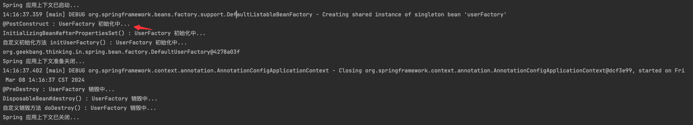

不加@Lazy

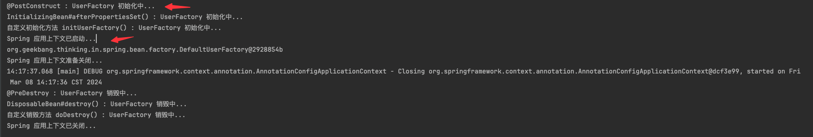

当 Bean 定义为延迟初始化，初始化的过程是在 Spring 应用上下文启动之后，在本例子中通过applicationContext.getBean(UserFactory.class) 
触发 Bean 的初始化。延迟初始化和非延迟初始化在 Bean 的定义上面没有区别，但是在依赖查找或者依赖注入有所不同。

#### 源码分析
在 AbstractApplicationContext 的 refresh() 方法中，会初始化所有非延迟初始化的 singletons

- org.springframework.context.support.AbstractApplicationContext#finishBeanFactoryInitialization

```java
// Instantiate all remaining (non-lazy-init) singletons.
finishBeanFactoryInitialization(beanFactory);
```

#### 总结

- 没有@Lazy就是在spring容器执行refresh中最后执行finishBeanFactoryInitialization初始化多有单例
- 有@Lazy就是在首次调用的时候，即getBean的时候调用
- 所谓初始化底层原理都是通过spring生命周期中回调完成的，调用初始化逻辑都是一样的，只是时机不一样

## 销毁 Spring Bean

Bean 销毁（Destroy）

- @PreDestroy 标注方法
- 实现 DisposableBean 接口的 destroy 方法
- 自定义销毁方法
  - XML 配置：<bean destroy=“destroy” …/>
  - Java 注解：@Bean(destroy=“init”)
  - Java API：AbstractBeanDefinition#setDestroyMethodName(String)

```java

org.geekbang.thinking.in.spring.bean.definition.BeanInitializationDemo

```

说明applicationContext.close()应用上下文关闭的时候进行 Bean 的销毁。

源码实际调用的位置：

org.springframework.context.support.AbstractApplicationContext#destroyBeans


## 垃圾回收

Bean 垃圾回收（GC）

关闭 Spring 容器
- 执行 GC
- Spring Bean 覆盖 finalize() 方法被回调
- 垃圾回收时，此方法会被回调

### DefaultUserFactory 重写 finalize()方法

## 面试

### 通过 BeanDefinition 和外部单体对象来注册

- org.geekbang.thinking.in.spring.bean.definition.SingletonBeanRegistrationDemo

### 什么是 Spring BeanDefinition?

参考 BeanDefinition元信息


# Spring IoC依赖来源

## 依赖查找的来源


- Spring 内建 BeanDefinition

.png)


.png)


### Spring 内建 BeanDefinition 注册过程

相关源码位置：AnnotationConfigUtils#registerAnnotationConfigProcessors()

#### 通过xml配置

```xml

<context:annotation-config/>

```

- org.geekbang.thinking.in.spring.ioc.overview.dependency.lookup.DependencyLookupDemo

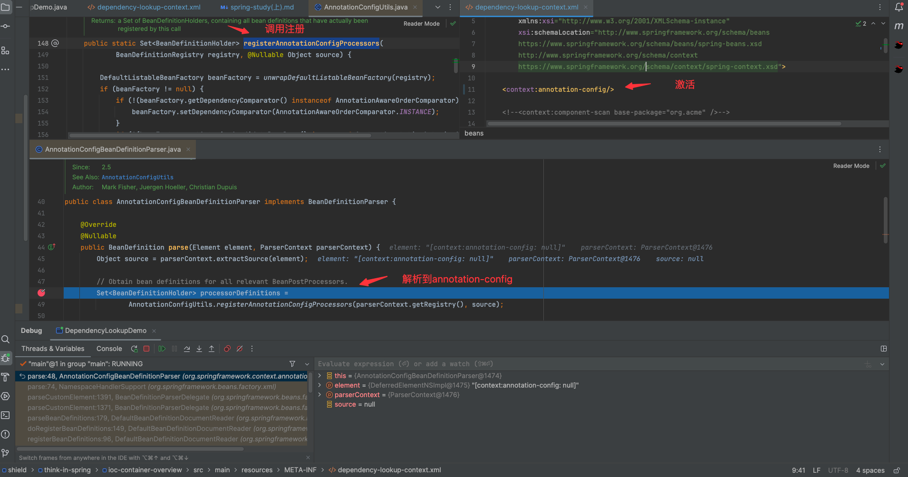

#### 通过注解配置

- source.ResolvableDependencySourceDemo

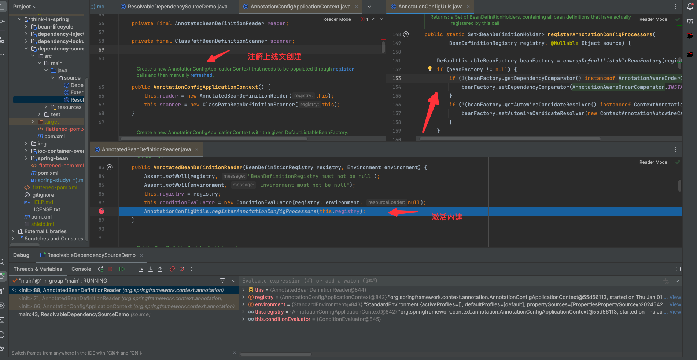

### 单例对象注册

相关源码位置：AbstractApplicationContext#prepareBeanFactory()

注册一些内建的 Bean，如果引入更多的模块，比如 AOP、事务，也会有相应通过 registerSingleton 注册 Bean。

```java
protected void prepareBeanFactory(ConfigurableListableBeanFactory beanFactory) {
		// Register default environment beans.
		if (!beanFactory.containsLocalBean(ENVIRONMENT_BEAN_NAME)) {
			beanFactory.registerSingleton(ENVIRONMENT_BEAN_NAME, getEnvironment());
		}
		if (!beanFactory.containsLocalBean(SYSTEM_PROPERTIES_BEAN_NAME)) {
			beanFactory.registerSingleton(SYSTEM_PROPERTIES_BEAN_NAME, getEnvironment().getSystemProperties());
		}
		if (!beanFactory.containsLocalBean(SYSTEM_ENVIRONMENT_BEAN_NAME)) {
			beanFactory.registerSingleton(SYSTEM_ENVIRONMENT_BEAN_NAME, getEnvironment().getSystemEnvironment());
		}
}

```

## 依赖注入的来源

依赖注入 的来源比 依赖查找 多了 非 Spring 容器管理对象 这一块

### 非 Spring 容器管理对象(ResolvableDependency)

- 对象不存在 spring 容器中（即通过 getBean 的方法无法查找），但是可以依赖注入

源码位置：AbstractApplicationContext#prepareBeanFactory

```java

protected void prepareBeanFactory(ConfigurableListableBeanFactory beanFactory) {
    // BeanFactory interface not registered as resolvable type in a plain factory.
    // MessageSource registered (and found for autowiring) as a bean.
    // 使用自动绑定的方式找到
    beanFactory.registerResolvableDependency(BeanFactory.class, beanFactory);
    beanFactory.registerResolvableDependency(ResourceLoader.class, this);
    beanFactory.registerResolvableDependency(ApplicationEventPublisher.class, this);
    beanFactory.registerResolvableDependency(ApplicationContext.class, this);
}

```

registerResolvableDependency() 这个方法的实现在 DefaultListableBeanFactory 中

```java
	@Override
	public void registerResolvableDependency(Class<?> dependencyType, @Nullable Object autowiredValue) {
		Assert.notNull(dependencyType, "Dependency type must not be null");
		if (autowiredValue != null) {
			if (!(autowiredValue instanceof ObjectFactory || dependencyType.isInstance(autowiredValue))) {
				throw new IllegalArgumentException("Value [" + autowiredValue +
						"] does not implement specified dependency type [" + dependencyType.getName() + "]");
			}
			this.resolvableDependencies.put(dependencyType, autowiredValue);
		}
	}

```

通过 this.resolvableDependencies.put(dependencyType, autowiredValue);

可以看到将这个 4 个对象放到 resolvableDependencies 这个 ConcurrentHashMap 中。

在启动Spring容器的时候，可以将断点打在 DefaultListableBeanFactory#findAutowireCandidates 这个方法里面，看到 resolvableDependencies 集合的元素，
就是前面注册的 4 个对象，而且因为后面三个对象注册的都是 this，也就是当前的应用上下文 applicationContext，所以是同一个对象。

- source.DependencySourceDemo

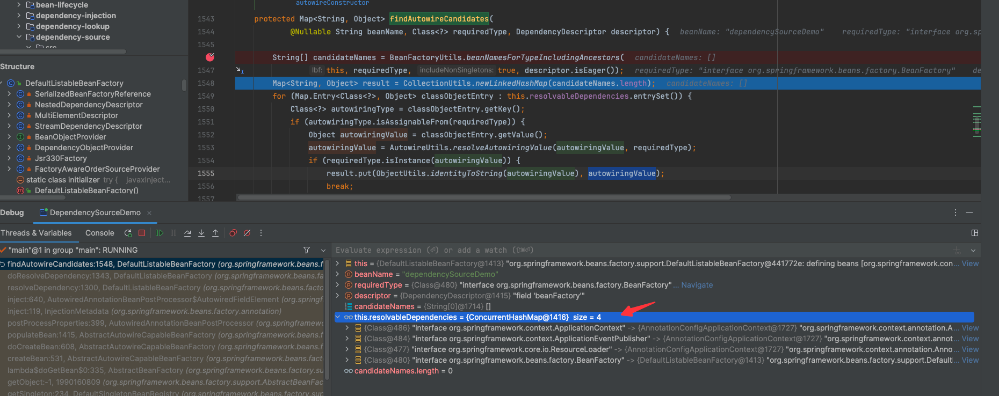

### 依赖来源示例

- source.DependencySourceDemo


```java

beanFactory == applicationContext false
beanFactory == applicationContext.getBeanFactory() true
resourceLoader == applicationContext true
ApplicationEventPublisher == applicationContext true
当前类型org.springframework.beans.factory.BeanFactory 无法在 BeanFactory 中查找!
当前类型org.springframework.context.ApplicationContext 无法在 BeanFactory 中查找!
当前类型org.springframework.core.io.ResourceLoader 无法在 BeanFactory 中查找!
当前类型org.springframework.context.ApplicationEventPublisher 无法在 BeanFactory 中查找!

```


由源码可知，BeanFactory 注册的对象是 beanFactory（通过 getBeanFactory() 方法获取），
而其他三个对象注册的是 this（即当前的应用上下文 ApplicationContext）


- beanFactory == applicationContext：false 不相等，而且在前面的文章中也分析过

- 而其他三个对象，都是 this，所以其他这个对象本身其实都是 applicationContext，所以都相等

- 这 4 个对象都是非 Spring 容器管理对象，通过 registerResolvableDependency 方法注册，所以通过 BeanFactory#getBean()
  依赖查找无法获取，抛出 NoSuchBeanDefinitionException 异常。

- 这个原因也比较好理解，DefaultListableBeanFactory 中分别用两个对象来进行存储
  - beanDefinitionMap 用来存储一般注册 BeanDefinition，比如 xml，注解，API
  - resolvableDependencies 用来存储 非 Spring 容器管理对象（或者叫游离对象）

```java
	/** Map from dependency type to corresponding autowired value. */
	private final Map<Class<?>, Object> resolvableDependencies = new ConcurrentHashMap<>(16);

	/** Map of bean definition objects, keyed by bean name. */
	private final Map<String, BeanDefinition> beanDefinitionMap = new ConcurrentHashMap<>(256);

```

可以猜测通过 beanFactory.getBean() 依赖查找是 beanDefinitionMap 集合，并未查找 resolvableDependencies 集合。那么我们来看下源码

```java
org.springframework.beans.factory.support.AbstractBeanFactory.getBean(java.lang.String)
  
public Object getBean(String name) throws BeansException {
		return doGetBean(name, null, null, false);
}
```

doGetBean() 这个方法的内容较多，我们只贴出部分相关的代码

- 第一步 getSingleton(beanName)查找单例对象集合，如果有的话直接返回

```java
	protected <T> T doGetBean(final String name, @Nullable final Class<T> requiredType,
			@Nullable final Object[] args, boolean typeCheckOnly) throws BeansException {

		final String beanName = transformedBeanName(name);
		Object bean;

		// Eagerly check singleton cache for manually registered singletons.
		Object sharedInstance = getSingleton(beanName);

```

- 第二步是层次性的查找，BeanFactory parentBeanFactory = getParentBeanFactory(); 跳过
- 第三步是合并 BeanDefinition，final RootBeanDefinition mbd = getMergedLocalBeanDefinition(beanName); 跳过
- AbstractBeanFactory 320 行，这里的单例指的是 Bean 的作用域，和前面的单例对象并不是一个概念，BeanDefinition 注册默认是 singleton。然后通过这个 mbd(合并后的 BeanDefinition ) 去 createBean，创建这个 bean。

```java
if (mbd.isSingleton()) {
    sharedInstance = getSingleton(beanName, () -> {
        try {
            return createBean(beanName, mbd, args);
        }
        catch (BeansException ex) {
            // Explicitly remove instance from singleton cache: It might have been put there
            // eagerly by the creation process, to allow for circular reference resolution.
            // Also remove any beans that received a temporary reference to the bean.
            destroySingleton(beanName);
            throw ex;
        }
    });
    beanInstance = getObjectForBeanInstance(sharedInstance, name, beanName, mbd);
}
```

- 那么关键点就在 final RootBeanDefinition mbd = getMergedLocalBeanDefinition(beanName); 这个合并的过程中。多次查找源码可以看到合并的过程会调用 getBeanDefinition 方法如下：

```java
org.springframework.beans.factory.support.DefaultListableBeanFactory.getBeanDefinition

public BeanDefinition getBeanDefinition(String beanName) throws NoSuchBeanDefinitionException {
  BeanDefinition bd = this.beanDefinitionMap.get(beanName);
  if (bd == null) {
    if (logger.isTraceEnabled()) {
      logger.trace("No bean named '" + beanName + "' found in " + this);
    }
    throw new NoSuchBeanDefinitionException(beanName);
  }
  return bd;
}

```

果然和我们猜想的一样通过 beanDefinitionMap get() 获取 BeanDefinition，
而整个 getBean 依赖查找的过程中没有查找过 resolvableDependencies 集合。
所以通过依赖查找无法获取 非 Spring 容器管理对象（Resolvable Dependency）

## Spring 容器管理和游离对象


## Spring BeanDefinition 作为依赖来源

要素

- 元数据：BeanDefinition
- 注册：BeanDefinitionRegistry#registrerBeanDefinition
- 类型：延迟和非延迟
- 顺序：Bean 生命周期顺序按照注册顺序

## 单例对象作为依赖来源
- 要素
  - 来源：外包普通 Java 对象（不一定是 POJO）
  - 注册：SingletonBeanRegistry#registerSingleton

- 限制
  - 无生命周期管理
  - 无法实现延迟初始化 Bean

### 注册单例对象

源码位置：DefaultSingletonBeanRegistry#registerSingleton

就是简单的 put 操作，将对象存放到 singletonObjects 中。

registerSingleton 的第一把锁，主要是这个方法既调用了 get() 方法，又调用了 add() 方法，为了线程安全。

addSingleton 中加锁的原因是 addSingleton() 方法可能被别的地方调用，而且此方法也是一个多元的操作，为了线程安全。

this.singletonObjects.put(beanName, singletonObject);
加入 singletonObjects 集合
this.singletonFactories.remove(beanName);
ObjectFactory 操作的 Bean,用来进行延迟查找，如果这个 Bean 注册成单例对象，和这个是一个互斥的操作，所以需要删除
this.earlySingletonObjects.remove(beanName);
这个早期的 SingletonObject 也是一个互斥的操作，所以需要删除
this.registeredSingletons.add(beanName);
这个也是为了保存一个顺序

```java

	@Override
	public void registerSingleton(String beanName, Object singletonObject) throws IllegalStateException {
		Assert.notNull(beanName, "Bean name must not be null");
		Assert.notNull(singletonObject, "Singleton object must not be null");
		synchronized (this.singletonObjects) {
			Object oldObject = this.singletonObjects.get(beanName);
			if (oldObject != null) {
				throw new IllegalStateException("Could not register object [" + singletonObject +
						"] under bean name '" + beanName + "': there is already object [" + oldObject + "] bound");
			}
			addSingleton(beanName, singletonObject);
		}
	}

	protected void addSingleton(String beanName, Object singletonObject) {
		synchronized (this.singletonObjects) {
			this.singletonObjects.put(beanName, singletonObject);
			this.singletonFactories.remove(beanName);
			this.earlySingletonObjects.remove(beanName);
			this.registeredSingletons.add(beanName);
		}
	}

```

### 单例对象依赖查找

依赖查找 还是通过 getBean 方法

源码位置：AbstractBeanFactory#getBean(java.lang.String, java.lang.Object…)

先查询的是 getSingleton() 而不是先查 BeanDefinition，如果找到 bean 直接返回，而 BeanDefinition 的方式会比较复杂，
需要将 BeanDefinition 通过 doGetBean() 变成 Bean，并激活整个 Bean 的生命周期。


## 非 Spring 容器管理对象作为依赖来源

- 要素
  - 注册：ConfigurableListableBeanFactory#registerResolvableDependency
  - 只有类型注入一种
  - 只能实现依赖注入

- 限制
  - 无生命周期管理
  - 无法实现延迟初始化 Bean
  - 无法通过依赖查找

- source.ResolvableDependencySourceDemo

## 外部化配置作为依赖来源

- 要素
  - 类型：非常规 Spring 对象依赖来源

- 限制
  - 无生命周期管理
  - 无法实现延迟初始化 Bean
  - 无法通过依赖查找

### 示例

- source.ExternalConfigurationDependencySourceDemo

## 面试
9.1 注入和查找的依赖来源是否相同？
不完全一样，依赖查找的来源仅限于 Spring BeanDefinition 以及单例对象，而依赖注入的来源还包括 Resolvable Dependency（非 Spring 容器管理对象或者称游离对象） 以及 @Value 所标注的外部化配置

9.2 单例对象能在 IOC 容器启动后注册吗？
可以，单例对象的注册与 BeanDefinition 不同，BeanDefinition 会被 ConfigurableListableBeanFactory#freezeConfiguration() 方法影响从而冻结注册，单例对象没有这个限制。

9.3 Spring 依赖注入有哪些来源？
Spring BeanDefinition
单体对象
Resolvable Dependency 游离对象 4个
BeanFactory
ApplicationContext
ResourceLoader
ApplicationEventPublisher
外部化配置@Value


# Spring Bean 作用域

## Spring Bean 作用域

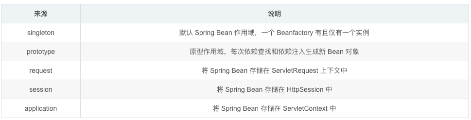

只需要关注和掌握 singleton 和 prototype，对应设计模式里面的单例模式和原型模式。

request、session、application 主要用于页面渲染，比如 JSP、Velocity、Freemaker 等模板引擎，在现在的 web 开发中已经慢慢的转向前后端分离，模板引擎技术已经慢慢的边缘化了。

## singleton Bean作用域

从设计模式的角度，单例模式不论是“懒汉式”还是“饿汉式”，其实最主要的作用是保证对象是唯一的。

在 JVM 的层面来说，我们常用静态变量做单例，每个类对应一个 ClassLoader，ClassLoader 在 load Class 的时候，会加载这个类的静态信息，在同一个 ClassLoader 中，单例对象是唯一的。

在 Spring 的场景中，一个 Bean 对象对应一个应用上下文，或者说 Spring IoC 的 BeanFactory 。通常一个 Bean 默认作用域就是 singleton，不需要配置，换言之，在同一个 BeanFactory 中，Bean 对象只有一个。

从上面的图可以看到，三个 bean 配置都不同，但是 ref="accountDao"，都指向同一个 bean，每次进行属性的注入，都是同一个共享实例。

Bean 的作用域，并不是指的所有的 Bean，而是指的我们 BeanDefinition 。

BeanDefinition 源码：

singleton：shared instance 共享的实例

prototype：independent instance 独立的实例


```java

public interface BeanDefinition extends AttributeAccessor, BeanMetadataElement {
    /**
     * Return whether this a <b>Singleton</b>, with a single, shared instance
     * returned on all calls.
     * @see #SCOPE_SINGLETON
     */
    boolean isSingleton();

    /**
     * Return whether this a <b>Prototype</b>, with an independent instance
     * returned for each call.
     * @since 3.0
     * @see #SCOPE_PROTOTYPE
     */
    boolean isPrototype();

}

```

通过这个两个方法可以判断一个 BeanDefinition 是否是单例或者原型，但是并没有 request、session、application 相关的方法，侧面说明这三种不需要过多关注。

singleton 和 prototype 不能简单的说是互斥的关系，因为从接口的角度看，两个方法可以同时存在。

## prototype Bean作用域

每次进行属性注入都会产生一个新的实例

### 依赖查找&依赖示例

- 分别定义两个 Bean，一个 singleton，一个 prototype。
- getBean() 依赖查找，循环三次看每次取到的对象是否相同
- 使用 System.nanoTime() 系统时间来定义 user 的 id，以便区别 bean 的实例

```java
scope.BeanScopeDemo
```

由此可以得出结论


- 结论一：
  - Singleton Bean 无论依赖查找还是依赖注入，均为同一个对象
  - Prototype Bean 无论依赖查找还是依赖注入，均为新生成的对象

- 结论二：
  - 如果依赖注入集合类型的对象，Singleton Bean 和 Prototype Bean 均会存在一个
  - Prototype Bean 有别于其他地方的依赖注入 Prototype Bean

- 结论三：
  - 无论是 Singleton 还是 Prototype Bean 均会执行初始化方法回调
  - 不过仅 Singleton Bean 会执行销毁方法回调

## request Bean作用域


- 配置
  - XML - <bean class="…" scope=“request” …/>
  - Java 注解 -@RequestScope 或者 Scope(WebApplicationContext.SCOPE_REQUEST)

- 实现
  - API - RequestScope

源码位置：org.springframework.web.context.request.RequestScope


### 示例

- scope.web.WebConfiguration

- scope.web.controller.IndexController

```java

mvn package

java -jar -agentlib:jdwp=transport=dt_socket,server=y,suspend=n,address=8888 bean-scope-0.0.1-war-exec.jar

```
当前端页面渲染时，我们说的对象是新生成的对象（JSP页面中的引用对象），每个请求都会生产新的对象。

但是创建代理对象或者创建新生对象，它实际上是一个被 CGLIB 提升后的一个代理对象，这个代理对象本身它始终是一个不变的，而在前端渲染的对象每次都是变化的。

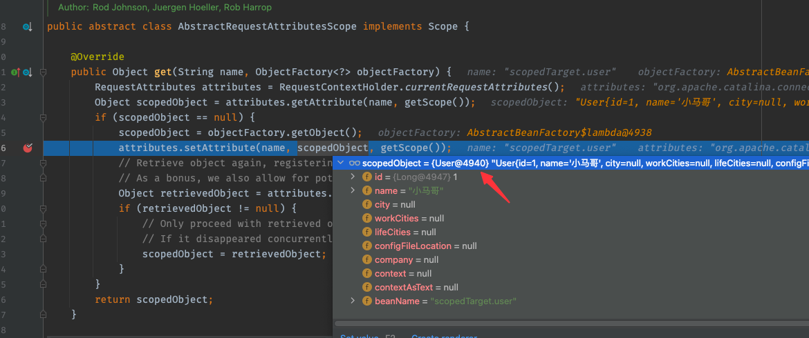

可以看到这里每次请求生成的id都不一样

## session Bean作用域


- 配置

  - XML - <bean class="…" scope=“session” …/>
  - Java 注解 -@SessionScope 或者 Scope(WebApplicationContext.SCOPE_SESSION)
  
- 实现

  - API - SessionScope
  - 源码位置：org.springframework.web.context.request.SessionScope

源码中的 get() 方法操作

```java

	@Override
	public Object get(String name, ObjectFactory<?> objectFactory) {
		Object mutex = RequestContextHolder.currentRequestAttributes().getSessionMutex();
		synchronized (mutex) {
			return super.get(name, objectFactory);
		}
	}
    
```

使用互斥锁，为了防止以下场景

一个用户同一个浏览器，打开多个 tab 窗口，打开的页面中使用 Ajax 循环发送请求，由于不同的 tab 之前，cookie 是共用的，这时候无法保证操作的顺序性；前后直接就会产生数据不一致的情况。

使用 cookie 记录 jsessionid 用来进行用户跟踪，因为涉及到同步，性能会有一定的损耗

和 Request 实现的区别

- 每个 Request 对应一个线程，线程和线程之间它的作用域，所以间接的就隔开了。
- 前端渲染的对象每次都是同一个对象

切换不同的浏览器会展示不用的

## application Bean作用域

- 配置
  - XML - <bean class="…" scope=“application” …/>
  - Java 注解 -@ApplicationScope 或者 Scope(WebApplicationContext.SCOPE_APPLICATION)

- 实现
  - API - ServletContextScope
  - scopedTarget

## 自定义 Bean 作用域

- 实现 Scope
  - org.springframework.beans.factory.config.Scope
  
- 注册 Scope
  - API - org.springframework.beans.factory.config.ConfigurableBeanFactory#registerScope

- 实现一个 ThreadLocal 级别的 Scope
  - scope.ThreadLocalScope
  - scope.ThreadLocalScopeDemo

- ThreadLocal解决SimpleDateFormat线程安全问题 https://blog.csdn.net/jike11231/article/details/108528406


## 自定义作用域的应用

Spring Cloud 中的 RefreshScope

```java

@Target({ ElementType.TYPE, ElementType.METHOD })
@Retention(RetentionPolicy.RUNTIME)
@Scope("refresh")
@Documented
public @interface RefreshScope {
	/**
	 * @see Scope#proxyMode()
	 */
	ScopedProxyMode proxyMode() default ScopedProxyMode.TARGET_CLASS;

}

```

源码位置：org.springframework.cloud.context.scope.refresh.RefreshScope

每次通过endpoint调用，都用调用refresh()
org.springframework.cloud.context.scope.refresh.RefreshScope.refresh

接着调用destroy，将缓存中的bean清理掉
org.springframework.cloud.context.scope.GenericScope.destroy(java.lang.String)

每次在doGetBean()，会掉用 org.springframework.beans.factory.config.Scope.get 方法
org.springframework.beans.factory.support.AbstractBeanFactory.doGetBean

refresh 的时候缓存不存在了，getBean()从容器中获取一个新的bean


# Spring Bean 生命周期

```
SpringBean元信息配置阶段
SpringBean元信息解析阶段
Spring Bean注册阶段
Spring BeanDefinition合并阶段
Spring Bean Class加载阶段
SpringBean实例化前阶段
Spring Bean实例化阶段
Spring Bean实例化后阶段
Spring Bean属性赋值前阶段
Spring Bean Aware接口回调阶段
Spring Bean初始化前阶段
Spring Bean初始化阶段
Spring Bean初始化后阶段
Spring Bean初始化完成阶段
Spring Bean销毁前阶段
Spring Bean销毁阶段
Spring Bean垃圾收集

```

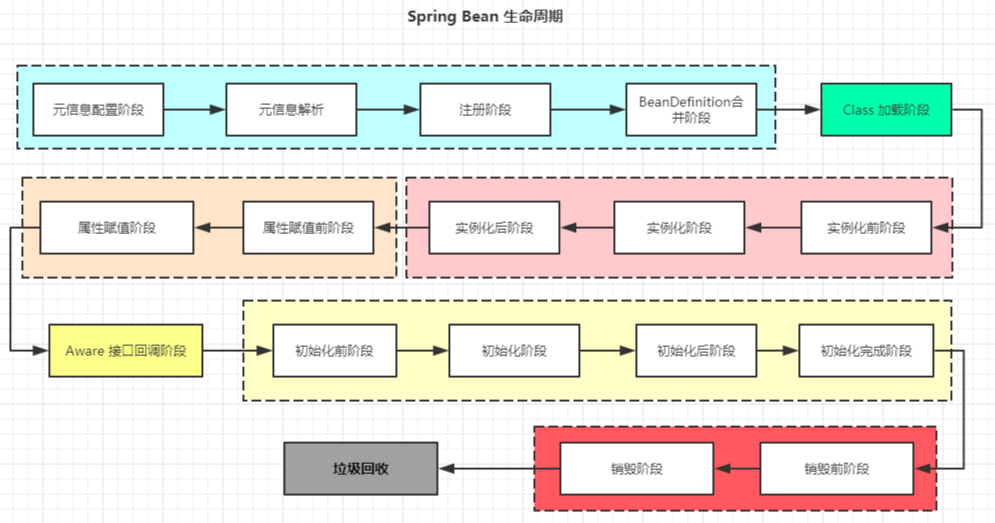

## SpringBean元信息配置阶段

BeanDefinition 配置

- 面向资源
  - XML 配置
    - <bean id="…" …>
  - Properties 资源配置
- 面向注解
  - @Configuration、@Component、@Bean
- 面向 API
  - BeanDefinitionBuilder


### XML 配置

- org.geekbang.thinking.in.spring.ioc.overview.container.BeanFactoryAsIoCContainerDemo

### Properties 资源配置

- lifecycle.BeanMetadataConfigurationDemo

### 注解 配置

- org/geekbang/thinking/in/spring/bean/definition/AnnotationBeanDefinitionDemo.java

### 面向 API

- org.geekbang.thinking.in.spring.bean.definition.AnnotationBeanDefinitionDemo.registerUserBeanDefinition(org.springframework.beans.factory.support.BeanDefinitionRegistry, java.lang.String)


## SpringBean元信息解析阶段

- 面向资源 BeanDefinition 解析
  - BeanDefinitionReader
  - Xml 解析器 - BeanDefinitionParser
- 面向注解 BeanDefinition 解析
  - AnnotatedBeanDefinitionReader

- lifecycle.AnnotatedBeanDefinitionParsingDemo


## Spring Bean注册阶段

- BeanDefinition 注册接口
  - BeanDefinitionRegistry
- 唯一实现
  - org.springframework.beans.factory.support.DefaultListableBeanFactory#registerBeanDefinition

- 源码较多，这里省略一部分，只对重点代码进行分析
  - beanDefinitionMap 数据结构为 ConcurrentHashMap，没有顺序
  - beanDefinitionNames 数据结构为 ArrayList， 存放 beanName 保证注册的顺序
  - this.beanDefinitionMap.put(beanName, beanDefinition); //将 beanDefinition 存入 beanDefinitionMap
  - removeManualSingletonName，注册的单例对象（并非 Bean Scope）和注册 BeanDefinition 是一个互斥的操作，只能存在一个

## Spring BeanDefinition合并阶段

BeanDefinition 合并

- 父子 BeanDefinition 合并
  - 当前 BeanFactory 查找
  - 层次性 BeanFactory 查找

- lifecycle.MergedBeanDefinitionDemo

superUser 的 parent 属性指向 user，表示 superUser 是一个普通的 BeanDefinition，
并且需要合并 user 中的字段属性，这样设计的好处主要是为了优化我们配置的方式。

### 源码分析

- org.springframework.beans.factory.config.ConfigurableBeanFactory#getMergedBeanDefinition

通过 beanName 返回一个被合并的 BeanDefinition，合并 child bean definition 和它的 parent。

这个接口也是只有一个唯一实现

org.springframework.beans.factory.support.AbstractBeanFactory#getMergedBeanDefinition(java.lang.String)

```java

	@Override
	public BeanDefinition getMergedBeanDefinition(String name) throws BeansException {
		String beanName = transformedBeanName(name);
		// Efficiently check whether bean definition exists in this factory.
		if (!containsBeanDefinition(beanName) && getParentBeanFactory() instanceof ConfigurableBeanFactory) {
			return ((ConfigurableBeanFactory) getParentBeanFactory()).getMergedBeanDefinition(beanName);
		}
		// Resolve merged bean definition locally.
		return getMergedLocalBeanDefinition(beanName);
	}

```
这是一个递归的方法，如果当前 BeanFactory 不包含这个 beanName 并且 Parent BeanFactory 是 ConfigurableBeanFactory 这个类型，
那么继续往下查找，如果有的话在当前的 BeanFactory 中查找。


```java
	protected RootBeanDefinition getMergedLocalBeanDefinition(String beanName) throws BeansException {
		// Quick check on the concurrent map first, with minimal locking.
		RootBeanDefinition mbd = this.mergedBeanDefinitions.get(beanName);
        // 如果 mbd 不为空 并且 没有过期
		if (mbd != null && !mbd.stale) {
			return mbd;
		}
		return getMergedBeanDefinition(beanName, getBeanDefinition(beanName));
	}

```

在 mergedBeanDefinitions 这个集合中查找，这个集合是合并之后的 BeanDefinition 存放的集合，集合元素类型为 RootBeanDefinition，
这里需要注意的是 mergedBeanDefinitions 表示的只是当前 BeanFactory 中的 BeanDefinition，如果有多层 BeanFactory ，
每个 BeanFactory 都会有这个 mergedBeanDefinitions 的缓存。 第一次进来肯定是没有的，我们继续往下看，最终到这个方法中，参数中的 containingBd 表示的是嵌套 Bean 的情况，我们这里不讨论。

```java 
	protected RootBeanDefinition getMergedBeanDefinition(
			String beanName, BeanDefinition bd, @Nullable BeanDefinition containingBd)
			throws BeanDefinitionStoreException {
        // 下面的操作既有 get 也有 put，需要加锁保证安全性，而且这个方法可能在很多地方调用
		synchronized (this.mergedBeanDefinitions) {
            RootBeanDefinition mbd = null;
            RootBeanDefinition previous = null;

            // Check with full lock now in order to enforce the same merged instance.
            // 如果为空，表示当前的 BeanDefintion 并不是一个嵌套 Bean 而是顶层 Bean
            if (containingBd == null) {
                // 再从 mergedBeanDefinitions 获取，这里主要是防止有其他线程已经添加了这个 BeanDefinition
                mbd = this.mergedBeanDefinitions.get(beanName);
            }

            if (mbd == null || mbd.stale) {
                previous = mbd;
                if (bd.getParentName() == null) {
                    // Use copy of given root bean definition.
                    if (bd instanceof RootBeanDefinition) {
                        // 如果是 RootBeanDefinition 直接返回
                        mbd = ((RootBeanDefinition) bd).cloneBeanDefinition();
                    } else {
                        // 构建一个 RootBeanDefinition
                        mbd = new RootBeanDefinition(bd);
                    }
                } else {
                    // 示例中 SuperUser 属于这一种情况
                    // Child bean definition: needs to be merged with parent.
                    BeanDefinition pbd;
                    try {
                        // 获取 parent 属性中 BeanName
                        String parentBeanName = transformedBeanName(bd.getParentName());
                        // 如果 beanName和parentBeanName不相同
                        if (!beanName.equals(parentBeanName)) {
                            // 获取 parent 的合并之后的 BeanDefinition，因为 parent 有可能也是一个被合并的 BeanDefinition
                            pbd = getMergedBeanDefinition(parentBeanName);
                        } else {// 如果相同的话，去 parent BeanFactory 中做层次性的查找
                            BeanFactory parent = getParentBeanFactory();
                            if (parent instanceof ConfigurableBeanFactory) {
                                pbd = ((ConfigurableBeanFactory) parent).getMergedBeanDefinition(parentBeanName);
                            }
               ...
                            // Deep copy with overridden values.
                            mbd = new RootBeanDefinition(pbd);
                            mbd.overrideFrom(bd);
                        }
               ...
                        if (containingBd == null && isCacheBeanMetadata()) {
                            // 将合并之后的 mbd 存放到 mergedBeanDefinitions 集合中
                            this.mergedBeanDefinitions.put(beanName, mbd);
                        }
                    }
                    if (previous != null) {
                        copyRelevantMergedBeanDefinitionCaches(previous, mbd);
                    }
                    return mbd;
                }
            }
        }
```

> - user 和 superUser 都会经过合并的过程，而且最后都变成了 RootBeanDefinition
> - superUser 合并了 user 的属性

## Spring Bean Class加载阶段

- ClassLoader 类加载

- Java Security 安全控制

- ConfigurableBeanFactory 临时 ClassLoader


### 源码调试

还是用上面的例子进行，我们将断点打在

方法调用栈如下
org.springframework.beans.factory.support.AbstractBeanFactory#doGetBean
org.springframework.beans.factory.support.AbstractAutowireCapableBeanFactory.createBean(java.lang.String, org.springframework.beans.factory.support.RootBeanDefinition, java.lang.Object[])
org.springframework.beans.factory.support.AbstractBeanDefinition.resolveBeanClass

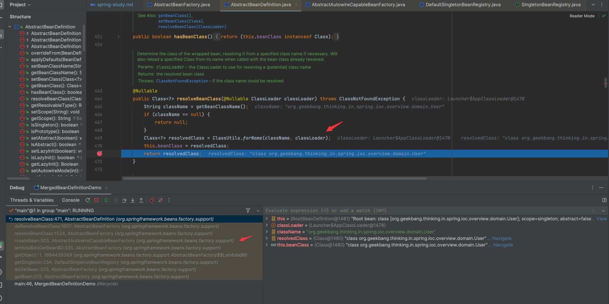

从源码分析可以看出，其实 Spring BeanDefinition 变成 Class 的过程其实还是通过传统 Java 的 ClassLoader 来进行加载的。

## SpringBean实例化前阶段

非主流生命周期 - Bean 实例化前阶段

- org.springframework.beans.factory.config.InstantiationAwareBeanPostProcessor#postProcessBeforeInstantiation

这个 Bean 的前置处理在目标 bean 实例化之前，返回一个 bean 的对象可能是一个代理对象去替换这个目标的 bean

- 自定义类来实现 InstantiationAwareBeanPostProcessor 接口，重写 postProcessBeforeInstantiation 方法

- 在这个方法中，我们根据 BeanName 来拦截 superUser，替换成一个新的 SuperUser 对象。

- 通过 beanFactory.addBeanPostProcessor 来增加我们的实例化前的操作

示例代码：lifecycle.BeanInstantiationLifecycleDemo

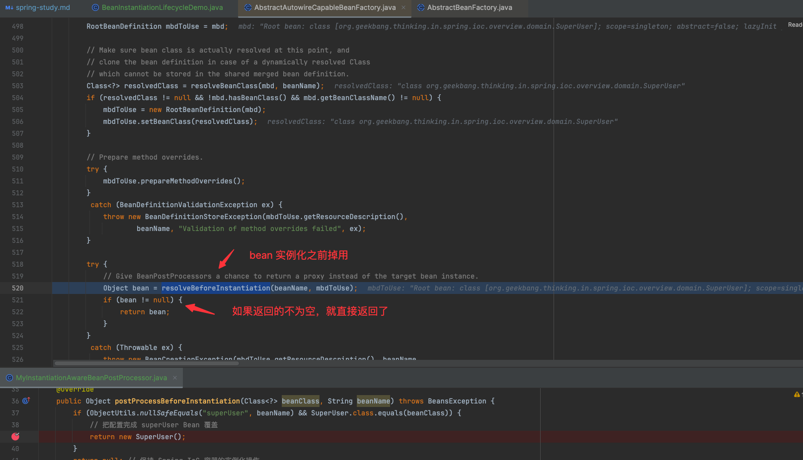


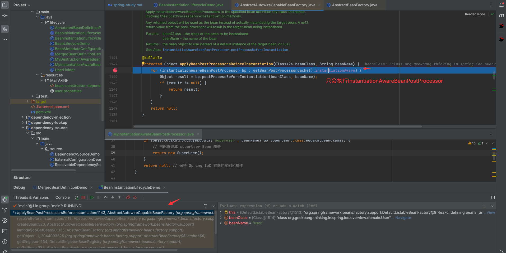

## Spring Bean实例化阶段

实例化方法

- 传统实例化方式
- 实例化策略- InstantiationStrategy
  - 构造器依赖注入
- 关键源码位置
  - AbstractAutowireCapableBeanFactory#doCreateBean
  
### 源码分析

我们可以知道 Spring Bean 默认实例化的方法是 doCreateBean()，在这方法中又可以找到 createBeanInstance()，这个就是 user 创建的调用代码

通过上一小节的源码调试，我们可以知道 Spring Bean 默认实例化的方法是 doCreateBean()，在这方法中又可以找到 createBeanInstance()，这个就是 user 创建的调用代码

通过 java8 中的函数式接口进行创建
通过 FactoryMethod 方式进行创建


```java
protected BeanWrapper createBeanInstance(String beanName, RootBeanDefinition mbd, @Nullable Object[] args) {
		// Make sure bean class is actually resolved at this point.
		Class<?> beanClass = resolveBeanClass(mbd, beanName);
        ...
        // 通过 java8 中的函数式接口进行创建
		Supplier<?> instanceSupplier = mbd.getInstanceSupplier();
		if (instanceSupplier != null) {
			return obtainFromSupplier(instanceSupplier, beanName);
		}
        // 通过 FactoryMethod 方式进行创建
		if (mbd.getFactoryMethodName() != null) {
			return instantiateUsingFactoryMethod(beanName, mbd, args);
		}

		// Shortcut when re-creating the same bean...
        // 重复创建相同的 bean，代码逻辑和下面的差不多，会少一些判断，这是一种性能的优化
        ... 
            
		// Candidate constructors for autowiring?
        // 可以提供一些构造器的选择策略 ctors 通常为 null
        // 自动绑定为构造器绑定
        // 或者 beanDefintion 中包含构造器参数
        // 获取 args 不为空
		Constructor<?>[] ctors = determineConstructorsFromBeanPostProcessors(beanClass, beanName);
		if (ctors != null || mbd.getResolvedAutowireMode() == AUTOWIRE_CONSTRUCTOR ||
				mbd.hasConstructorArgumentValues() || !ObjectUtils.isEmpty(args)) {
			return autowireConstructor(beanName, mbd, ctors, args);
		}
         
		// Preferred constructors for default construction?
        // 是否有默认的偏好构造器
		ctors = mbd.getPreferredConstructors();
		if (ctors != null) {
			return autowireConstructor(beanName, mbd, ctors, null);
		}

		// No special handling: simply use no-arg constructor.
        // 非特殊方式：简单实用无参构造器
		return instantiateBean(beanName, mbd);
	}


```
#### 传统实例化方式 InstantiationStrategy

- instantiateBean：非特殊方式：简单实用无参构造器
  - 源代码较多，我们这里直接说关键源码
  - SimpleInstantiationStrategy#instantiate()

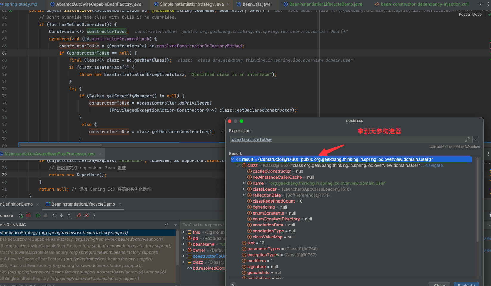

- 最终是通过 ctor.newInstance(argsWithDefaultValues); 来进行实例化，其实就是 Java 反射中的方法。
- 源码位置：org.springframework.beans.BeanUtils#instantiateClass(java.lang.reflect.Constructor, java.lang.Object…) 200 行
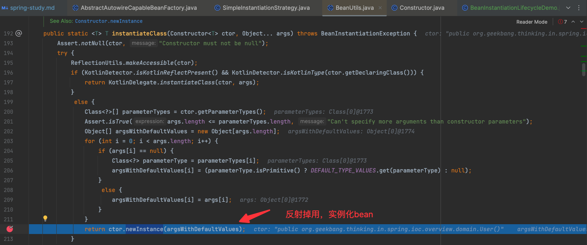
- 最后获取到实例化之后的 User 对象，被封装成 BeanWrapper 对象，这个对象比较复杂，我们这里不进行展开

- 这里 User 对象通过无参的构造器实例化完成，所有的属性都是 null，这就是 Spring Bean 实例化的过程，此时还没有进行属性赋值和初始化相关的过程。
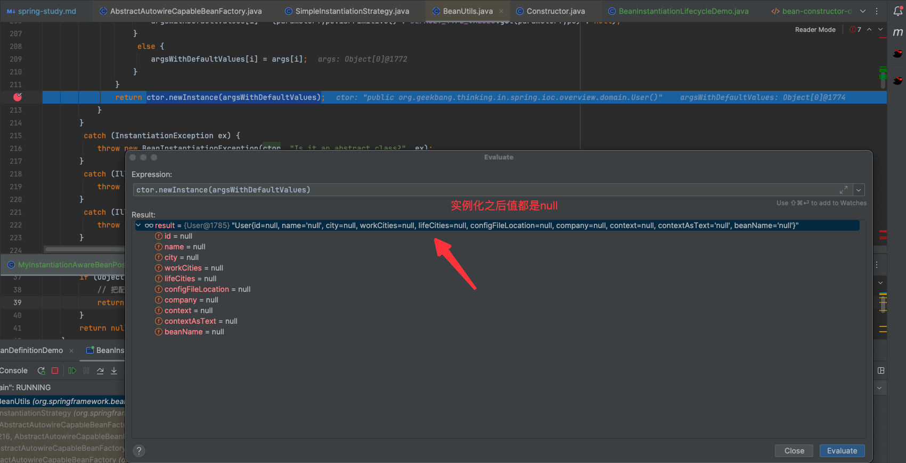

#### 构造器依赖注入

- 示例改造

```java
/**
 * UserHolder
 */
public class UserHolder {

    private User user;

    public UserHolder(User user) {
        this.user = user;
    }

    @Override
    public String toString() {
        return "UserHolder{" +
                "user=" + user +
                '}';
    }
}

```

```xml
<?xml version="1.0" encoding="UTF-8"?>
<beans xmlns="http://www.springframework.org/schema/beans"
       xmlns:xsi="http://www.w3.org/2001/XMLSchema-instance"
       xsi:schemaLocation="http://www.springframework.org/schema/beans
        https://www.springframework.org/schema/beans/spring-beans.xsd">

    <import resource="classpath:/META-INF/dependency-lookup-context.xml"/>

  <bean id="userHolder" class="lifecycle.UserHolder" autowire="constructor"
        init-method="init" destroy-method="doDestroy"/>
</beans>

```

- 断点打在AbstractAutowireCapableBeanFactory#createBeanInstance 1168 行，放掉前面的几个对象，
当 beanName 为 Holder 我们开始进行调试

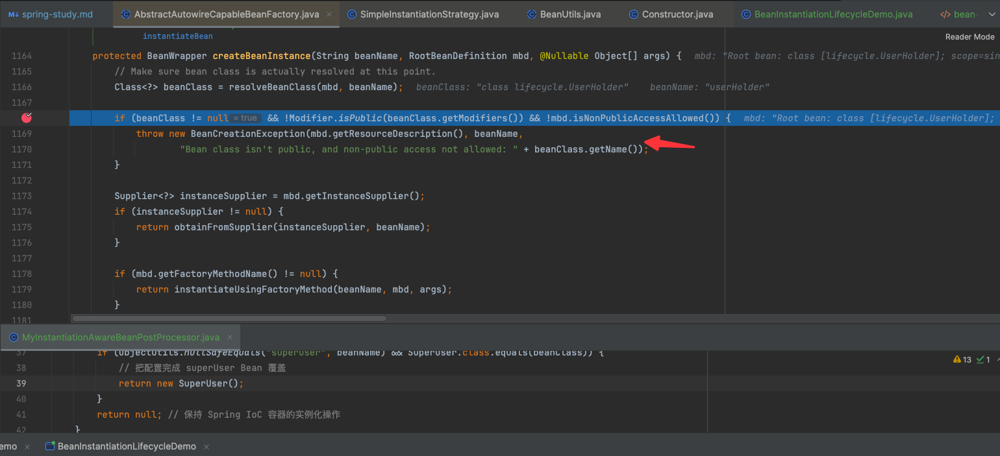

- mbd.getResolvedAutowireMode() == AUTOWIRE_CONSTRUCTOR，即 BeanDefintion 的自动绑定方式是构造器

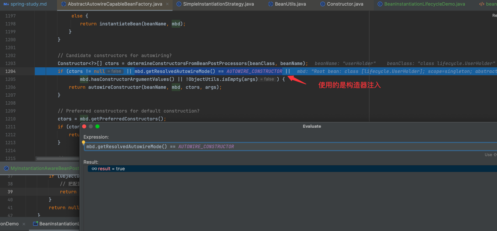

- org.springframework.beans.factory.support.ConstructorResolver.autowireConstructor

- 获取 UserHolder 构造器，这里我们只定义了一个

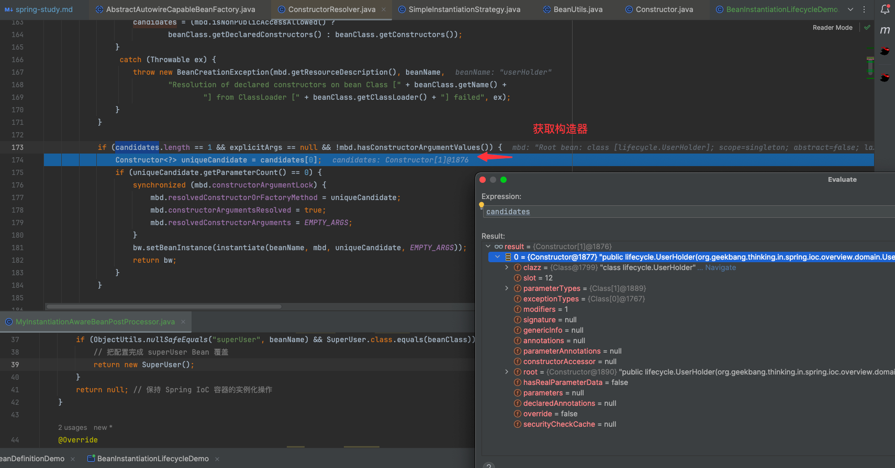

- 获取构造器参数

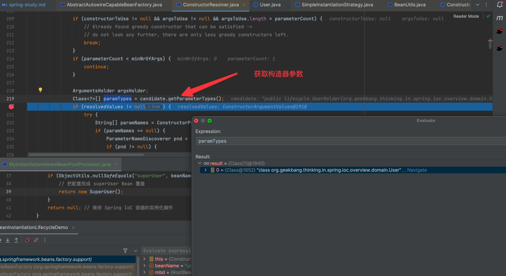


- org.springframework.beans.factory.support.ConstructorResolver.createArgumentArray

- resolveAutowiredArgument 这个方法会触发依赖处理，原因就是 User 这个参数需要注入，
- 这个 beanFactory.resolveDependency
- org.springframework.beans.factory.support.ConstructorResolver.resolveAutowiredArgument

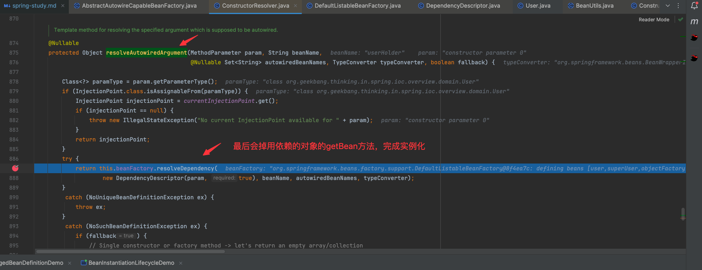
- org.springframework.beans.factory.support.SimpleInstantiationStrategy.instantiate(org.springframework.beans.factory.support.RootBeanDefinition, java.lang.String, org.springframework.beans.factory.BeanFactory, java.lang.reflect.Constructor<?>, java.lang.Object...)
- 调用有参构造器完成实例化
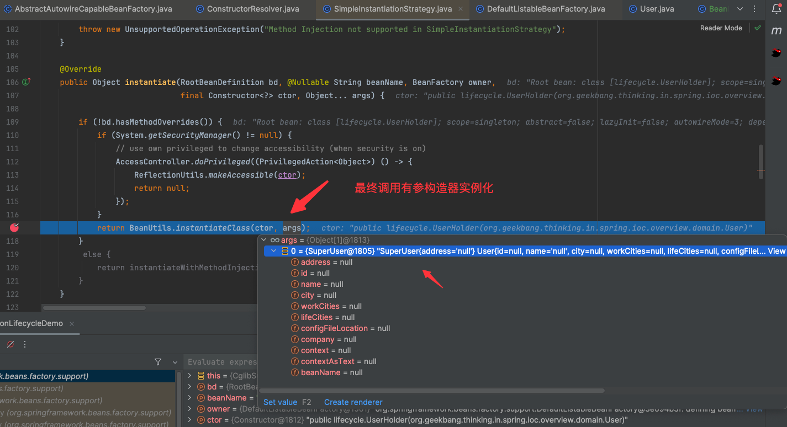

## Spring Bean实例化后阶段

Bean 属性值（Populate）判断

- InstantiationAwareBeanPostProcessor#postProcessAfterInstantiation

在 MyInstantiationAwareBeanPostProcess 新增一个 postProcessAfterInstantiation 的重载方法

### 源码调试

断点打在 AbstractAutowireCapableBeanFactory#populateBean 594 行，当 User 实例化之后，会执行该方法

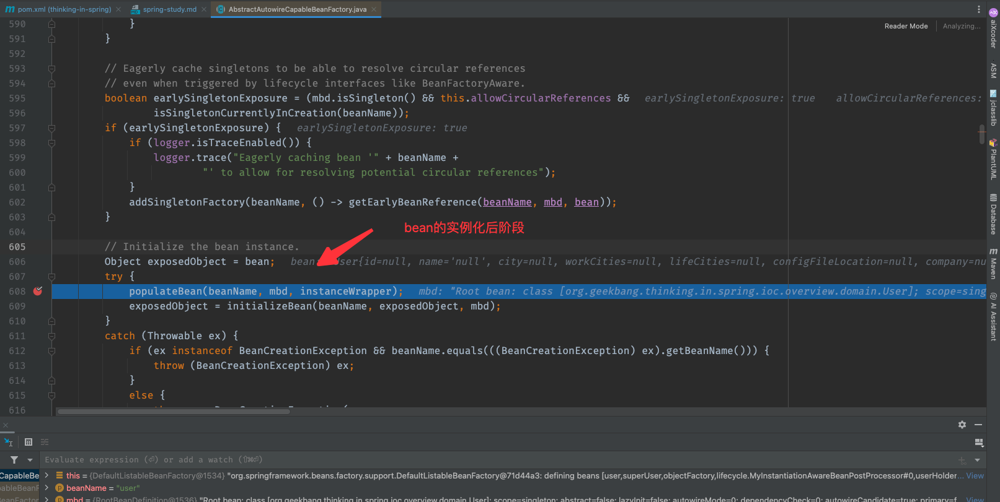

进入到方法中，这里逻辑比较简单，遍历所有的 BeanPostProcessors，找到类型为 InstantiationAwareBeanPostProcessor 的（
这里就是我们实现的 MyInstantiationAwareBeanPostProcess 类），执行 postProcessAfterInstantiation 方法。

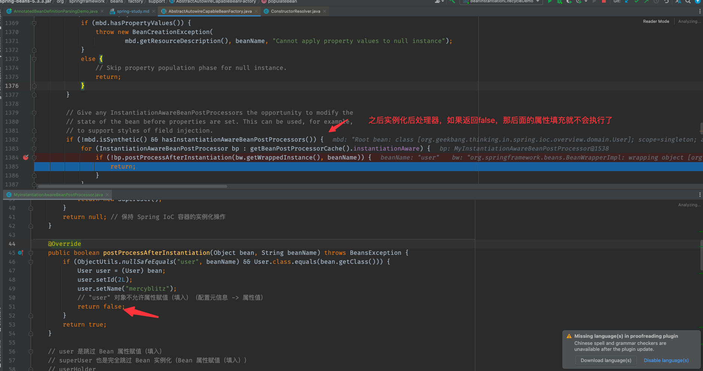

postProcessAfterInstantiation 方法可以用来判断这个 Bean 是否要进行属性赋值（populateBean），
如果不需要可以进行拦截返回 false ；这个时候 Bean 的实例化已经完成，但是属性赋值还没有开始。


## Spring Bean属性赋值前阶段

Bean 属性值元信息

- PropertyValues
Bean 属性赋值前回调

- Spring 1.2 - 5.0 :

  - org.springframework.beans.factory.config.InstantiationAwareBeanPostProcessor#postProcessPropertyValues

- Spring 5.1:

  - org.springframework.beans.factory.config.InstantiationAwareBeanPostProcessor#postProcessProperties


### 示例改造

首先 UserHolder 增加两个属性， number 和 description


对应的 xml 配置如下，我们只设置 description 的值为 “The user holder”

```xml
    <bean id="userHolder" class="com.huajie.thinking.in.spring.bean.lifecycle.domain.UserHolder"
          autowire="constructor">
        <!--<property name="number" value="1"/>-->
        <property name="description" value="The user holder" />
    </bean>
```

我们在上面示例的基础上，在 MyInstantiationAwareBeanPostProcess 新增一个 postProcessProperties 的重载方法

- 设置 numebr 属性值为 1
- 覆盖 description 的属性为 “The user holder v2”

``` java
    // user 是跳过 Bean 属性赋值（填入）
    // superUser 也是完全跳过 Bean 实例化（Bean 属性赋值（填入））
    // userHolder
    @Override
    public PropertyValues postProcessProperties(PropertyValues pvs, Object bean, String beanName)
            throws BeansException {
        // 对 "userHolder" Bean 进行拦截
        if (ObjectUtils.nullSafeEquals("userHolder", beanName) && UserHolder.class.equals(bean.getClass())) {
            // 假设 <property name="number" value="1" /> 配置的话，那么在 PropertyValues 就包含一个 PropertyValue(number=1)

            final MutablePropertyValues propertyValues;

            if (pvs instanceof MutablePropertyValues) {
                propertyValues = (MutablePropertyValues) pvs;
            } else {
                propertyValues = new MutablePropertyValues();
            }

            // 等价于 <property name="number" value="1" />
            propertyValues.addPropertyValue("number", "1");
            // 原始配置 <property name="description" value="The user holder" />

            // 如果存在 "description" 属性配置的话
            if (propertyValues.contains("description")) {
                // PropertyValue value 是不可变的
//                    PropertyValue propertyValue = propertyValues.getPropertyValue("description");
                propertyValues.removePropertyValue("description");
                propertyValues.addPropertyValue("description", "The user holder V2");
            }

            return propertyValues;
        }
        return null;
    }
```
### 源码调试

断点位置 AbstractAutowireCapableBeanFactory#populateBean 行，当 UserHolder 进来的时候，会走这段逻辑，
可以看到此时 pvs 只有 description 一个属性，因为我们 xml 文件中只配置了这一个属性。

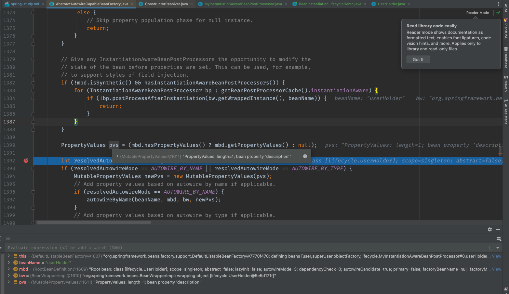

通过遍历 BeanPostProcessors 执行我们的 postProcessPropertyValues 方法，
pvs 的 length 变成了 2，此时属性已经变成 number = 1，description = ‘The user holder v2’。
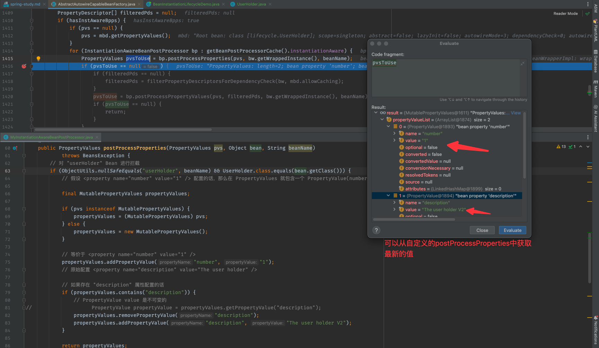


## Spring Bean属性赋值阶段

还是上面的例子，applyPropertyValues 其实就是属性赋值阶段。

源码位置 AbstractAutowireCapableBeanFactory#applyPropertyValues

源码相对比较简单，我们就不贴出来了，大致分为三步

遍历我们前面传进来的 pvs 参数
进行 deepCopy 深拷贝
然后通过 bw.setPropertyValues(new MutablePropertyValues(deepCopy)); 进行赋值操作
断点打在 AbstractAutowireCapableBeanFactory#applyPropertyValues行

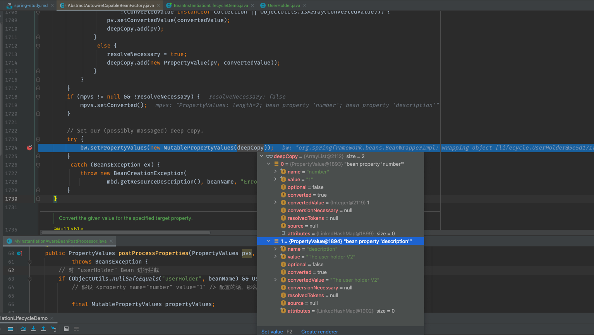

## Spring Bean Aware接口回调阶段

Spring Aware 接口（此接口顺序也是源码的回调执行顺序）

- BeanNameAware
- BeanClassLoaderAware
- BeanFactoryAware
- EnvironmentAware
- EmbeddedValueResolverAware
- ResourceLoaderAware
- ApplicationEventPublisherAware
- MessageSourceAware
- ApplicationContextAware


### 示例改造1
UserHolder 分别实现 BeanNameAware, BeanClassLoaderAware, BeanFactoryAware 三个回调接口

### 源码分析1
AbstractAutowireCapableBeanFactory#doCreateBean 行，同样还是 doCreateBean 方法，但是之前是属性赋值阶段 populateBean，
现在是 initializeBean 阶段

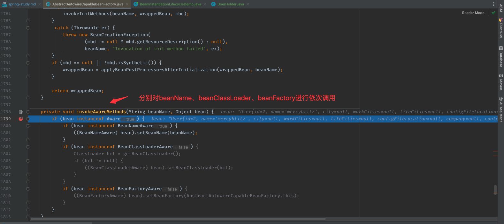

### 示例改造2

UserHolder，我们再实现一个 EnvironmentAware 回调

- 执行 lifecycle.BeanInstantiationLifecycleDemo.executeBeanFactory

发现没有走到setEnvironment回调

其实原因是这些 Aware 回调接口是 ApplicationContext 生命周期中的，并不在 BeanFactory 生命周期中，
这是 BeanFactory 和 ApplicationContext 的一个具体区别之一。

- 执行 lifecycle.BeanInstantiationLifecycleDemo.executeApplicationContext

发现可以走到setEnvironment回调
### 源码分析2
我们看一下 AbstractApplicationContext#prepareBeanFactory 中如何进行 Aware 回调

```java
	protected void prepareBeanFactory(ConfigurableListableBeanFactory beanFactory) {
    // Configure the bean factory with context callbacks.
    beanFactory.addBeanPostProcessor(new ApplicationContextAwareProcessor(this));
    beanFactory.ignoreDependencyInterface(EnvironmentAware.class);
    beanFactory.ignoreDependencyInterface(EmbeddedValueResolverAware.class);
    beanFactory.ignoreDependencyInterface(ResourceLoaderAware.class);
    beanFactory.ignoreDependencyInterface(ApplicationEventPublisherAware.class);
    beanFactory.ignoreDependencyInterface(MessageSourceAware.class);
    beanFactory.ignoreDependencyInterface(ApplicationContextAware.class);

    }

```

关键代码 ApplicationContextAwareProcessor 我们再看下 ApplicationContextAwareProcessor 具体实现

ApplicationContextAwareProcessor#invokeAwareInterfaces


```java

	private void invokeAwareInterfaces(Object bean) {
		if (bean instanceof EnvironmentAware) {
			((EnvironmentAware) bean).setEnvironment(this.applicationContext.getEnvironment());
		}
		if (bean instanceof EmbeddedValueResolverAware) {
			((EmbeddedValueResolverAware) bean).setEmbeddedValueResolver(this.embeddedValueResolver);
		}
		if (bean instanceof ResourceLoaderAware) {
			((ResourceLoaderAware) bean).setResourceLoader(this.applicationContext);
		}
		if (bean instanceof ApplicationEventPublisherAware) {
			((ApplicationEventPublisherAware) bean).setApplicationEventPublisher(this.applicationContext);
		}
		if (bean instanceof MessageSourceAware) {
			((MessageSourceAware) bean).setMessageSource(this.applicationContext);
		}
		if (bean instanceof ApplicationContextAware) {
			((ApplicationContextAware) bean).setApplicationContext(this.applicationContext);
		}
	}

```

代码和 BeanNameAware 的回调如出一辙。

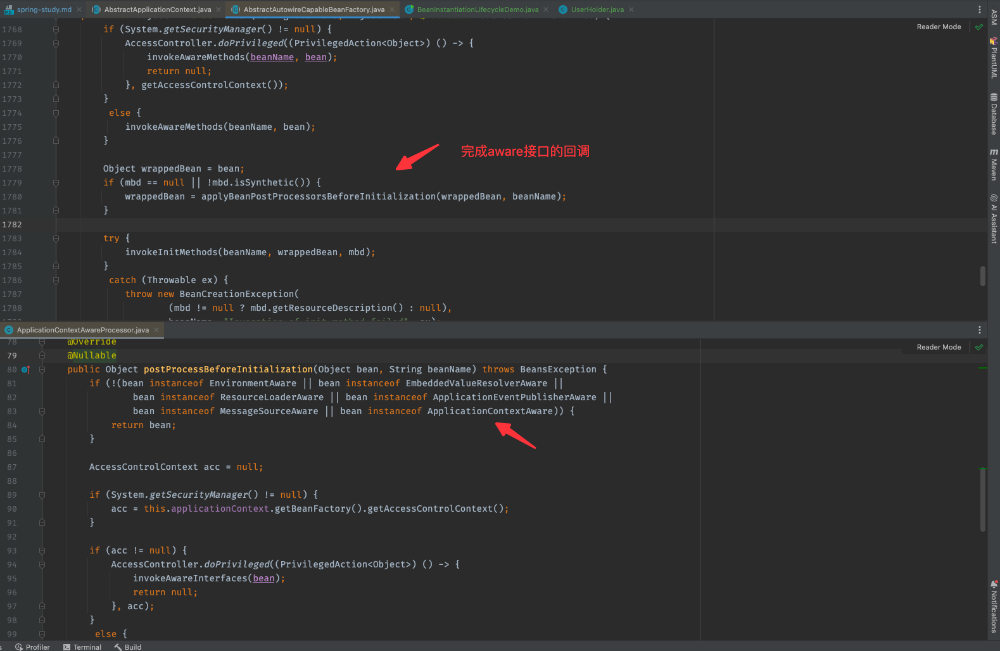

## Spring Bean初始化前阶段

- 初始化前阶段已完成以下三个阶段
  - Bean 实例化
  - Bean 属性赋值
  - Bean Aware 接口回调
- 方法回调
  - BeanPostProcessor#postProcessBeforeInitialization

### 示例代码
MyInstantiationAwareBeanPostProcess 新增 postProcessBeforeInitialization 的实现

调用示例 BeanInitializationLifecycleDemo


### 源码分析
AbstractAutowireCapableBeanFactory#applyBeanPostProcessorsBeforeInitialization

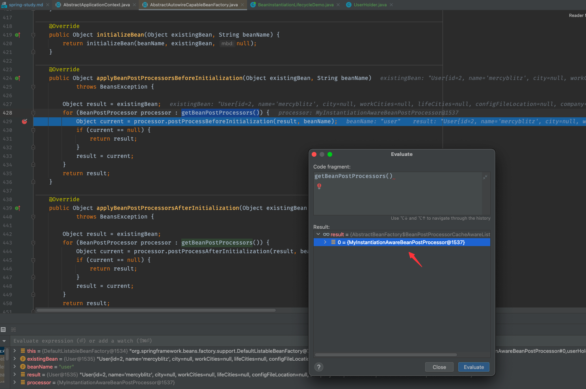


## Spring Bean初始化阶段

- @PostConstruct 标注方法
- 实现 InitializingBean 接口的 afterPropertiesSet() 方法
- 自定义初始化方法


### 源码分析

- @PostConstruct

其实在初始化前的操作中就已经完成了postProcessBeforeInitialization

由InitDestroyAnnotationBeanPostProcessor#postProcessBeforeInitialization =》 

InitDestroyAnnotationBeanPostProcessor.LifecycleMetadata#invokeInitMethods 调用

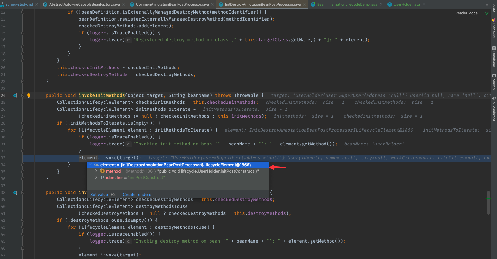

- afterPropertiesSet
AbstractAutowireCapableBeanFactory#invokeInitMethods

((InitializingBean) bean).afterPropertiesSet();

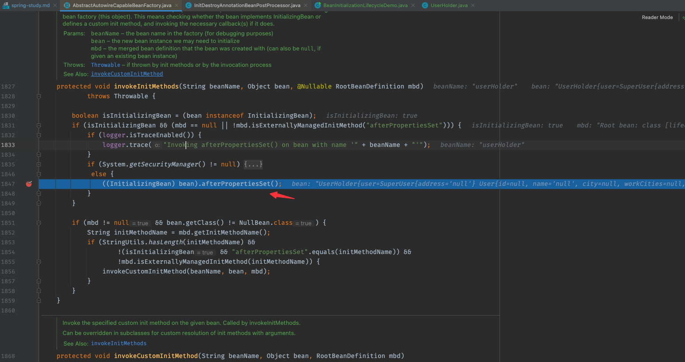

- 自定义方法
AbstractAutowireCapableBeanFactory#invokeInitMethods

invokeCustomInitMethod(beanName, bean, mbd);

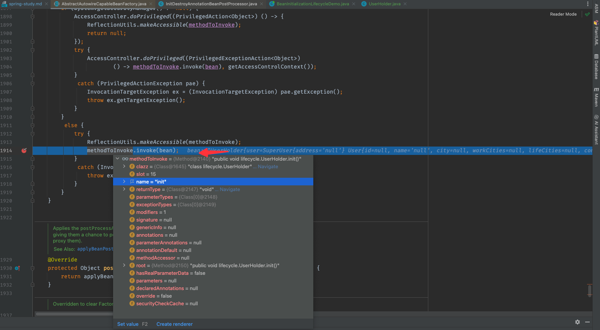

## Spring Bean初始化后阶段

- 方法回调
BeanPostProcessor#postProcessAfterInitialization

和初始化前的阶段一样，我们只需要重写 BeanPostProcessor 中的 postProcessAfterInitialization 方法即可

### 源码分析

这个源代码和初始化前阶段的 applyBeanPostProcessorsBeforeInitialization 源码基本上完全一样

- 遍历所有的 BeanPostProcessor 执行 postProcessAfterInitialization 方法

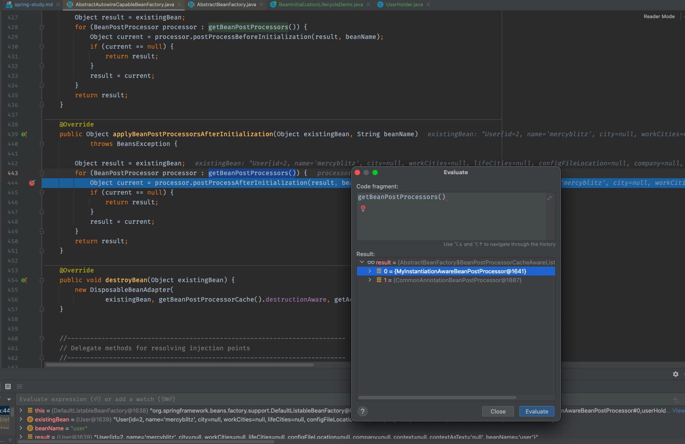

### 小结
从上面源码分析可以看出 initializeBean 初始化 Bean 的方法依次进行了四个操作

invokeAwareMethods(beanName, bean); //Aware回调
applyBeanPostProcessorsBeforeInitialization //初始化前
invokeInitMethods //初始化
applyBeanPostProcessorsAfterInitialization //初始化后

## Spring Bean初始化完成阶段

方法回调

- Spring 4.1+: SmartInitializingSingleton#afterSingletonsInstantiated

UserHolder 实现 SmartInitializingSingleton 接口

afterSingletonsInstantiated 这个方法此时还不能被回调，我们需要通过 Idea 来查找这个方法在哪里被调用过，

DefaultListableBeanFactory#preInstantiateSingletons，所以我们需要在代码中显示的调用这个方法

beanFactory.preInstantiateSingletons();


### 

SmartInitializingSingleton 通常在 ApplicationContext 场景使用，因为在应用上下文启动过程中，

AbstractApplicationContext#refresh 中 finishBeanFactoryInitialization(beanFactory); 会显示的调用这个 preInstantiateSingletons() 方法。

preInstantiateSingletons 在 AbstractApplicationContext 场景非常重要，有两层含义

- 初始化我们所有的 Spring Bean
- 通过 beanDefinitionNames 来遍历我们所有的 BeanDefinition，逐一进行 getBean(beanName) 操作，通过我们的 BeanDefinition 创建 bean 对象， 并缓存到 DefaultSingletonBeanRegistry#singletonObjects 中
   当我们的 Spring Bean 全部初始化完成之后，再进行 afterSingletonsInstantiated() 方法的回调


## Spring Bean销毁前阶段
方法回调

- DestructionAwareBeanPostProcessor#postProcessBeforeDestruction

新增 MyDestructionAwareBeanPostProcessor 实现 DestructionAwareBeanPostProcessor

覆盖 postProcessBeforeDestruction 销毁前的方法

调用需要的执行 beanFactory.destroyBean("userHolder",userHolder); 销毁这个 bean 才会触发销毁前的过程。

### 源码调试

- org.springframework.beans.factory.support.DisposableBeanAdapter#destroy

循环遍历 beanPostProcessors，执行 postProcessBeforeDestruction 方法

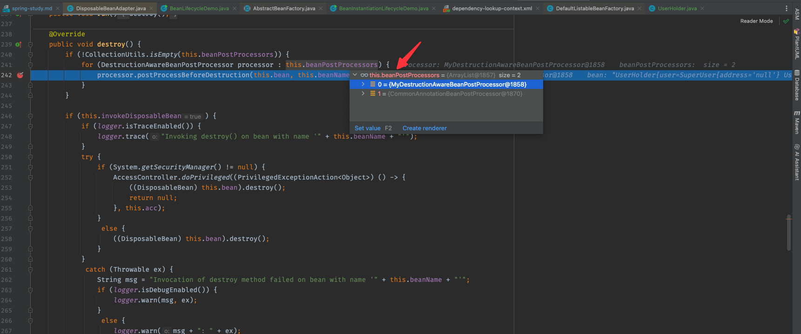

## Spring Bean销毁阶段

- Bean 销毁（Destroy）
  - @PreDestroy 标注方法
  - 实现 DisposableBean 接口的 destroy() 方法
  - 自定义销毁方法

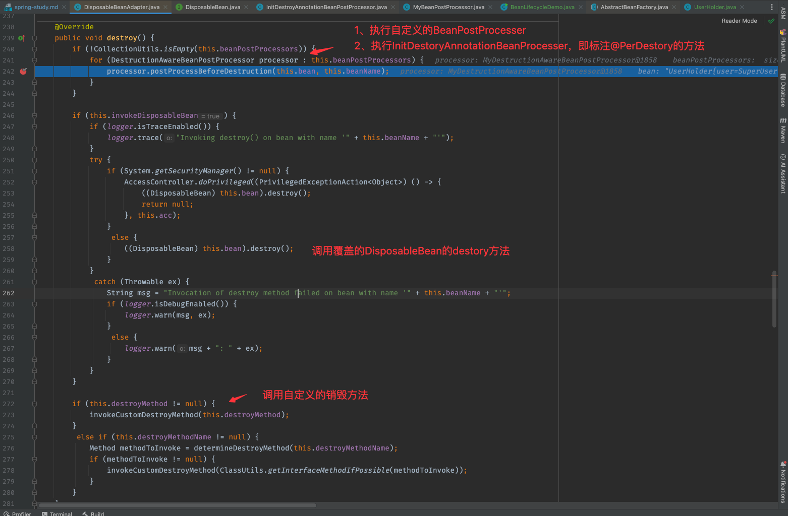


## Spring Bean垃圾收集

Bean 垃圾回收

关闭 Spring 容器（应用上下文）
执行 GC
Spring Bean 覆盖 finalize() 方法被回调

UserHolder 覆盖 Object#finalize 方法，因为这个方法会在对象被 GC 的时候调用

beanFactory.destroySingletons();//销毁掉所有单例对象，保证没有对象的强引用
userHolder=null;//对象置为空
System.gc(); //调用 Full gc 可以看到finalize 方法调用


## 面试题

### BeanPostProcessor 的使用场景有哪些？
BeanPostProcessor 提供 Spring Bean 初始化前和初始化后的生命周期回调，分别对应 postProcessBeforeInitialization 以及 postProcessAfterInitialization 方法，
允许对相关的 Bean 进行扩展，甚至是替换。

BeanPostProcessor 的子类 DestructionAwareBeanPostProcessor 提供销毁前的生命周期回调。
BeanPostProcessor 的子类 InstantiationAwareBeanPostProcessor 提供实例化前postProcessBeforeInstantiation，实例化后 postProcessAfterInstantiation，
属性赋值前 postProcessProperties 的生命周期回调。

加分项：其中 ApplicationContext 相关的 Aware 回调也是基于 BeanPostProcessor 实现，即 ApplicationContextAwareProcessor。

### BeanFactoryPostProcessor 与 BeanPostProcessor 的区别？

其实两者无法进行对比，BeanFactoryPostProcessor 是 Spring BeanFactory（实际是ConfigurableListableBeanFactory）的后置处理器，用于扩展 BeanFactory，
或者通过 BeanFactory 进行依赖查找和依赖注入。 而 BeanPostProcessor 则是直接与 BeanFactory 关联，属于 N 对 1 的关系。

加分项：BeanFactoryPostProcessor 必须有 Spring ApplicationContext 执行，BeanFactory 无法直接与其交互。

### BeanFactory 是怎样处理 Bean 生命周期？

BeanFactory 的默认实现为 DefaultListableBeanFactory ,其中 Bean 生命周期与方法映射如下：

- BeanDefinition 注册阶段 - registerBeanDefinition

- BeanDefinition 合并阶段 - getMergedBeanDefinition

- Bean 实例化前阶段 - resolveBeforeInstantiation

- Bean 实例化阶段 - createBeanInstance

- Bean 实例化后阶段 - populateBean

- Bean 属性赋值前阶段 - populateBean

- Bean 属性赋值阶段 - populateBean

- Bean Aware 接口回调阶段 - initializeBean

- Bean 初始化前阶段 - initializeBean

- Bean 初始化阶段 - initializeBean

- Bean 初始化后阶段 - initializeBean

- Bean 初始化完成阶段 - preInstantiateSingletons

- Bean 销毁前阶段 - destroyBean

- Bean 销毁阶段 - destroyBean

# 参考博客

> https://blog.csdn.net/xiewenfeng520/category_9912098.html


