# 重新认识IOC

## 什么是IoC?

简单地说,IoC是反转控制,类似于好莱坞原则,主要有依赖查
找和依赖注入实现

## 依赖查找和依赖注入的区别?

依赖查找是主动或手动的依赖查找方式,通常需要依赖容器或标准API实现。
而依赖注入则是手动或自动依赖绑定的方式,无需依赖特定的容器和ΑΡΙ

```dtd
org.geekbang.thinking.in.spring.ioc.overview.dependency.injection.DependencyInjectionDemo

        org.geekbang.thinking.in.spring.ioc.overview.dependency.lookup.DependencyLookupDemo
```

## 依赖查找VS.依赖注入


## Spring 作为 IoC 容器有什么优势?

- 典型的IoC管理,依赖查找和依赖注入
- AOP抽象
- 事务抽象
- 事件机制
- SPI扩展
- 强大的第三方整合
- 易测试性
- 更好的面向对象


## BeanFactory与FactoryBean?

- BeanFactory是IoC底层容器
- FactoryBean是创建Bean的一种方式,帮助实现复杂的初始化逻辑

## Spring IoC容器启动时做了哪些准备?

IoC配置元信息读取和解析、IoC容器生命周期、Spring事件发布
国际化等,更多答案将在后续专题章节逐一讨论

# spring bean 基础

## 初始化 Spring Bean

- Bean 初始化 (Initialization)
  - @PostConstruct标注方法
  - 实现 InitializingBean接口的afterPropertiesSet方法
  - 自定义初始化方法
    - XML配置:<bean init-method=" init".../>
    - Java注解:@Bean(initMethod="init")
    - Java API: AbstractBeanDefinition#setInitMethodName (String)
```dtd
org.geekbang.thinking.in.spring.bean.definition.BeanInitializationDemo
```

## 延迟初始化SpringBean

- Bean 延迟初始化(Lazy Initialization)
  - XML 配置:<bean lazy-init="true
  - Java注解:@Lazy(true)

```dtd
org.geekbang.thinking.in.spring.bean.definition.BeanInitializationDemo
@Lazy(value = true)
```

## 销毁 Spring Bean

- Bean 销毁(Destroy)
  - @PreDestroy标注方法
  - 实现 DisposableBean接口的 destroy()方法
  - 自定义销毁方法
    - XML配置:<beandestroy="destroy"
    - Java注解:@Bean(destroy="destroy")
    - Java API: AbstractBeanDefinition#setDestroyMethodNanme (String)

## 如何注册一个SpringBean?

通过 BeanDefinition和外部单体对象来注册
```dtd
org.geekbang.thinking.in.spring.bean.definition.SingletonBeanRegistrationDemo

```
## BeanDefinition 元信息


- BeanDefinition 构建
  - 通过 BeanDefinitionBuilder
  - 通过AbstractBeanDefinition以及派生类

```dtd
org.geekbang.thinking.in.spring.bean.definition.BeanDefinitionCreationDemo
```
# Spring依赖查找

## 单一类型依赖查找

- 单一类型依赖查找接口-BeanFactory
  - 根据Bean名称查找
    - getBean (String)
    - Spring 2.5覆盖默认参数:getBean(String,Object...)
  - 根据 Bean类型查找
    - Bean实时查找
      - Spring 3.0getBean (Class)
      - Spring4.1覆盖默认参数:getBean(Class, Object...)
    - Spring 5.1 Bean 延迟查找
      - getBeanProvider (Class)
      - getBeanProvider (ResolvableType)
  - 根据Bean名称+类型查找:getBean(String,Class)

```dtd
org.geekbang.thinking.in.spring.dependency.lookup.ObjectProviderDemo
```

## 集合类型依赖查找

- 集合类型依赖查找接口-ListableBeanFactory
  - 根据 Bean 类型查找
    - 获取同类型Bean名称列表
      - getBeanNamesForType (Class)
      - Spring 4.2 getBeanNamesForType (ResolvableType)
    - 获取同类型Bean实例列表
      - getBeansOfType(Class) 以及重载方法
  - 通过注解类型查找
    - Spring3.0获取标注类型Bean名称列表
      - getBeanNamesForAnnotation (Class<? extends Annotation)
    - Spring3.0获取标注类型Bean实例列表
      - getBeansWithAnnotation(Class<? extends Annotation>)
    - Spring3.0获取指定名称+标注类型Bean实例
      - findAnnotationOnBean (String, Class<? extends Annotatioon>

```dtd
org.geekbang.thinking.in.spring.ioc.overview.dependency.lookup.DependencyLookupDemo
```

## 层次性依赖查找

- 层次性依赖查找接口-HierarchicalBeanFactory
  - 双亲BeanFactory:getParentBeanFactory()
  - 层次性查找
    - 根据Bean名称查找
      - 基于containsLocalBean方法实现
    - 根据 Bean 类型查找实例列表
      - 单一类型:BeanFactoryUtils#bean0fType
      - 集合类型:BeanFactoryUtils#beansOfTypeIncludingAncesstors
    - 根据Java注解查找名称列表
      - BeanFactoryUtils#beanNamesForTypeIncludingAncesttors

```dtd
org.geekbang.thinking.in.spring.dependency.lookup.HierarchicalDependencyLookupDemo
```
## 延迟依赖查找

- Bean 延迟依赖查找接口
  - org. springframework.beans.factory.ObjectFactory
  - org. springframework.beans.factory.ObjectProvider
    - Spring 5对 Java 8特性扩展
      - 函数式接口
        - get IfAvailable (Supplier)
        - ifAvailable (Consumer)
      - Stream 扩展-stream()

```dtd
org.geekbang.thinking.in.spring.dependency.lookup.ObjectProviderDemo
```

## 安全依赖查找

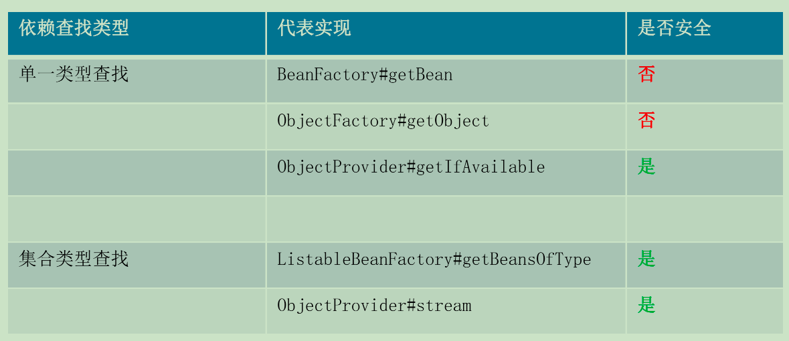

## 依赖查找中的经典异常

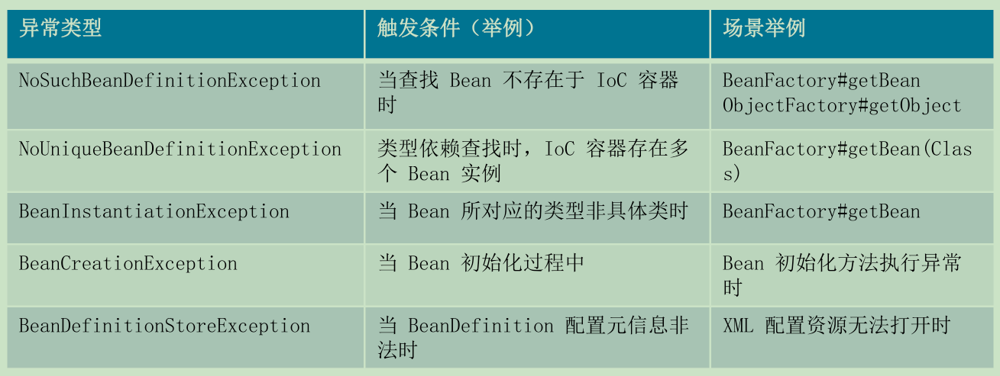

## ObjectFactory与BeanFactory的区别 ? 

答: 
1. ObjectFactory与BeanFactory均提供依赖查找的能力。
2. 不过ObjectFactory仅关注一个或一种类型的Bean依赖查找,并
且自身不具备依赖查找的能力,能力则由BeanFactory输出。
BeanFactory则提供了单一类型、集合类型以及层次性等多种依赖查
找方式。

## BeanFactory.getBean操作是否线程安全

答:BeanFactory.getBean方法的执行是线程安全的,换操作过程中会增加互
斥锁

# Spring IoC 注入

## 依赖注入的模式和类型

- 手动模式-配置或者编程的方式,提前安排注入规则
  - XML资源配置元信息
  - Java注解配置元信息
  - API配置元信息
- 自动模式-实现方提供依赖自动关联的方式,按照内建的注入规则
  - AutoWiring(自动绑定)

## 依赖注入的模式和类型

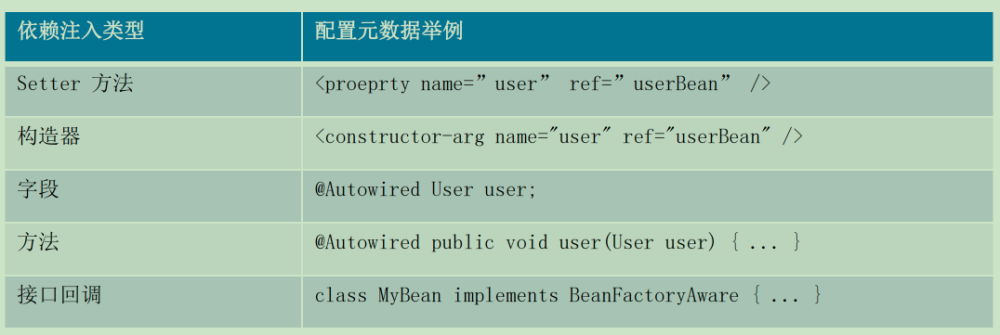


## 自动绑定(Autowiring)模式

模式.png)


## Setter 方法注入

- 手动模式
  - XML资源配置元信息 injection.XmlDependencySetterInjectionDemo
  - Java注解配置元信息 injection.AnnotationDependencySetterInjectionDemo
  - API 配置元信息 injection.AnnotationDependencySetterInjectionDemo
- 自动模式
  - byName injection.AutoWiringByNameDependencySetterInjectionDemo
  - byType

## 构造器注入

- 实现方法
  - 手动模式
    - XML资源配置元信息 injection.XmlDependencyConstructorInjectionDemo
    - Java注解配置元信息 injection.AnnotationDependencyConstructorInjectionDemo
    - API 配置元信息 injection.ApiDependencyConstructorInjectionDemo
- 自动模式
  - constructor injection.AutoWiringConstructorDependencyConstructorInjectionDemo


## 字段注入

- 实现方法
  - 手动模式
    - Java注解配置元信息 injection.AnnotationDependencyFieldInjectionDemo
      - @Autowired
      - @Resource 
      - @Inject(可选)

## 方法注入

- 实现方法
  - 手动模式
    - Java注解配置元信息 injection.AnnotationDependencyMethodInjectionDemo
      - @Autowired
      - @Resource
      - @Inject(可选)
      - @Bean

## 接口回调注入

- injection.AwareInterfaceDependencyInjectionDemo

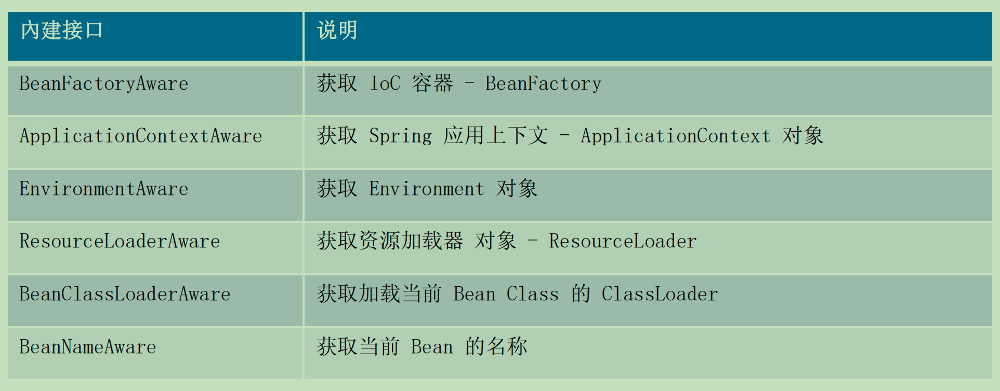

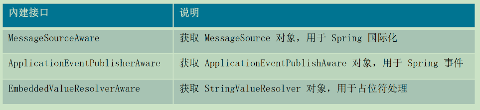

## 依赖注入类型选择

- 注入选型
  - 低依赖:构造器注入
  - 多依赖:Setter方法注入
  - 便利性:字段注入
  - 声明类:方法注入

## 基础类型注入

- 基础类型
  - 原生类型(Primitive):boolean、byte、char、short、int、float、long、double
  - 标量类型(Scalar):Number、Character、Boolean、Enum、Locale、Charset、Currency、Properties、UUID
  - 常规类型(General):Object、String、TimeZone、Calendar、Optional等
  - Spring类型:Resource、InputSource、Formatter等


## 集合类型注入

- 集合类型
  - 数组类型(Array):原生类型、标量类型、常规类型、Sprin类型
  - 集合类型(Collection)
    - Collection: List、Set (SortedSet、NavigableSet、EnuimSet
    - Map: Properties

## 限定注入

- 使用注解@Qualifier限定 injection.QualifierAnnotationDependencyInjectionDemo
  - 通过Bean名称限定
  - 通过分组限定
- 基于注解@Qualifier扩展限定
  - 自定义注解-如SpringCloud@LoadBalanced

## 延迟依赖注入
- injection.LazyAnnotationDependencyInjectionDemo

- 使用APIObjectFactory延迟注入
  - 单一类型
  - 集合类型
- 使用APIObjectProvider延迟注入(推荐)
  - 单一类型
  - 集合类型


## 依赖处理过程

- 基础知识
  - 入口 - DefaultListableBeanFactory#resolveDependenLcy
  - 依赖描述符-DependencyDescriptor
  - 自定绑定候选对象处理器-AutowireCandidateResolver


## @Autowired 注入

- @Autowired注入规则
  - 非静态字段
  - 非静态方法
  - 构造器

- @Autowired注入过程
  - 元信息解析
  - 依赖查找
  - 依赖注入(字段、方法)

## @Inject注入

- @Inject注入过程
  - 如果JSR-330存在于ClassPath中,复用AutowiredAnnotationBeanPostProcessor实现

## Java通用注解注入原理

- CommonAnnotationBeanPostProcessor
  - 注入注解
    - javax.xml.ws.WebServiceRef
    - javax.ejb.EJB
    - javax.annotation.Resource
  - 生命周期注解
    - javax.annotation.PostConstruct
    - javax.annotation.PreDestroy

## 自定义依赖注入注解

- injection.AnnotationDependencyInjectionResolutionDemo

- 基于AutowiredAnnotationBeanPostProcessor实现
- 自定义实现
  - 生命周期处理
    - InstantiationAwareBeanPostProcessor
    - MergedBeanDefinitionPostProcessor
  - 元数据
    - InjectedElement
    - InjectionMetadata

## 面试题

### 有多少种依赖注入的方式?

答:构造器注入 Setter注入 字段注入 方法注入 接口回调注入

### 你偏好构造器注入还是Setter注入?

答:两种依赖注入的方式均可使用,如果是必须依赖的话,那么推荐使用构造器注入,Setter注入用于可选依赖。

# Spring IoC依赖来源

## 依赖查找的来源

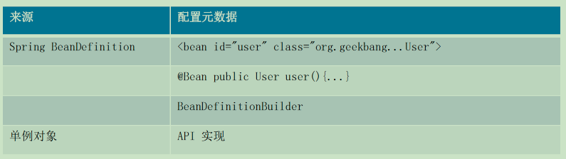

- Spring 内建 BeanDefinition

.png)


.png)


# Spring Bean 作用域

## Spring Bean 作用域

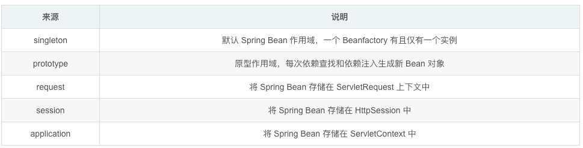

只需要关注和掌握 singleton 和 prototype，对应设计模式里面的单例模式和原型模式。

request、session、application 主要用于页面渲染，比如 JSP、Velocity、Freemaker 等模板引擎，在现在的 web 开发中已经慢慢的转向前后端分离，模板引擎技术已经慢慢的边缘化了。


## singleton Bean作用域

从设计模式的角度，单例模式不论是“懒汉式”还是“饿汉式”，其实最主要的作用是保证对象是唯一的。

在 JVM 的层面来说，我们常用静态变量做单例，每个类对应一个 ClassLoader，ClassLoader 在 load Class 的时候，会加载这个类的静态信息，在同一个 ClassLoader 中，单例对象是唯一的。

在 Spring 的场景中，一个 Bean 对象对应一个应用上下文，或者说 Spring IoC 的 BeanFactory 。通常一个 Bean 默认作用域就是 singleton，不需要配置，换言之，在同一个 BeanFactory 中，Bean 对象只有一个。

从上面的图可以看到，三个 bean 配置都不同，但是 ref="accountDao"，都指向同一个 bean，每次进行属性的注入，都是同一个共享实例。

Bean 的作用域，并不是指的所有的 Bean，而是指的我们 BeanDefinition 。

BeanDefinition 源码：

singleton：shared instance 共享的实例

prototype：independent instance 独立的实例


```java

public interface BeanDefinition extends AttributeAccessor, BeanMetadataElement {
    /**
     * Return whether this a <b>Singleton</b>, with a single, shared instance
     * returned on all calls.
     * @see #SCOPE_SINGLETON
     */
    boolean isSingleton();

    /**
     * Return whether this a <b>Prototype</b>, with an independent instance
     * returned for each call.
     * @since 3.0
     * @see #SCOPE_PROTOTYPE
     */
    boolean isPrototype();

}

```

通过这个两个方法可以判断一个 BeanDefinition 是否是单例或者原型，但是并没有 request、session、application 相关的方法，侧面说明这三种不需要过多关注。

singleton 和 prototype 不能简单的说是互斥的关系，因为从接口的角度看，两个方法可以同时存在。


# Spring Bean 生命周期

```
SpringBean元信息配置阶段
SpringBean元信息解析阶段
Spring Bean注册阶段
Spring BeanDefinition合并阶段
Spring Bean Class加载阶段
SpringBean实例化前阶段
Spring Bean实例化阶段
Spring Bean实例化后阶段
Spring Bean属性赋值前阶段
Spring Bean Aware接口回调阶段
Spring Bean初始化前阶段
Spring Bean初始化阶段
Spring Bean初始化后阶段
Spring Bean初始化完成阶段
Spring Bean销毁前阶段
Spring Bean销毁阶段
Spring Bean垃圾收集

```

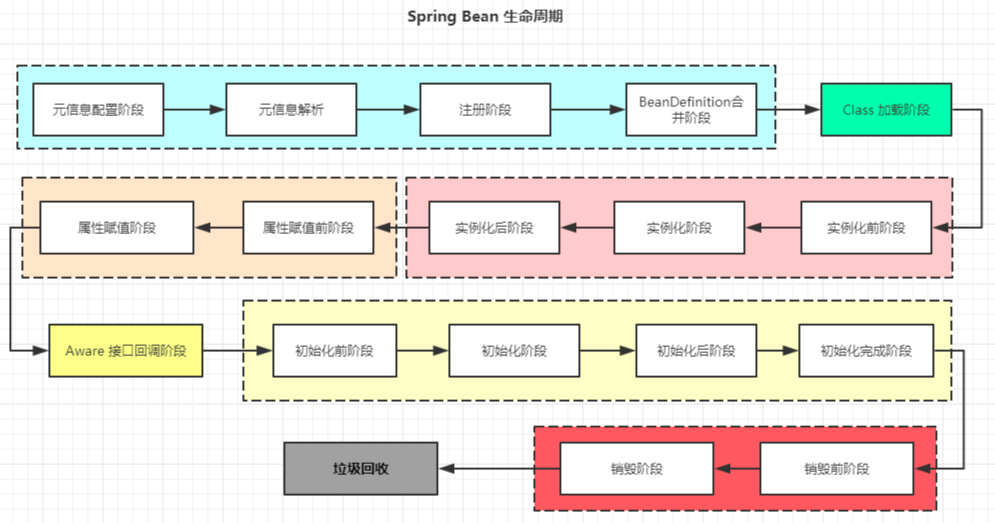

## SpringBean元信息配置阶段

BeanDefinition 配置

- 面向资源
  - XML 配置
    - <bean id="…" …>
  - Properties 资源配置
- 面向注解
  - @Configuration、@Component、@Bean
- 面向 API
  - BeanDefinitionBuilder


### XML 配置

- org.geekbang.thinking.in.spring.ioc.overview.container.BeanFactoryAsIoCContainerDemo

### Properties 资源配置

- lifecycle.BeanMetadataConfigurationDemo

### 注解 配置

- org/geekbang/thinking/in/spring/bean/definition/AnnotationBeanDefinitionDemo.java

### 面向 API

- org.geekbang.thinking.in.spring.bean.definition.AnnotationBeanDefinitionDemo.registerUserBeanDefinition(org.springframework.beans.factory.support.BeanDefinitionRegistry, java.lang.String)


## SpringBean元信息解析阶段

- 面向资源 BeanDefinition 解析
  - BeanDefinitionReader
  - Xml 解析器 - BeanDefinitionParser
- 面向注解 BeanDefinition 解析
  - AnnotatedBeanDefinitionReader

- lifecycle.AnnotatedBeanDefinitionParsingDemo


## Spring Bean注册阶段

- BeanDefinition 注册接口
  - BeanDefinitionRegistry
- 唯一实现
  - org.springframework.beans.factory.support.DefaultListableBeanFactory#registerBeanDefinition

- 源码较多，这里省略一部分，只对重点代码进行分析
  - beanDefinitionMap 数据结构为 ConcurrentHashMap，没有顺序
  - beanDefinitionNames 数据结构为 ArrayList， 存放 beanName 保证注册的顺序
  - this.beanDefinitionMap.put(beanName, beanDefinition); //将 beanDefinition 存入 beanDefinitionMap
  - removeManualSingletonName，注册的单例对象（并非 Bean Scope）和注册 BeanDefinition 是一个互斥的操作，只能存在一个

## Spring BeanDefinition合并阶段

BeanDefinition 合并

- 父子 BeanDefinition 合并
  - 当前 BeanFactory 查找
  - 层次性 BeanFactory 查找

- lifecycle.MergedBeanDefinitionDemo

superUser 的 parent 属性指向 user，表示 superUser 是一个普通的 BeanDefinition，
并且需要合并 user 中的字段属性，这样设计的好处主要是为了优化我们配置的方式。

### 源码分析

- org.springframework.beans.factory.config.ConfigurableBeanFactory#getMergedBeanDefinition

通过 beanName 返回一个被合并的 BeanDefinition，合并 child bean definition 和它的 parent。

这个接口也是只有一个唯一实现

org.springframework.beans.factory.support.AbstractBeanFactory#getMergedBeanDefinition(java.lang.String)

```java

	@Override
	public BeanDefinition getMergedBeanDefinition(String name) throws BeansException {
		String beanName = transformedBeanName(name);
		// Efficiently check whether bean definition exists in this factory.
		if (!containsBeanDefinition(beanName) && getParentBeanFactory() instanceof ConfigurableBeanFactory) {
			return ((ConfigurableBeanFactory) getParentBeanFactory()).getMergedBeanDefinition(beanName);
		}
		// Resolve merged bean definition locally.
		return getMergedLocalBeanDefinition(beanName);
	}

```
这是一个递归的方法，如果当前 BeanFactory 不包含这个 beanName 并且 Parent BeanFactory 是 ConfigurableBeanFactory 这个类型，
那么继续往下查找，如果有的话在当前的 BeanFactory 中查找。


```java
	protected RootBeanDefinition getMergedLocalBeanDefinition(String beanName) throws BeansException {
		// Quick check on the concurrent map first, with minimal locking.
		RootBeanDefinition mbd = this.mergedBeanDefinitions.get(beanName);
        // 如果 mbd 不为空 并且 没有过期
		if (mbd != null && !mbd.stale) {
			return mbd;
		}
		return getMergedBeanDefinition(beanName, getBeanDefinition(beanName));
	}

```

在 mergedBeanDefinitions 这个集合中查找，这个集合是合并之后的 BeanDefinition 存放的集合，集合元素类型为 RootBeanDefinition，
这里需要注意的是 mergedBeanDefinitions 表示的只是当前 BeanFactory 中的 BeanDefinition，如果有多层 BeanFactory ，
每个 BeanFactory 都会有这个 mergedBeanDefinitions 的缓存。 第一次进来肯定是没有的，我们继续往下看，最终到这个方法中，参数中的 containingBd 表示的是嵌套 Bean 的情况，我们这里不讨论。

```java 
	protected RootBeanDefinition getMergedBeanDefinition(
			String beanName, BeanDefinition bd, @Nullable BeanDefinition containingBd)
			throws BeanDefinitionStoreException {
        // 下面的操作既有 get 也有 put，需要加锁保证安全性，而且这个方法可能在很多地方调用
		synchronized (this.mergedBeanDefinitions) {
            RootBeanDefinition mbd = null;
            RootBeanDefinition previous = null;

            // Check with full lock now in order to enforce the same merged instance.
            // 如果为空，表示当前的 BeanDefintion 并不是一个嵌套 Bean 而是顶层 Bean
            if (containingBd == null) {
                // 再从 mergedBeanDefinitions 获取，这里主要是防止有其他线程已经添加了这个 BeanDefinition
                mbd = this.mergedBeanDefinitions.get(beanName);
            }

            if (mbd == null || mbd.stale) {
                previous = mbd;
                if (bd.getParentName() == null) {
                    // Use copy of given root bean definition.
                    if (bd instanceof RootBeanDefinition) {
                        // 如果是 RootBeanDefinition 直接返回
                        mbd = ((RootBeanDefinition) bd).cloneBeanDefinition();
                    } else {
                        // 构建一个 RootBeanDefinition
                        mbd = new RootBeanDefinition(bd);
                    }
                } else {
                    // 示例中 SuperUser 属于这一种情况
                    // Child bean definition: needs to be merged with parent.
                    BeanDefinition pbd;
                    try {
                        // 获取 parent 属性中 BeanName
                        String parentBeanName = transformedBeanName(bd.getParentName());
                        // 如果 beanName和parentBeanName不相同
                        if (!beanName.equals(parentBeanName)) {
                            // 获取 parent 的合并之后的 BeanDefinition，因为 parent 有可能也是一个被合并的 BeanDefinition
                            pbd = getMergedBeanDefinition(parentBeanName);
                        } else {// 如果相同的话，去 parent BeanFactory 中做层次性的查找
                            BeanFactory parent = getParentBeanFactory();
                            if (parent instanceof ConfigurableBeanFactory) {
                                pbd = ((ConfigurableBeanFactory) parent).getMergedBeanDefinition(parentBeanName);
                            }
               ...
                            // Deep copy with overridden values.
                            mbd = new RootBeanDefinition(pbd);
                            mbd.overrideFrom(bd);
                        }
               ...
                        if (containingBd == null && isCacheBeanMetadata()) {
                            // 将合并之后的 mbd 存放到 mergedBeanDefinitions 集合中
                            this.mergedBeanDefinitions.put(beanName, mbd);
                        }
                    }
                    if (previous != null) {
                        copyRelevantMergedBeanDefinitionCaches(previous, mbd);
                    }
                    return mbd;
                }
            }
        }
```

> - user 和 superUser 都会经过合并的过程，而且最后都变成了 RootBeanDefinition
> - superUser 合并了 user 的属性

## Spring Bean Class加载阶段

- ClassLoader 类加载

- Java Security 安全控制

- ConfigurableBeanFactory 临时 ClassLoader


### 源码调试

还是用上面的例子进行，我们将断点打在

方法调用栈如下
org.springframework.beans.factory.support.AbstractBeanFactory#doGetBean
org.springframework.beans.factory.support.AbstractAutowireCapableBeanFactory.createBean(java.lang.String, org.springframework.beans.factory.support.RootBeanDefinition, java.lang.Object[])
org.springframework.beans.factory.support.AbstractBeanDefinition.resolveBeanClass

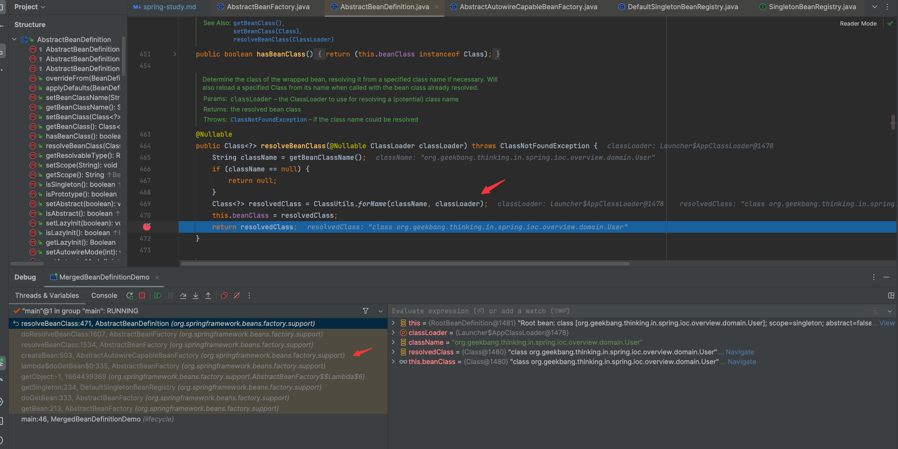

从源码分析可以看出，其实 Spring BeanDefinition 变成 Class 的过程其实还是通过传统 Java 的 ClassLoader 来进行加载的。

## SpringBean实例化前阶段

非主流生命周期 - Bean 实例化前阶段

- org.springframework.beans.factory.config.InstantiationAwareBeanPostProcessor#postProcessBeforeInstantiation

这个 Bean 的前置处理在目标 bean 实例化之前，返回一个 bean 的对象可能是一个代理对象去替换这个目标的 bean

- 自定义类来实现 InstantiationAwareBeanPostProcessor 接口，重写 postProcessBeforeInstantiation 方法

- 在这个方法中，我们根据 BeanName 来拦截 superUser，替换成一个新的 SuperUser 对象。

- 通过 beanFactory.addBeanPostProcessor 来增加我们的实例化前的操作

示例代码：lifecycle.BeanInstantiationLifecycleDemo

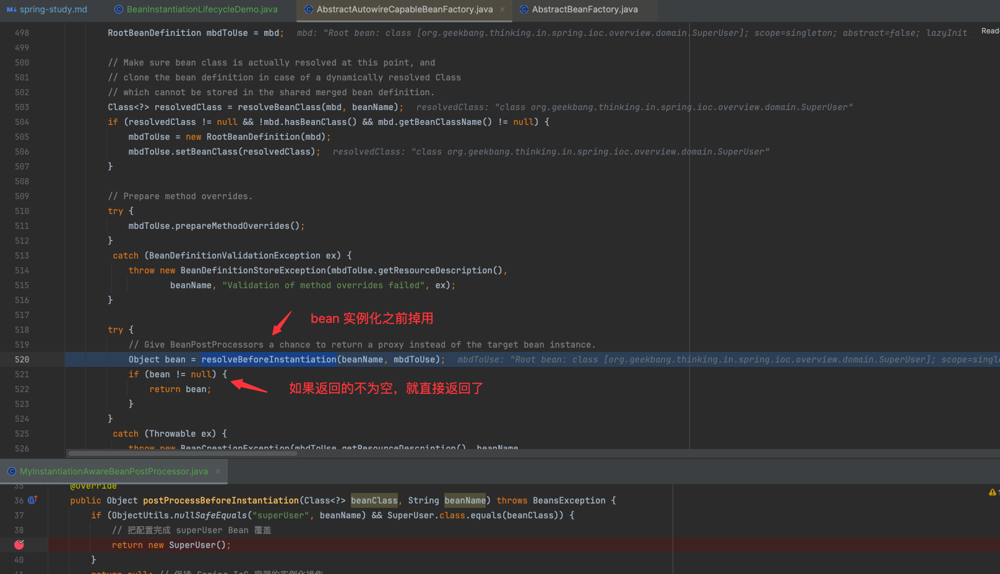


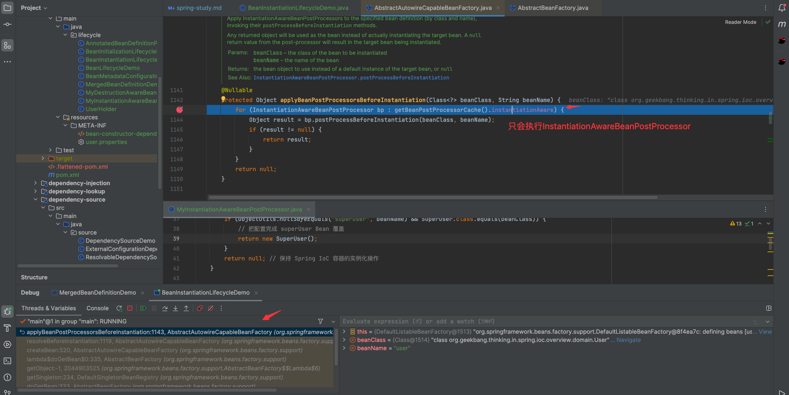

## Spring Bean实例化阶段

实例化方法

- 传统实例化方式
- 实例化策略- InstantiationStrategy
  - 构造器依赖注入
- 关键源码位置
  - AbstractAutowireCapableBeanFactory#doCreateBean
  
### 源码分析

我们可以知道 Spring Bean 默认实例化的方法是 doCreateBean()，在这方法中又可以找到 createBeanInstance()，这个就是 user 创建的调用代码

通过上一小节的源码调试，我们可以知道 Spring Bean 默认实例化的方法是 doCreateBean()，在这方法中又可以找到 createBeanInstance()，这个就是 user 创建的调用代码

通过 java8 中的函数式接口进行创建
通过 FactoryMethod 方式进行创建


```java
protected BeanWrapper createBeanInstance(String beanName, RootBeanDefinition mbd, @Nullable Object[] args) {
		// Make sure bean class is actually resolved at this point.
		Class<?> beanClass = resolveBeanClass(mbd, beanName);
        ...
        // 通过 java8 中的函数式接口进行创建
		Supplier<?> instanceSupplier = mbd.getInstanceSupplier();
		if (instanceSupplier != null) {
			return obtainFromSupplier(instanceSupplier, beanName);
		}
        // 通过 FactoryMethod 方式进行创建
		if (mbd.getFactoryMethodName() != null) {
			return instantiateUsingFactoryMethod(beanName, mbd, args);
		}

		// Shortcut when re-creating the same bean...
        // 重复创建相同的 bean，代码逻辑和下面的差不多，会少一些判断，这是一种性能的优化
        ... 
            
		// Candidate constructors for autowiring?
        // 可以提供一些构造器的选择策略 ctors 通常为 null
        // 自动绑定为构造器绑定
        // 或者 beanDefintion 中包含构造器参数
        // 获取 args 不为空
		Constructor<?>[] ctors = determineConstructorsFromBeanPostProcessors(beanClass, beanName);
		if (ctors != null || mbd.getResolvedAutowireMode() == AUTOWIRE_CONSTRUCTOR ||
				mbd.hasConstructorArgumentValues() || !ObjectUtils.isEmpty(args)) {
			return autowireConstructor(beanName, mbd, ctors, args);
		}
         
		// Preferred constructors for default construction?
        // 是否有默认的偏好构造器
		ctors = mbd.getPreferredConstructors();
		if (ctors != null) {
			return autowireConstructor(beanName, mbd, ctors, null);
		}

		// No special handling: simply use no-arg constructor.
        // 非特殊方式：简单实用无参构造器
		return instantiateBean(beanName, mbd);
	}


```
#### 传统实例化方式 InstantiationStrategy

- instantiateBean：非特殊方式：简单实用无参构造器
  - 源代码较多，我们这里直接说关键源码
  - SimpleInstantiationStrategy#instantiate()

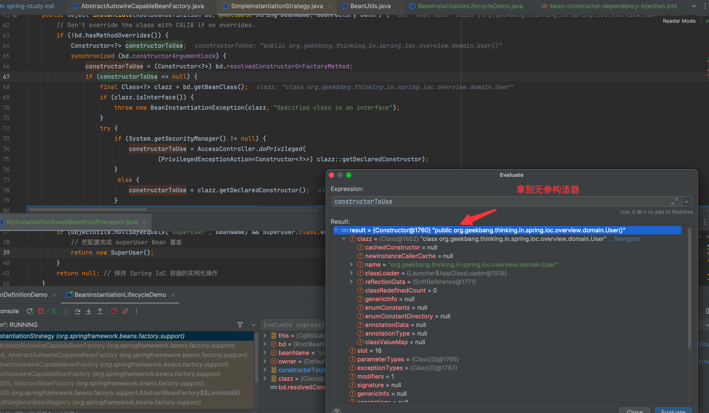

- 最终是通过 ctor.newInstance(argsWithDefaultValues); 来进行实例化，其实就是 Java 反射中的方法。
- 源码位置：org.springframework.beans.BeanUtils#instantiateClass(java.lang.reflect.Constructor, java.lang.Object…) 200 行
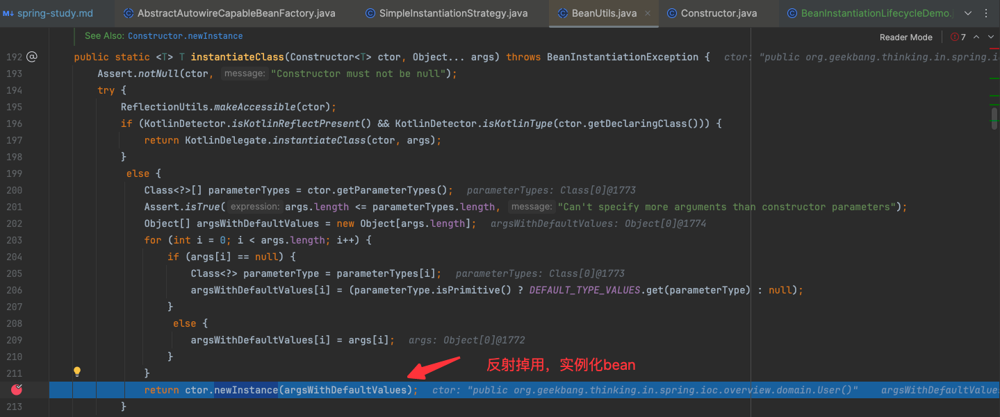
- 最后获取到实例化之后的 User 对象，被封装成 BeanWrapper 对象，这个对象比较复杂，我们这里不进行展开

- 这里 User 对象通过无参的构造器实例化完成，所有的属性都是 null，这就是 Spring Bean 实例化的过程，此时还没有进行属性赋值和初始化相关的过程。
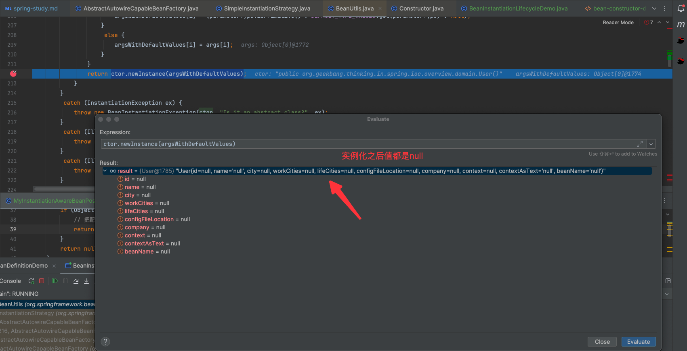

#### 构造器依赖注入

- 示例改造

```java
/**
 * UserHolder
 */
public class UserHolder {

    private User user;

    public UserHolder(User user) {
        this.user = user;
    }

    @Override
    public String toString() {
        return "UserHolder{" +
                "user=" + user +
                '}';
    }
}

```

```xml
<?xml version="1.0" encoding="UTF-8"?>
<beans xmlns="http://www.springframework.org/schema/beans"
       xmlns:xsi="http://www.w3.org/2001/XMLSchema-instance"
       xsi:schemaLocation="http://www.springframework.org/schema/beans
        https://www.springframework.org/schema/beans/spring-beans.xsd">

    <import resource="classpath:/META-INF/dependency-lookup-context.xml"/>

  <bean id="userHolder" class="lifecycle.UserHolder" autowire="constructor"
        init-method="init" destroy-method="doDestroy"/>
</beans>

```

- 断点打在AbstractAutowireCapableBeanFactory#createBeanInstance 1168 行，放掉前面的几个对象，
当 beanName 为 Holder 我们开始进行调试

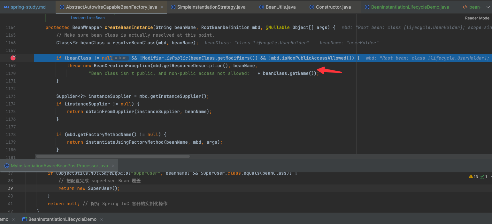

- mbd.getResolvedAutowireMode() == AUTOWIRE_CONSTRUCTOR，即 BeanDefintion 的自动绑定方式是构造器

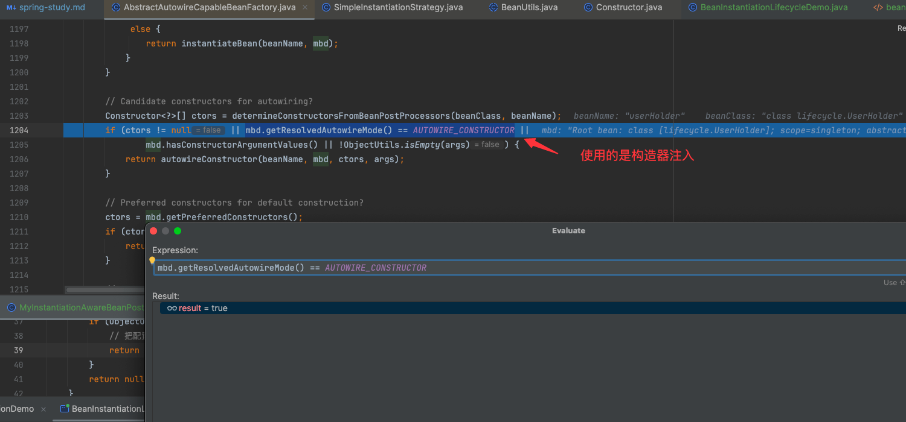

- org.springframework.beans.factory.support.ConstructorResolver.autowireConstructor

- 获取 UserHolder 构造器，这里我们只定义了一个

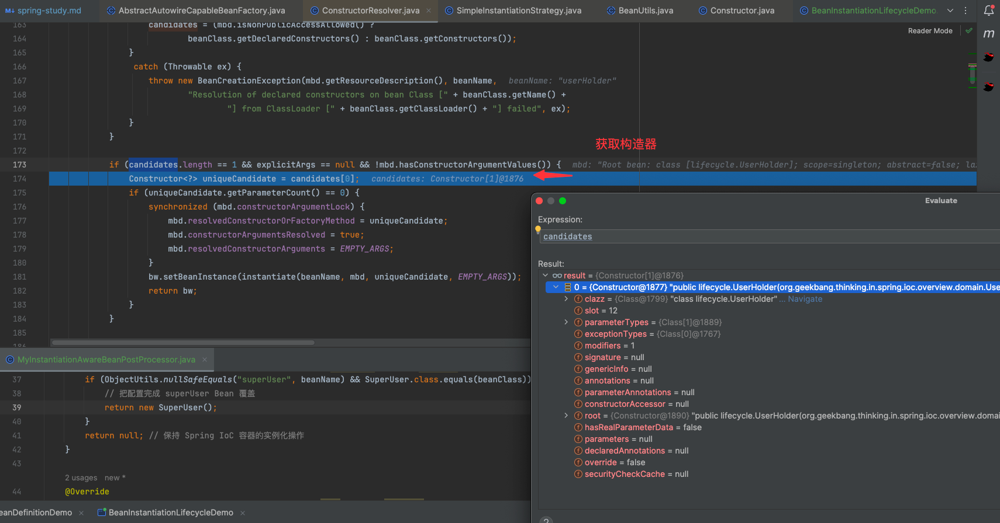

- 获取构造器参数

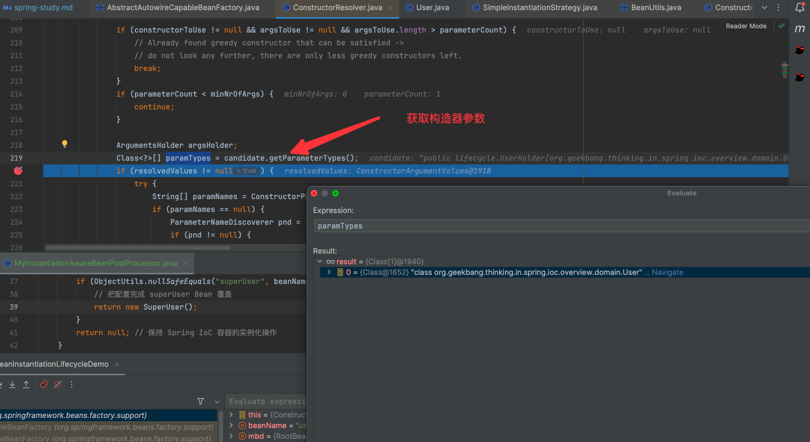


- org.springframework.beans.factory.support.ConstructorResolver.createArgumentArray

- resolveAutowiredArgument 这个方法会触发依赖处理，原因就是 User 这个参数需要注入，
- 这个 beanFactory.resolveDependency
- org.springframework.beans.factory.support.ConstructorResolver.resolveAutowiredArgument

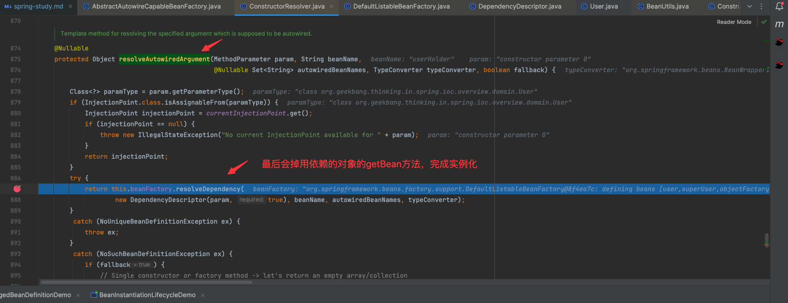
- org.springframework.beans.factory.support.SimpleInstantiationStrategy.instantiate(org.springframework.beans.factory.support.RootBeanDefinition, java.lang.String, org.springframework.beans.factory.BeanFactory, java.lang.reflect.Constructor<?>, java.lang.Object...)
- 调用有参构造器完成实例化
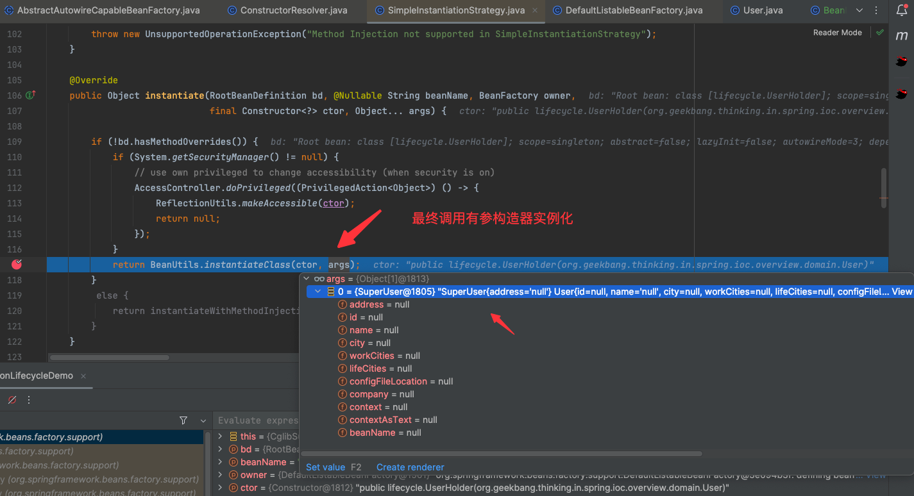

## Spring Bean实例化后阶段

Bean 属性值（Populate）判断

- InstantiationAwareBeanPostProcessor#postProcessAfterInstantiation

在 MyInstantiationAwareBeanPostProcess 新增一个 postProcessAfterInstantiation 的重载方法

### 源码调试

断点打在 AbstractAutowireCapableBeanFactory#populateBean 594 行，当 User 实例化之后，会执行该方法

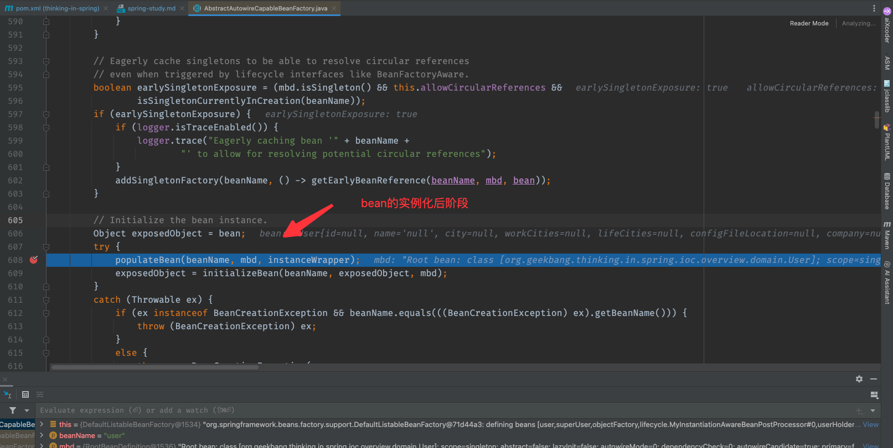

进入到方法中，这里逻辑比较简单，遍历所有的 BeanPostProcessors，找到类型为 InstantiationAwareBeanPostProcessor 的（
这里就是我们实现的 MyInstantiationAwareBeanPostProcess 类），执行 postProcessAfterInstantiation 方法。

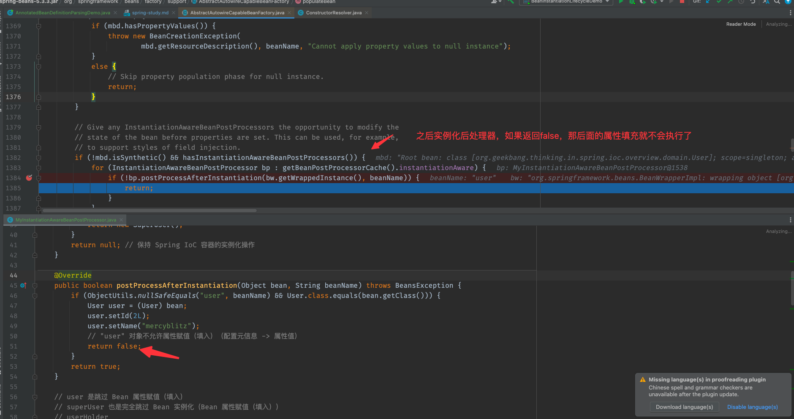

postProcessAfterInstantiation 方法可以用来判断这个 Bean 是否要进行属性赋值（populateBean），
如果不需要可以进行拦截返回 false ；这个时候 Bean 的实例化已经完成，但是属性赋值还没有开始。


## Spring Bean属性赋值前阶段

Bean 属性值元信息

- PropertyValues
Bean 属性赋值前回调

- Spring 1.2 - 5.0 :

  - org.springframework.beans.factory.config.InstantiationAwareBeanPostProcessor#postProcessPropertyValues

- Spring 5.1:

  - org.springframework.beans.factory.config.InstantiationAwareBeanPostProcessor#postProcessProperties


### 示例改造

首先 UserHolder 增加两个属性， number 和 description


对应的 xml 配置如下，我们只设置 description 的值为 “The user holder”

```xml
    <bean id="userHolder" class="com.huajie.thinking.in.spring.bean.lifecycle.domain.UserHolder"
          autowire="constructor">
        <!--<property name="number" value="1"/>-->
        <property name="description" value="The user holder" />
    </bean>
```

我们在上面示例的基础上，在 MyInstantiationAwareBeanPostProcess 新增一个 postProcessProperties 的重载方法

- 设置 numebr 属性值为 1
- 覆盖 description 的属性为 “The user holder v2”

``` java
    // user 是跳过 Bean 属性赋值（填入）
    // superUser 也是完全跳过 Bean 实例化（Bean 属性赋值（填入））
    // userHolder
    @Override
    public PropertyValues postProcessProperties(PropertyValues pvs, Object bean, String beanName)
            throws BeansException {
        // 对 "userHolder" Bean 进行拦截
        if (ObjectUtils.nullSafeEquals("userHolder", beanName) && UserHolder.class.equals(bean.getClass())) {
            // 假设 <property name="number" value="1" /> 配置的话，那么在 PropertyValues 就包含一个 PropertyValue(number=1)

            final MutablePropertyValues propertyValues;

            if (pvs instanceof MutablePropertyValues) {
                propertyValues = (MutablePropertyValues) pvs;
            } else {
                propertyValues = new MutablePropertyValues();
            }

            // 等价于 <property name="number" value="1" />
            propertyValues.addPropertyValue("number", "1");
            // 原始配置 <property name="description" value="The user holder" />

            // 如果存在 "description" 属性配置的话
            if (propertyValues.contains("description")) {
                // PropertyValue value 是不可变的
//                    PropertyValue propertyValue = propertyValues.getPropertyValue("description");
                propertyValues.removePropertyValue("description");
                propertyValues.addPropertyValue("description", "The user holder V2");
            }

            return propertyValues;
        }
        return null;
    }
```
### 源码调试

断点位置 AbstractAutowireCapableBeanFactory#populateBean 行，当 UserHolder 进来的时候，会走这段逻辑，
可以看到此时 pvs 只有 description 一个属性，因为我们 xml 文件中只配置了这一个属性。

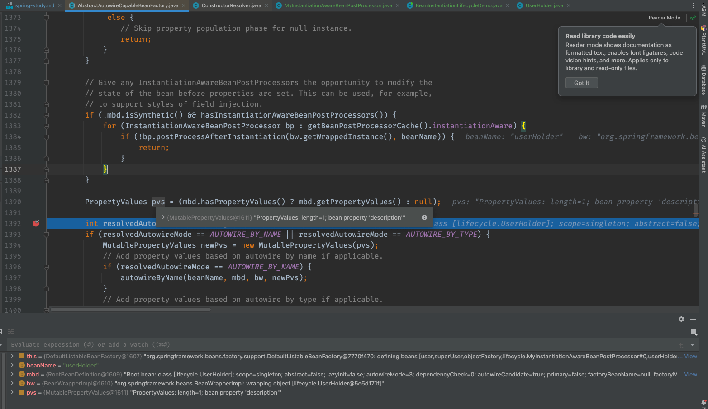

通过遍历 BeanPostProcessors 执行我们的 postProcessPropertyValues 方法，
pvs 的 length 变成了 2，此时属性已经变成 number = 1，description = ‘The user holder v2’。
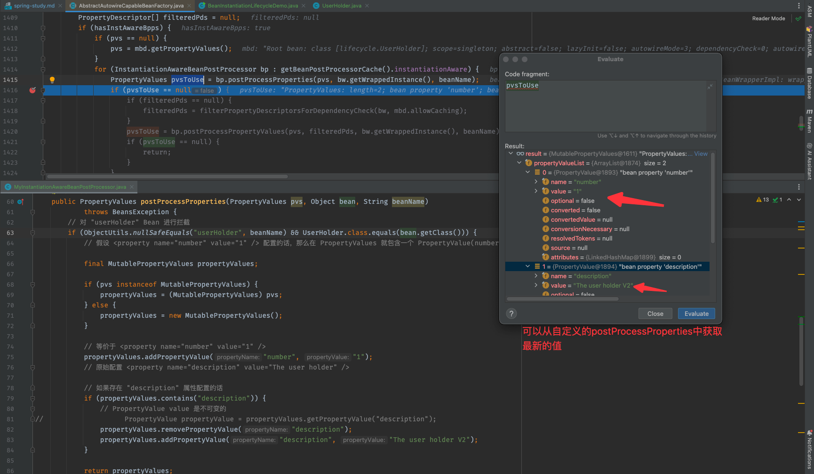


## Spring Bean属性赋值阶段

还是上面的例子，applyPropertyValues 其实就是属性赋值阶段。

源码位置 AbstractAutowireCapableBeanFactory#applyPropertyValues

源码相对比较简单，我们就不贴出来了，大致分为三步

遍历我们前面传进来的 pvs 参数
进行 deepCopy 深拷贝
然后通过 bw.setPropertyValues(new MutablePropertyValues(deepCopy)); 进行赋值操作
断点打在 AbstractAutowireCapableBeanFactory#applyPropertyValues行

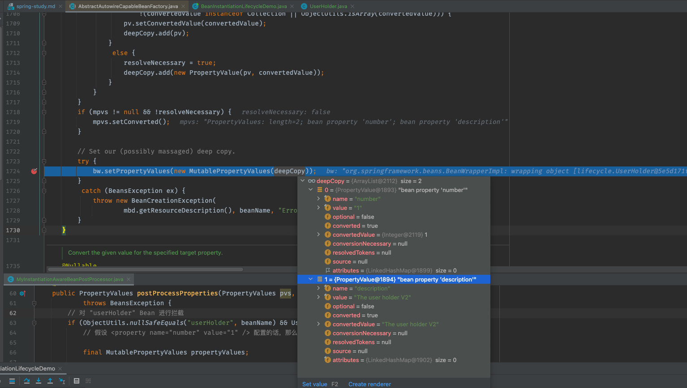

## Spring Bean Aware接口回调阶段

Spring Aware 接口（此接口顺序也是源码的回调执行顺序）

- BeanNameAware
- BeanClassLoaderAware
- BeanFactoryAware
- EnvironmentAware
- EmbeddedValueResolverAware
- ResourceLoaderAware
- ApplicationEventPublisherAware
- MessageSourceAware
- ApplicationContextAware


### 示例改造1
UserHolder 分别实现 BeanNameAware, BeanClassLoaderAware, BeanFactoryAware 三个回调接口

### 源码分析1
AbstractAutowireCapableBeanFactory#doCreateBean 行，同样还是 doCreateBean 方法，但是之前是属性赋值阶段 populateBean，
现在是 initializeBean 阶段

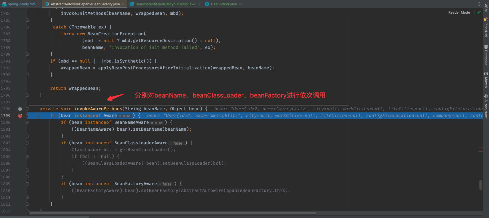

### 示例改造2

UserHolder，我们再实现一个 EnvironmentAware 回调

- 执行 lifecycle.BeanInstantiationLifecycleDemo.executeBeanFactory

发现没有走到setEnvironment回调

其实原因是这些 Aware 回调接口是 ApplicationContext 生命周期中的，并不在 BeanFactory 生命周期中，
这是 BeanFactory 和 ApplicationContext 的一个具体区别之一。

- 执行 lifecycle.BeanInstantiationLifecycleDemo.executeApplicationContext

发现可以走到setEnvironment回调
### 源码分析2
我们看一下 AbstractApplicationContext#prepareBeanFactory 中如何进行 Aware 回调

```java
	protected void prepareBeanFactory(ConfigurableListableBeanFactory beanFactory) {
    // Configure the bean factory with context callbacks.
    beanFactory.addBeanPostProcessor(new ApplicationContextAwareProcessor(this));
    beanFactory.ignoreDependencyInterface(EnvironmentAware.class);
    beanFactory.ignoreDependencyInterface(EmbeddedValueResolverAware.class);
    beanFactory.ignoreDependencyInterface(ResourceLoaderAware.class);
    beanFactory.ignoreDependencyInterface(ApplicationEventPublisherAware.class);
    beanFactory.ignoreDependencyInterface(MessageSourceAware.class);
    beanFactory.ignoreDependencyInterface(ApplicationContextAware.class);

    }

```

关键代码 ApplicationContextAwareProcessor 我们再看下 ApplicationContextAwareProcessor 具体实现

ApplicationContextAwareProcessor#invokeAwareInterfaces


```java

	private void invokeAwareInterfaces(Object bean) {
		if (bean instanceof EnvironmentAware) {
			((EnvironmentAware) bean).setEnvironment(this.applicationContext.getEnvironment());
		}
		if (bean instanceof EmbeddedValueResolverAware) {
			((EmbeddedValueResolverAware) bean).setEmbeddedValueResolver(this.embeddedValueResolver);
		}
		if (bean instanceof ResourceLoaderAware) {
			((ResourceLoaderAware) bean).setResourceLoader(this.applicationContext);
		}
		if (bean instanceof ApplicationEventPublisherAware) {
			((ApplicationEventPublisherAware) bean).setApplicationEventPublisher(this.applicationContext);
		}
		if (bean instanceof MessageSourceAware) {
			((MessageSourceAware) bean).setMessageSource(this.applicationContext);
		}
		if (bean instanceof ApplicationContextAware) {
			((ApplicationContextAware) bean).setApplicationContext(this.applicationContext);
		}
	}

```

代码和 BeanNameAware 的回调如出一辙。

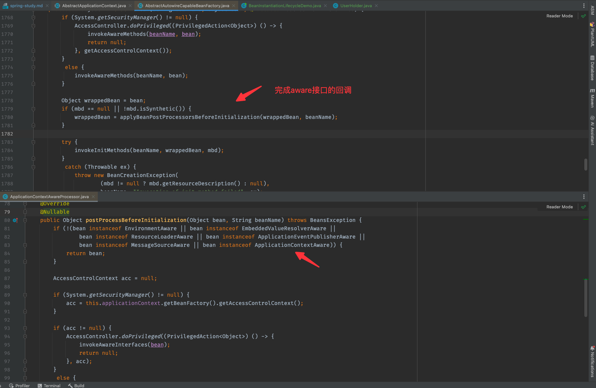

## Spring Bean初始化前阶段

- 初始化前阶段已完成以下三个阶段
  - Bean 实例化
  - Bean 属性赋值
  - Bean Aware 接口回调
- 方法回调
  - BeanPostProcessor#postProcessBeforeInitialization

### 示例代码
MyInstantiationAwareBeanPostProcess 新增 postProcessBeforeInitialization 的实现

调用示例 BeanInitializationLifecycleDemo


### 源码分析
AbstractAutowireCapableBeanFactory#applyBeanPostProcessorsBeforeInitialization

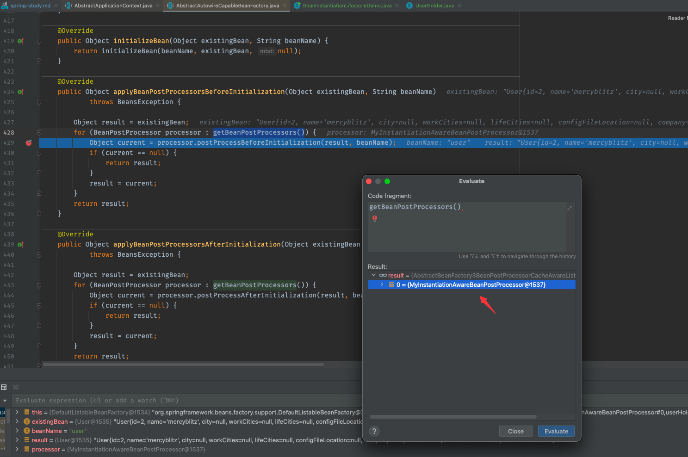


## Spring Bean初始化阶段

- @PostConstruct 标注方法
- 实现 InitializingBean 接口的 afterPropertiesSet() 方法
- 自定义初始化方法


### 源码分析

- @PostConstruct

其实在初始化前的操作中就已经完成了postProcessBeforeInitialization

由InitDestroyAnnotationBeanPostProcessor#postProcessBeforeInitialization =》 

InitDestroyAnnotationBeanPostProcessor.LifecycleMetadata#invokeInitMethods 调用

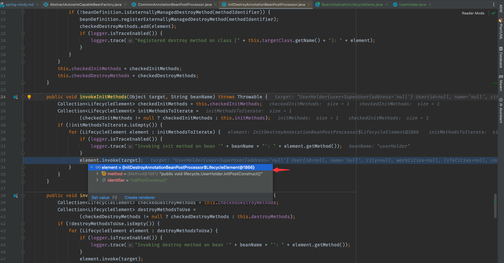

- afterPropertiesSet
AbstractAutowireCapableBeanFactory#invokeInitMethods

((InitializingBean) bean).afterPropertiesSet();

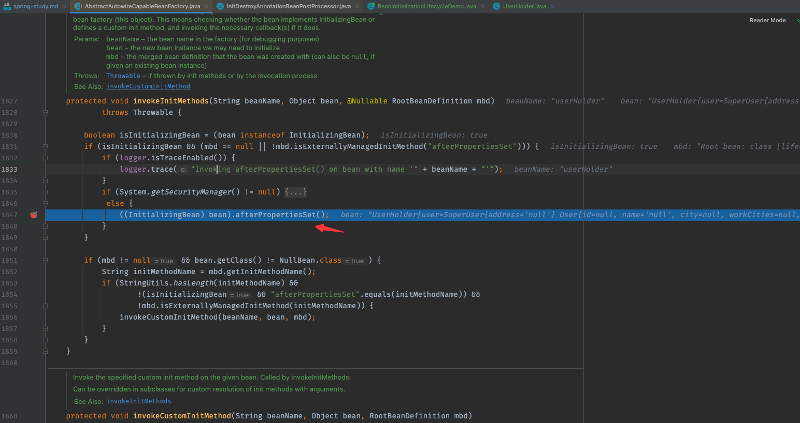

- 自定义方法
AbstractAutowireCapableBeanFactory#invokeInitMethods

invokeCustomInitMethod(beanName, bean, mbd);

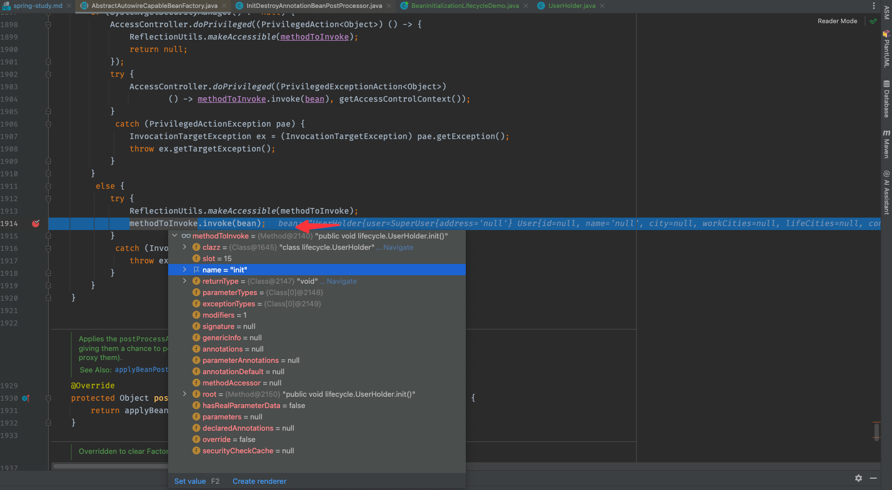

## Spring Bean初始化后阶段

- 方法回调
BeanPostProcessor#postProcessAfterInitialization

和初始化前的阶段一样，我们只需要重写 BeanPostProcessor 中的 postProcessAfterInitialization 方法即可

### 源码分析

这个源代码和初始化前阶段的 applyBeanPostProcessorsBeforeInitialization 源码基本上完全一样

- 遍历所有的 BeanPostProcessor 执行 postProcessAfterInitialization 方法

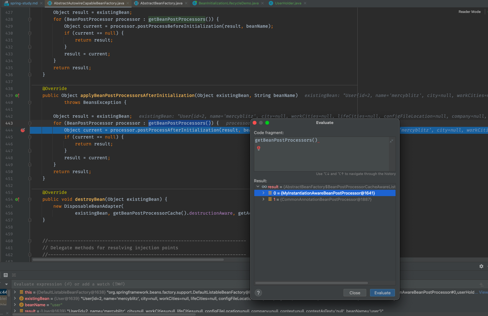

### 小结
从上面源码分析可以看出 initializeBean 初始化 Bean 的方法依次进行了四个操作

invokeAwareMethods(beanName, bean); //Aware回调
applyBeanPostProcessorsBeforeInitialization //初始化前
invokeInitMethods //初始化
applyBeanPostProcessorsAfterInitialization //初始化后

## Spring Bean初始化完成阶段

方法回调

- Spring 4.1+: SmartInitializingSingleton#afterSingletonsInstantiated

UserHolder 实现 SmartInitializingSingleton 接口

afterSingletonsInstantiated 这个方法此时还不能被回调，我们需要通过 Idea 来查找这个方法在哪里被调用过，

DefaultListableBeanFactory#preInstantiateSingletons，所以我们需要在代码中显示的调用这个方法

beanFactory.preInstantiateSingletons();


### 

SmartInitializingSingleton 通常在 ApplicationContext 场景使用，因为在应用上下文启动过程中，

AbstractApplicationContext#refresh 中 finishBeanFactoryInitialization(beanFactory); 会显示的调用这个 preInstantiateSingletons() 方法。

preInstantiateSingletons 在 AbstractApplicationContext 场景非常重要，有两层含义

- 初始化我们所有的 Spring Bean
- 通过 beanDefinitionNames 来遍历我们所有的 BeanDefinition，逐一进行 getBean(beanName) 操作，通过我们的 BeanDefinition 创建 bean 对象， 并缓存到 DefaultSingletonBeanRegistry#singletonObjects 中
   当我们的 Spring Bean 全部初始化完成之后，再进行 afterSingletonsInstantiated() 方法的回调


## Spring Bean销毁前阶段
方法回调

- DestructionAwareBeanPostProcessor#postProcessBeforeDestruction

新增 MyDestructionAwareBeanPostProcessor 实现 DestructionAwareBeanPostProcessor

覆盖 postProcessBeforeDestruction 销毁前的方法

调用需要的执行 beanFactory.destroyBean("userHolder",userHolder); 销毁这个 bean 才会触发销毁前的过程。

### 源码调试

- org.springframework.beans.factory.support.DisposableBeanAdapter#destroy

循环遍历 beanPostProcessors，执行 postProcessBeforeDestruction 方法

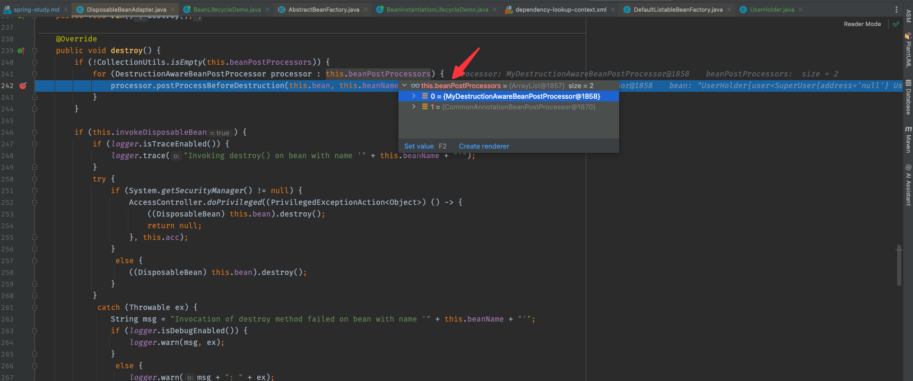

## Spring Bean销毁阶段

- Bean 销毁（Destroy）
  - @PreDestroy 标注方法
  - 实现 DisposableBean 接口的 destroy() 方法
  - 自定义销毁方法

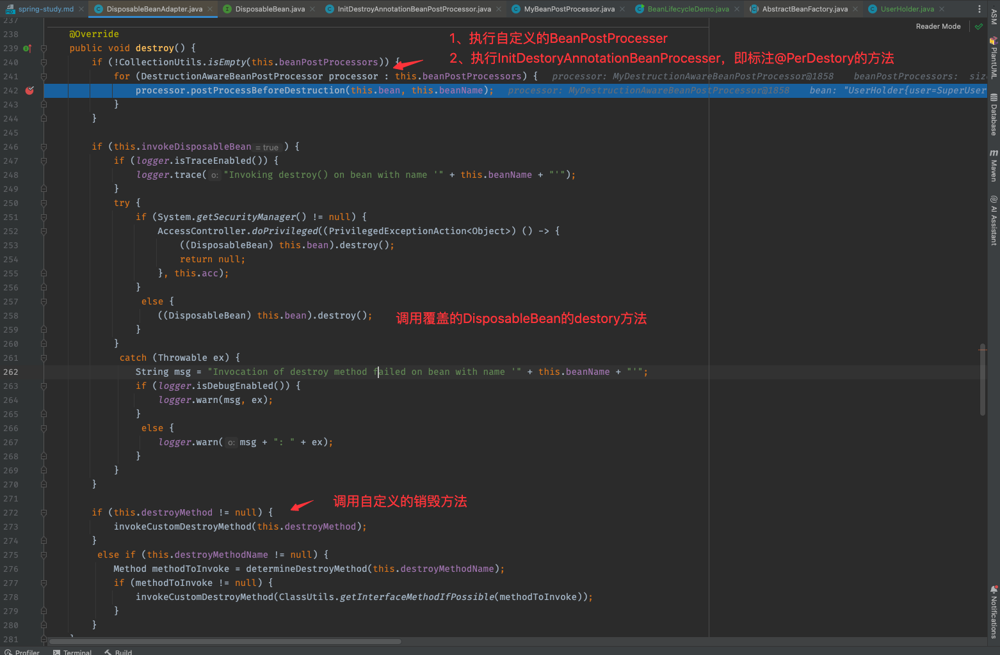


## Spring Bean垃圾收集

Bean 垃圾回收

关闭 Spring 容器（应用上下文）
执行 GC
Spring Bean 覆盖 finalize() 方法被回调

UserHolder 覆盖 Object#finalize 方法，因为这个方法会在对象被 GC 的时候调用

beanFactory.destroySingletons();//销毁掉所有单例对象，保证没有对象的强引用
userHolder=null;//对象置为空
System.gc(); //调用 Full gc 可以看到finalize 方法调用


## 面试题

### BeanPostProcessor 的使用场景有哪些？
BeanPostProcessor 提供 Spring Bean 初始化前和初始化后的生命周期回调，分别对应 postProcessBeforeInitialization 以及 postProcessAfterInitialization 方法，
允许对相关的 Bean 进行扩展，甚至是替换。

BeanPostProcessor 的子类 DestructionAwareBeanPostProcessor 提供销毁前的生命周期回调。
BeanPostProcessor 的子类 InstantiationAwareBeanPostProcessor 提供实例化前postProcessBeforeInstantiation，实例化后 postProcessAfterInstantiation，
属性赋值前 postProcessProperties 的生命周期回调。

加分项：其中 ApplicationContext 相关的 Aware 回调也是基于 BeanPostProcessor 实现，即 ApplicationContextAwareProcessor。

### BeanFactoryPostProcessor 与 BeanPostProcessor 的区别？

其实两者无法进行对比，BeanFactoryPostProcessor 是 Spring BeanFactory（实际是ConfigurableListableBeanFactory）的后置处理器，用于扩展 BeanFactory，
或者通过 BeanFactory 进行依赖查找和依赖注入。 而 BeanPostProcessor 则是直接与 BeanFactory 关联，属于 N 对 1 的关系。

加分项：BeanFactoryPostProcessor 必须有 Spring ApplicationContext 执行，BeanFactory 无法直接与其交互。

### BeanFactory 是怎样处理 Bean 生命周期？

BeanFactory 的默认实现为 DefaultListableBeanFactory ,其中 Bean 生命周期与方法映射如下：

- BeanDefinition 注册阶段 - registerBeanDefinition

- BeanDefinition 合并阶段 - getMergedBeanDefinition

- Bean 实例化前阶段 - resolveBeforeInstantiation

- Bean 实例化阶段 - createBeanInstance

- Bean 实例化后阶段 - populateBean

- Bean 属性赋值前阶段 - populateBean

- Bean 属性赋值阶段 - populateBean

- Bean Aware 接口回调阶段 - initializeBean

- Bean 初始化前阶段 - initializeBean

- Bean 初始化阶段 - initializeBean

- Bean 初始化后阶段 - initializeBean

- Bean 初始化完成阶段 - preInstantiateSingletons

- Bean 销毁前阶段 - destroyBean

- Bean 销毁阶段 - destroyBean

# 参考博客

> https://blog.csdn.net/xiewenfeng520/category_9912098.html


