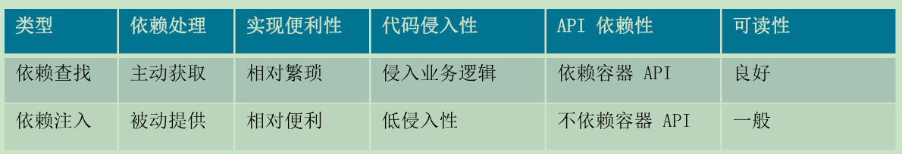

# 重新认识IOC

## 什么是IoC?

简单地说,IoC是反转控制,类似于好莱坞原则,主要有依赖查
找和依赖注入实现

## 依赖查找和依赖注入的区别?

依赖查找是主动或手动的依赖查找方式,通常需要依赖容器或标准API实现。
而依赖注入则是手动或自动依赖绑定的方式,无需依赖特定的容器和ΑΡΙ

```dtd
org.geekbang.thinking.in.spring.ioc.overview.dependency.injection.DependencyInjectionDemo

        org.geekbang.thinking.in.spring.ioc.overview.dependency.lookup.DependencyLookupDemo
```

## 依赖查找VS.依赖注入



## Spring 作为 IoC 容器有什么优势?

- 典型的IoC管理,依赖查找和依赖注入
- AOP抽象
- 事务抽象
- 事件机制
- SPI扩展
- 强大的第三方整合
- 易测试性
- 更好的面向对象


## BeanFactory与FactoryBean?

- BeanFactory是IoC底层容器
- FactoryBean是创建Bean的一种方式,帮助实现复杂的初始化逻辑

## Spring IoC容器启动时做了哪些准备?

IoC配置元信息读取和解析、IoC容器生命周期、Spring事件发布
国际化等,更多答案将在后续专题章节逐一讨论

# spring bean 基础

## 初始化 Spring Bean

- Bean 初始化 (Initialization)
  - @PostConstruct标注方法
  - 实现 InitializingBean接口的afterPropertiesSet方法
  - 自定义初始化方法
    - XML配置:<bean init-method=" init".../>
    - Java注解:@Bean(initMethod="init")
    - Java API: AbstractBeanDefinition#setInitMethodName (String)
```dtd
org.geekbang.thinking.in.spring.bean.definition.BeanInitializationDemo
```

## 延迟初始化SpringBean

- Bean 延迟初始化(Lazy Initialization)
  - XML 配置:<bean lazy-init="true
  - Java注解:@Lazy(true)

```dtd
org.geekbang.thinking.in.spring.bean.definition.BeanInitializationDemo
@Lazy(value = true)
```

## 销毁 Spring Bean

- Bean 销毁(Destroy)
  - @PreDestroy标注方法
  - 实现 DisposableBean接口的 destroy()方法
  - 自定义销毁方法
    - XML配置:<beandestroy="destroy"
    - Java注解:@Bean(destroy="destroy")
    - Java API: AbstractBeanDefinition#setDestroyMethodNanme (String)

## 如何注册一个SpringBean?

通过 BeanDefinition和外部单体对象来注册
```dtd
org.geekbang.thinking.in.spring.bean.definition.SingletonBeanRegistrationDemo

```
## BeanDefinition 元信息


- BeanDefinition 构建
  - 通过 BeanDefinitionBuilder
  - 通过AbstractBeanDefinition以及派生类

```dtd
org.geekbang.thinking.in.spring.bean.definition.BeanDefinitionCreationDemo
```
# Spring依赖查找

## 单一类型依赖查找

- 单一类型依赖查找接口-BeanFactory
  - 根据Bean名称查找
    - getBean (String)
    - Spring 2.5覆盖默认参数:getBean(String,Object...)
  - 根据 Bean类型查找
    - Bean实时查找
      - Spring 3.0getBean (Class)
      - Spring4.1覆盖默认参数:getBean(Class, Object...)
    - Spring 5.1 Bean 延迟查找
      - getBeanProvider (Class)
      - getBeanProvider (ResolvableType)
  - 根据Bean名称+类型查找:getBean(String,Class)

```dtd
org.geekbang.thinking.in.spring.dependency.lookup.ObjectProviderDemo
```

## 集合类型依赖查找

- 集合类型依赖查找接口-ListableBeanFactory
  - 根据 Bean 类型查找
    - 获取同类型Bean名称列表
      - getBeanNamesForType (Class)
      - Spring 4.2 getBeanNamesForType (ResolvableType)
    - 获取同类型Bean实例列表
      - getBeansOfType(Class) 以及重载方法
  - 通过注解类型查找
    - Spring3.0获取标注类型Bean名称列表
      - getBeanNamesForAnnotation (Class<? extends Annotation)
    - Spring3.0获取标注类型Bean实例列表
      - getBeansWithAnnotation(Class<? extends Annotation>)
    - Spring3.0获取指定名称+标注类型Bean实例
      - findAnnotationOnBean (String, Class<? extends Annotatioon>

```dtd
org.geekbang.thinking.in.spring.ioc.overview.dependency.lookup.DependencyLookupDemo
```

## 层次性依赖查找

- 层次性依赖查找接口-HierarchicalBeanFactory
  - 双亲BeanFactory:getParentBeanFactory()
  - 层次性查找
    - 根据Bean名称查找
      - 基于containsLocalBean方法实现
    - 根据 Bean 类型查找实例列表
      - 单一类型:BeanFactoryUtils#bean0fType
      - 集合类型:BeanFactoryUtils#beansOfTypeIncludingAncesstors
    - 根据Java注解查找名称列表
      - BeanFactoryUtils#beanNamesForTypeIncludingAncesttors

```dtd
org.geekbang.thinking.in.spring.dependency.lookup.HierarchicalDependencyLookupDemo
```
## 延迟依赖查找

- Bean 延迟依赖查找接口
  - org. springframework.beans.factory.ObjectFactory
  - org. springframework.beans.factory.ObjectProvider
    - Spring 5对 Java 8特性扩展
      - 函数式接口
        - get IfAvailable (Supplier)
        - ifAvailable (Consumer)
      - Stream 扩展-stream()

```dtd
org.geekbang.thinking.in.spring.dependency.lookup.ObjectProviderDemo
```

## 安全依赖查找


